# Hardware Integration Roadmap And System Diagram

This document refines the future smart-hardware integration plan for the tank inspection product. The target architecture is simple: field hardware can accelerate capture, but the Android V3 Product app remains the canonical field-capture host and the V3 export package remains the report-generation handoff.

## Current Project Anchors

- Android V3 Product stores inspection work locally and exports `packageType: "v3_product_export"` with `schemaVersion: 3`.
- The report platform imports that package through the Android V3 Product import path, then creates a tenant/workspace report job.
- The AI/report engine should draft from current inspection facts, report-side manual inputs, and authorized precedent. Precedent must not override current field data.
- Hardware integrations should map into the current V3 export sections first: `inspectionRecord`, `layoutTargets`, `layoutConfigs`, `elements`, `utMeasurements`, `inspectionChecklistItems`, `inspectionChecklistSectionNotes`, `findings`, `attachments`, `taskSnapshots`, and `validationResults`.
- Future hardware metadata should be added through an explicit schema migration, not by placing opaque vendor payloads directly into report prompts.

## Hardware System Diagram

Editable Mermaid source:

`apps/field-android/docs/v3-product/diagrams/hardware-integration-diagram.mmd`

Rendered SVG target:

`apps/field-android/docs/v3-product/diagrams/hardware-integration-diagram.svg`

```mermaid
flowchart LR
  subgraph Hardware["Field Hardware Sources"]
    MIC["Smart Microphone<br/>Voice findings + audio"]
    UT["UT Probe / Crawler<br/>Thickness readings + OCR fallback"]
    TAG["RFID / NFC / QR Tags<br/>Plate, element, or section identity"]
    THERM["Thermal / IR Camera<br/>Thermograms + derived metrics"]
    AR["AR / HUD / Smart Glasses<br/>Hands-free checklist + overlays"]
    DRONE["Drone / LiDAR Survey<br/>External imagery + spatial evidence"]
  end

  subgraph Adapter["Hardware Adapter Layer"]
    REG["Device Registry<br/>deviceId, type, calibration, adapter version"]
    HUB["Edge Gateway / Adapter SDK<br/>BLE, USB, Wi-Fi, file import"]
    QA["Capture Normalizer<br/>timestamps, target binding, confidence, checksum"]
  end

  subgraph Android["Android V3 Product App"]
    CAPTURE["Capture Screens<br/>layout, elements, UT, checklist, findings"]
    ROOM[("Room Storage<br/>offline-first inspection state")]
    VALIDATE["Export Readiness Gates<br/>scope, layout approval, attachments"]
    EXPORTER["V3 Product Exporter<br/>schemaVersion 3"]
  end

  subgraph Package["Canonical Export Package"]
    PKG["JSON + Attachments<br/>utMeasurements, findings, attachments,<br/>layoutTargets, layoutConfigs, elements"]
  end

  subgraph Storage["Storage And Evidence Stores"]
    FILES[("Android Attachment Files<br/>photos, audio, thermal, imports")]
    IMPORTSTORE[("Report Import Store<br/>package JSON + manifest")]
    REPORTDB[("Report DB<br/>jobs, sections, reviews, provenance")]
    OBJECTS[("Object Storage<br/>attachments, previews, final PDFs")]
    VECTOR[("Vector Index<br/>authorized precedent embeddings")]
  end

  subgraph Report["Report Platform And AI Engine"]
    IMPORT["Import Adapter<br/>validate V3 package + attachments"]
    JOB["Normalized Report Job<br/>tenant, workspace, inspection, provenance"]
    FACTS["Fact Pack Builder<br/>current inspection facts only"]
    KB["Knowledge Base Retrieval<br/>authorized precedent + section patterns"]
    AI["AI Section Generator<br/>drafting + evidence validation"]
    PREVIEW["Preview Composer<br/>editable browser report"]
    PDF["PDF Composer<br/>final report output"]
  end

  MIC --> HUB
  UT --> HUB
  TAG --> HUB
  THERM --> HUB
  AR --> HUB
  DRONE --> HUB

  REG --> HUB
  HUB --> QA
  QA -->|"normalized hardware events"| CAPTURE
  CAPTURE --> ROOM
  CAPTURE --> FILES
  ROOM --> VALIDATE
  VALIDATE --> EXPORTER
  EXPORTER --> PKG

  PKG --> IMPORT
  PKG --> IMPORTSTORE
  IMPORT --> JOB
  IMPORT --> REPORTDB
  IMPORT --> OBJECTS
  JOB --> FACTS
  JOB --> REPORTDB
  VECTOR --> KB
  KB --> AI
  FACTS --> AI
  AI --> PREVIEW
  AI --> REPORTDB
  PREVIEW --> PDF
  PREVIEW --> OBJECTS
  PDF --> OBJECTS

  PKG -.->|"tenantId, workspaceId, inspectionId, inspectionReference"| JOB
  PKG -.->|"utMeasurements, findings, attachments"| FACTS
  PKG -.->|"layoutTargets, layoutConfigs, elements"| FACTS
  AI -.->|"draft provenance + validation notes"| JOB

  classDef hardware fill:#eff6ff,stroke:#2563eb,color:#172554,stroke-width:1px;
  classDef adapter fill:#ecfeff,stroke:#0891b2,color:#164e63,stroke-width:1px;
  classDef android fill:#fff7ed,stroke:#ea580c,color:#7c2d12,stroke-width:1px;
  classDef package fill:#f0fdf4,stroke:#16a34a,color:#14532d,stroke-width:1px;
  classDef storage fill:#f8fafc,stroke:#475569,color:#0f172a,stroke-width:1px;
  classDef report fill:#f5f3ff,stroke:#7c3aed,color:#2e1065,stroke-width:1px;

  class MIC,UT,TAG,THERM,AR,DRONE hardware;
  class REG,HUB,QA adapter;
  class CAPTURE,ROOM,VALIDATE,EXPORTER android;
  class PKG package;
  class FILES,IMPORTSTORE,REPORTDB,OBJECTS,VECTOR storage;
  class IMPORT,JOB,FACTS,KB,AI,PREVIEW,PDF report;
```





## Integration Principles

- Keep Android as the field source of truth. Hardware should help populate Android capture state, not bypass it.
- Keep the report platform as an import, QA, drafting, review, and composition workspace.
- Preserve tenant, workspace, inspection, user, device, and timestamp provenance on every hardware-originated record.
- Support offline-first capture. Hardware features should degrade to manual entry when a device is missing, disconnected, or untrusted.
- Treat raw vendor payloads as evidence or adapter input. Only normalized, schema-valid facts should drive report drafting.
- Use validation rules before export to catch missing attachments, incomplete layouts, unconfirmed readings, and unavailable calibration metadata.

## How Hardware, App, AI, And Report Generation Work Together

1. Hardware captures evidence in the field: voice notes, UT readings, tag scans, thermal images, AR media, drone imagery, and LiDAR/spatial files.
2. The adapter layer normalizes each event with device identity, timestamp, operator, target binding, confidence, calibration context, and checksum.
3. Android V3 Product accepts only reviewed/approved capture data and stores it in Room plus local attachment files.
4. Android exports a schema-valid V3 package containing JSON facts, validation results, layout data, findings, UT measurements, checklist data, and copied attachments.
5. The report platform imports the package, stores attachments, creates a tenant/workspace report job, and builds an AI fact pack from current inspection facts.
6. The AI engine retrieves authorized precedent for structure and wording, drafts report sections, and performs evidence-alignment checks.
7. The inspector/reviewer accepts, edits, rejects, or reruns generated sections before preview/PDF generation creates the final report.

Feedback rule: review feedback can trigger AI reruns or require Android/export corrections, but raw hardware data should never bypass Android validation or become a report fact directly.

## Data Flow And Storage Model

| Stage | Data moving through the system | Stored in |
| --- | --- | --- |
| Hardware capture | Raw device readings, audio, photos, thermal images, QR/RFID scans, drone/LiDAR evidence | Device memory temporarily, then Android adapter queue |
| Normalization | Trusted hardware events with timestamps, target binding, confidence, checksum, and operator context | Android Room tables plus local attachment files |
| Android capture state | Approved layout scope, elements, UT measurements, checklist answers, findings, and attachment links | Android Room storage and app-managed attachment directory |
| Export handoff | `v3_product_export` JSON plus copied attachments and validation results | Export package file/folder and optional shared/uploaded bundle |
| Report import | Validated package, attachment manifest, tenant/workspace/inspection provenance | Report import store, report DB, and object storage |
| AI/report generation | Fact pack, authorized precedent, generated section drafts, evidence checks, review decisions | Report DB, vector index for precedent, object storage for preview/final artifacts |
| Final output | Browser preview, final PDF, source attachments, provenance/audit trail | Object storage plus report DB metadata |

Storage rule: raw vendor payloads may be retained as evidence, but report generation should use normalized Android/export records as facts. This keeps auditability high and prevents device-specific formats from leaking into report logic.

## Device Integration Map

| Device family | Field value | Android V3 destination | Report and AI value |
| --- | --- | --- | --- |
| Smart microphone | Faster finding capture while hands are occupied | `findings.note`, optional audio `attachments`, future transcript metadata | Turns field speech into reviewable findings with source audio retained as evidence |
| UT probe / crawler | Direct thickness capture and fewer transcription errors | `utMeasurements` with `targetKey`, `plateId`, `elementId`, `laneId`, `course`, `value1..value5`, and `reinforcementPadReading` where available | Enables evidence checks, anomaly detection, and report tables grounded in device readings |
| RFID / NFC / QR tags | Confirms current plate, nozzle, element, or inspection section | Target binding for `layoutTargets`, `elements`, `utMeasurements`, `findings`, and `attachments` | Reduces mismatched evidence and improves provenance for photos/readings |
| Thermal / IR camera | Adds thermal evidence and derived temperature metrics | Image/video `attachments`; future derived metric rows or attachment metadata | Gives reviewers supporting evidence without making thermal data the only report fact |
| AR / HUD / smart glasses | Hands-free checklist, remote assistance, annotated capture | Checklist updates, findings, image/video attachments, optional overlay assets | Supports traceable field collaboration and faster capture in confined or elevated areas |
| Drone / LiDAR survey | External visual evidence and spatial context | Geotagged attachments now; future spatial overlay metadata | Supports external inspection sections, appendix visuals, and map/geometry review |

## Hardware Function And Purpose Detail

### Smart Microphone

Purpose:
- Capture verbal findings when the inspector cannot easily type, especially during roof, shell, nozzle, confined-space, or elevated work.
- Preserve the inspector's original field observation as evidence, not only the cleaned transcript.

Field function:
- Record voice notes against the currently selected `targetKey`, `plateId`, `elementId`, checklist section, or finding.
- Run speech-to-text on device or through an approved adapter.
- Allow inspector confirmation before the transcript becomes a finding.

Captured data:
- Audio file, transcript text, language, confidence, speaker/operator, capture timestamp, device id, and optional noise-quality score.

Android storage/export destination:
- `findings.note` for the approved text.
- `attachments` for raw audio or transcript sidecar files.
- Future source metadata on `findings`: `source`, `deviceId`, `voiceAssetId`, `transcriptConfidence`, `language`, and `rawEventId`.

Report/AI usage:
- Summarize multiple voice notes into concise finding language.
- Link the generated finding back to the original audio asset for review.
- Detect low-confidence or ambiguous speech that requires human confirmation.

Validation notes:
- Do not export unreviewed transcripts as final facts.
- Flag low-confidence speech-to-text, missing audio assets, or notes with no layout target.

### UT Probe / Crawler

Purpose:
- Reduce manual transcription errors in thickness measurement capture.
- Support high-volume shell, roof, floor, nozzle, and reinforcement pad readings with stronger provenance.

Field function:
- Stream numeric UT readings directly from a probe, crawler, or bridge device.
- Support OCR fallback for crawler camera displays only when direct numeric integration is unavailable.
- Bind each reading to the active target, plate, course, lane, nozzle, element, or reinforcement pad.

Captured data:
- Thickness values, units, probe type, calibration id, calibration expiry, material velocity/profile, gain/setup where available, capture timestamp, device id, and confidence.

Android storage/export destination:
- `utMeasurements` with `targetKey`, `plateId`, `elementId`, `laneId`, `course`, `value1..value5`, and `reinforcementPadReading` where available.
- Future source metadata on `utMeasurements`: `source`, `deviceId`, `calibrationId`, `probeType`, `captureMethod`, `confidence`, and `rawEventId`.

Report/AI usage:
- Generate report UT tables from structured rows.
- Cross-check UT values against layout geometry and previous readings.
- Flag suspicious clusters, outliers, repeated values, missing courses, or expired calibration.

Validation notes:
- Block or warn on missing calibration id, expired calibration, unconfirmed target binding, or OCR-only values below confidence threshold.
- Preserve manual override with reviewer provenance.

### RFID / NFC / QR Location Tags

Purpose:
- Prevent readings, photos, and findings from being attached to the wrong plate, nozzle, or inspection section.
- Speed up field navigation and reduce manual target selection.

Field function:
- Scan a physical tag installed on or near a plate, nozzle, course, shell lane, floor zone, roof plate, or inspection area.
- Set the active Android capture context before voice, photo, checklist, or UT capture.
- Record a binding event whenever the active target changes.

Captured data:
- Tag id, scan method, reader id, target key, plate/element mapping, scan timestamp, operator id, optional GPS/geofence, and confidence.

Android storage/export destination:
- Target binding for `layoutTargets`, `elements`, `utMeasurements`, `findings`, and `attachments`.
- Future `hardwareEvents[]` rows for scan events and `rawPayloadChecksum`.

Report/AI usage:
- Improve evidence alignment between field records and layout-map geometry.
- Explain why a finding or attachment belongs to a specific plate/element.
- Detect target mismatch when scanned tag does not match selected layout context.

Validation notes:
- Warn when a scan maps to an unknown target, archived tag, duplicate tag, or wrong inspection.
- Keep manual correction available but record the correction reason.

### Thermal / IR Camera

Purpose:
- Add complementary evidence for temperature anomalies, insulation issues, moisture indicators, or suspected active defects.
- Support visual review without turning thermal imagery into unsupported final conclusions.

Field function:
- Capture thermograms, thermal video, visible-light companion photos, and derived temperature metrics.
- Bind images to the active target, finding, checklist item, or inspection section.
- Preserve camera settings that affect interpretation.

Captured data:
- Thermal image/video, visible photo, palette, emissivity, reflected temperature, spot/range measurements, camera calibration, timestamp, device id, and optional GPS.

Android storage/export destination:
- `attachments` with image/video media type.
- Future richer attachment metadata for `palette`, `emissivity`, `deviceCalibration`, derived temperature metrics, and `rawEventId`.

Report/AI usage:
- Attach supporting evidence to findings and appendix pages.
- Compare thermal evidence with visual photos and UT readings.
- Flag cases where thermal evidence exists but no finding/checklist note references it.

Validation notes:
- Require reviewer confirmation before thermal metrics drive recommendation wording.
- Warn on missing emissivity/calibration metadata or orphaned thermal assets.

### AR / HUD / Smart Glasses

Purpose:
- Provide hands-free capture and guidance in areas where holding a phone/tablet is unsafe or inefficient.
- Enable remote support while preserving traceable field records.

Field function:
- Show layout target, checklist status, and active task overlay.
- Capture voice notes, images, short videos, and annotated overlays.
- Support remote reviewer/operator guidance as a session record.

Captured data:
- Images/video, voice notes, overlay annotations, operator id, session id, plate focus, optional gaze/context metadata, timestamp, and device id.

Android storage/export destination:
- Checklist updates, `findings`, image/video `attachments`, and optional overlay assets.
- Future `hardwareEvents[]` for AR session events and source metadata.

Report/AI usage:
- Preserve field collaboration context for reviewer audit.
- Convert confirmed voice/image evidence into findings or appendix items.
- Identify incomplete tasks visible in AR checklist state.

Validation notes:
- Treat gaze/context metadata as optional and privacy-sensitive.
- Require explicit acceptance before remote-session notes become report facts.

### Drone / LiDAR Survey

Purpose:
- Capture external tank condition, wide-area imagery, roof overview, hard-to-access elevation views, and spatial evidence.
- Support future geometry overlays and appendix-quality visuals.

Field function:
- Import drone photos, videos, orthomosaics, LiDAR point-cloud tiles, or mission exports.
- Bind survey assets to inspection id, tank id, shell/roof/floor target, or report appendix section.
- Record mission metadata and sensor provenance.

Captured data:
- Geotagged images/video, orthomosaic, point-cloud assets, GPS, altitude, IMU, mission id, pilot/operator, sensor bundle, capture timestamp, and checksum.

Android storage/export destination:
- `attachments` for imagery and survey files.
- Future spatial metadata linked to `layoutConfigs`, `elements`, or report-platform layout overlays.

Report/AI usage:
- Support external inspection sections, overview plates, appendix visuals, and geometry review.
- Compare drone imagery with manually captured findings and layout-map targets.
- Flag missing captions, orphaned survey assets, or survey evidence outside approved scope.

Validation notes:
- Keep raw point-cloud/orthomosaic files as evidence; only normalized references should drive report generation.
- Warn on missing mission id, checksum, or location metadata when required by tenant policy.

### Edge Gateway / Adapter SDK

Purpose:
- Provide a trusted bridge between heterogeneous devices and the Android V3 Product capture model.
- Keep vendor-specific payloads out of report logic.

Field function:
- Receive hardware data over BLE, USB, Wi-Fi, file import, or vendor SDK.
- Normalize events into a common shape before Android accepts them.
- Apply local queueing when the field device or network connection is unstable.

Captured data:
- Adapter version, connection type, source device id, raw payload checksum, received timestamp, normalization status, and error codes.

Android storage/export destination:
- Future `hardwareDevices[]` and `hardwareEvents[]`.
- Normalized records populate existing `utMeasurements`, `findings`, `attachments`, layout/element bindings, and validation results.

Report/AI usage:
- Provide provenance for every device-originated fact.
- Let the report platform explain source confidence without parsing vendor-specific formats.

Validation notes:
- Reject unknown adapters unless tenant policy allows experimental devices.
- Store raw payload checksums so evidence can be audited without bloating report prompts.

## Future Schema Extensions

The current V3 package is intentionally structured and report-friendly. Hardware should extend it through a versioned contract, likely `schemaVersion: 3`, with additions such as:

- `hardwareDevices[]`: registered device identity, adapter version, firmware, calibration status, and last trusted sync.
- `hardwareEvents[]`: normalized capture events with `eventId`, `deviceId`, `deviceType`, `connectionType`, `capturedAtIso`, `receivedAtIso`, `operatorUserId`, `targetKey`, `plateId`, `elementId`, `itemKey`, `findingId`, `attachmentId`, `confidence`, and `rawPayloadChecksum`.
- Source metadata on `utMeasurements`: `source`, `deviceId`, `calibrationId`, `probeType`, `captureMethod`, `confidence`, and `rawEventId`.
- Source metadata on `findings`: `source`, `deviceId`, `voiceAssetId`, `transcriptConfidence`, `language`, and `rawEventId`.
- Richer `attachments`: checksum, capture device, capture timestamp, GPS/IMU fields where permitted, evidence role, and derived metadata.
- Export validation rules for calibration expiry, missing raw evidence, low-confidence OCR/STT, and unresolved target binding.

## Recommended Implementation Phases

1. Foundation: define the adapter contract, device registry, normalized hardware event model, attachment checksum strategy, and export validation rules.
2. Pilot: integrate QR/RFID plate binding and one UT probe/crawler path. Map readings into existing `utMeasurements` and keep manual override available.
3. Evidence capture: add smart microphone transcripts, audio attachments, and thermal image attachments linked to findings and checklist sections.
4. Advanced survey: add drone/LiDAR imports as attachments plus spatial metadata, then decide whether layout overlays belong in Android, report platform, or both.
5. Report intelligence: teach the report platform fact pack and AI generator to use hardware provenance for evidence alignment, anomaly flags, and source-aware recommendations.

## Third-Party Diagram Workflow

Use Mermaid as the source-controlled diagram format and export polished assets from it. This keeps the architecture reviewable in Git while still allowing high-quality presentation output.

```bash
npx --yes @mermaid-js/mermaid-cli \
  -i apps/field-android/docs/v3-product/diagrams/hardware-integration-diagram.mmd \
  -o apps/field-android/docs/v3-product/diagrams/hardware-integration-diagram.svg

npx --yes @mermaid-js/mermaid-cli \
  -i apps/field-android/docs/v3-product/diagrams/hardware-integration-diagram.mmd \
  -o apps/field-android/docs/v3-product/diagrams/hardware-integration-diagram.pdf
```

Recommended production flow:

- Keep `.mmd` as the editable source of truth in the repo.
- Render SVG/PDF with Mermaid CLI for repeatable local or CI output.
- Import the SVG into Figma, Illustrator, or diagrams.net for executive presentation polish.
- Commit the `.mmd` and final `.svg`; keep Figma/Illustrator working files linked from project notes if they are used.

## Report Generation Impact

- Import adapter: validate device-originated records exactly like manually entered Android records.
- Fact pack builder: expose hardware provenance without letting raw vendor blobs become report facts.
- AI engine: use device metadata for evidence alignment, anomaly flags, and confidence notes.
- Preview/PDF composer: surface attachments, captions, and source provenance where useful for auditability.
- Review workflow: allow inspectors/reviewers to accept, edit, or reject hardware-originated facts before final PDF output.

## Open Product Decisions

- Which UT hardware should be the first certified integration target?
- Should hardware metadata ship in a minor V3 extension or wait for `schemaVersion: 3`?
- Which attachment kinds are needed beyond the current photo/document style records?
- How much GPS/IMU/location metadata is allowed under client privacy and site safety policy?
- Should drone/LiDAR spatial overlays be editable in Android, the report platform, or both?
