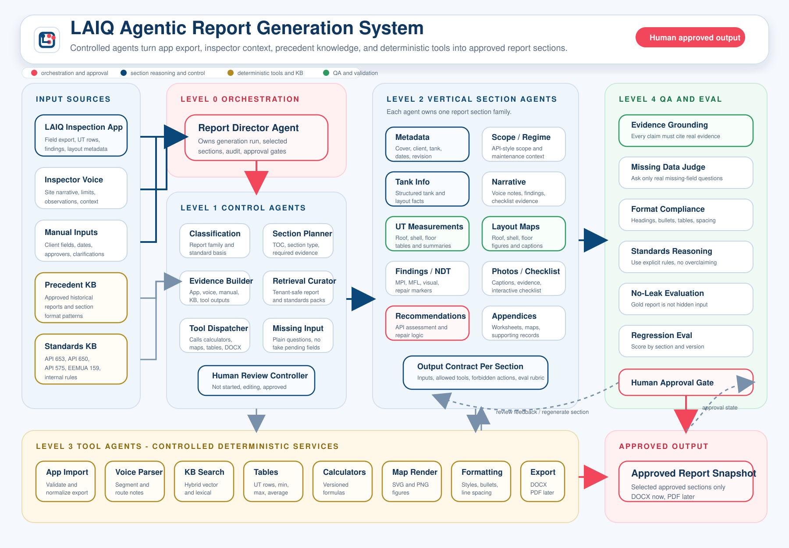

# LAIQ Report Generation Agentic System Design

## Purpose

Define the product-standard runtime design for the LAIQ report generation platform.

The product intent is unchanged:

```text
app export + inspector context + precedent + deterministic tools
-> approved report sections
-> DOCX / PDF export
```

The important design correction is the organizing principle.

The system should not be designed as a large org chart of many chatbots. It should be designed as a report compiler: mostly deterministic passes, with a small number of constrained AI prose workers where a script cannot produce the output.

## Visual Topology

Open the SVG directly if the markdown preview is too small:

`apps/report-platform/assets/agentic-system-design.svg`



## Core Principle

Scripts own every fact, number, table, figure, geometry, page number, and authorization decision.

The LLM owns prose only, and only where deterministic code cannot produce the output.

This must be enforced structurally through:

- schemas
- output contracts
- data-layer authorization
- deterministic tool APIs
- runtime gates
- sandbox boundaries

It should not rely only on prompt instructions. If the model cannot emit a number by schema, it cannot fabricate a measurement.

## Four Component Kinds

The earlier v1 agent list collapses into four runtime component kinds.

| Kind | What it is | Runs LLM? | Authored how |
| --- | --- | --- | --- |
| A. Deterministic spine | Orchestration, adapter/validation, evidence-pack builder, tool dispatch, render, export | No | normal product code |
| B. Deterministic tools | UT table compiler, layout-map renderer, calculator, checklist builder, DOCX assembler | No at runtime | Codex writes once at build time, then frozen and versioned |
| C. LLM prose workers | Scope, inspection narrative, regime, recommendations explanation, captions, missing-input phrasing | Yes | prompt + schema contract, tuned in eval loop |
| D. Evaluators | Runtime gates plus offline regression/no-leak tests | Mixed | harness and validators |

Most v1 "agents" are really deterministic spine stages or deterministic tools. Only a small group should be live runtime LLM calls.

That reduction is the robustness win.

## Section Class To Engine Routing

Every report section must be classified before generation. The section class decides the engine, allowed tools, and scoring method.

| Class | Source | Engine | Examples | Scored by |
| --- | --- | --- | --- | --- |
| A - App-structured | LAIQ inspection app export | Deterministic tool only; optional AI caption | Roof/shell/floor UT tables, layout maps, checklist tables, photo inventory, tank metadata | exact match per cell or artifact |
| B - Voice/manual | Voice transcript and manual input | LLM prose from evidence pack | inspection narrative, access limits, site observations | fact coverage and grounding |
| C - Template/standards | Template plus standards guidance | LLM fills fixed structure | scope, inspection regime, boilerplate section language | structural rubric |
| D - Hybrid judgment | App data plus calculations, rules, and approval | deterministic rules first; LLM explains approved conclusion only | repair recommendations, API assessment, fitness statements | coverage, grounding, rule trace, human approval |

Concrete V10 mapping:

- 141 UT rows are Class A.
- 23 placed elements are Class A.
- roof, shell, and floor layout maps are Class A.
- 195 checklist items are Class A.
- 23 V3 voice notes with prepared mock transcripts and voice-audio attachment references feed Class B.
- scope and inspection regime are Class C.
- repair recommendations and API assessment are Class D.

## A. Deterministic Spine

The spine owns the report run. It writes no prose.

### 1. Orchestrator

The orchestrator owns one report run as a durable state machine over a DAG of sections.

Responsibilities:

- validate report job and actor context
- build the section plan
- schedule independent sections in parallel where safe
- checkpoint each section
- enforce approval before export
- resume from failure without restarting the whole run

### 2. Adapter And Validator

This is the only code that knows the current app export shape.

Responsibilities:

- validate export package against the canonical schema target
- pin supported `schemaVersion`
- hard-fail on schema drift
- normalize the export into the report-job model
- hide raw app export shape from downstream tools

Downstream stages should see only the normalized model.

### 3. Section Planner

The section planner chooses the report-family section spine.

Current primary family:

`api653_vertical_ast_internal_external`

Responsibilities:

- map report family to section template registry
- assign each section class A/B/C/D
- attach required evidence rules
- attach allowed tool list
- attach approval policy

LLM fallback is allowed only when the report family is ambiguous.

### 4. Evidence-Pack Builder

The evidence-pack builder is where enriched context is reorganized before generation.

It separates imported context into:

- structured field facts for deterministic tools
- voice-note transcript facts for narrative prose workers
- report-side manual inputs for user confirmation
- precedent snippets for formatting/style guidance
- standards snippets for controlled technical guidance

Voice-note routing uses:

- `screenKey` and `screenLabel`
- `cardKey` and `fieldKey`
- `targetKey` and `targetLabel`
- `itemKey` and `itemLabel`
- `transcriptStatus`
- transcript text after server-side transcription or prepared mock transcript loading

The output is a section evidence pack. A section agent should never receive the whole inspection dump unless the section contract explicitly allows inspection-wide context.

### 5. Voice Transcription Worker

The LAIQ inspection app stores audio and metadata. The report platform owns transcription and interpretation.

Responsibilities:

- receive `voice_audio` attachments from the app export
- run server-side speech-to-text when `transcriptStatus` is pending
- preserve the raw audio attachment as primary evidence
- store transcript text with confidence/status metadata
- route transcript facts into evidence packs rather than directly into report output

The worker does not decide final wording. It only converts audio into auditable text evidence.

The evidence-pack builder remains the anti-hallucination core.

For every section, build a small, relevant evidence pack:

```json
{
  "sectionKey": "inspection-report",
  "appFacts": [],
  "voiceFacts": [],
  "manualInputs": [],
  "calcArtifacts": [],
  "mapArtifacts": [],
  "precedentHints": [],
  "standardsHints": [],
  "missingInputs": []
}
```

Every evidence item must carry:

- `evidenceId`
- origin type
- source location
- tenant/workspace scope
- confidence or validation status where applicable

The evidence ID is later used by grounding gates.

### 6. Tool Dispatch

Tool Dispatch calls frozen deterministic tools and stores artifacts with provenance.

Examples:

- roof UT section calls the UT table compiler
- shell map section calls the layout renderer
- recommendation section calls rule/calculation outputs first
- final export calls the DOCX assembler

### 7. Renderer And Paginator

Rendering and pagination should feed both browser preview and final export.

Responsibilities:

- compute page structure late
- place figures near related sections
- keep browser preview and export output aligned
- compute page numbers only after section selection and final layout are known

The reviewer should approve what will export.

### 8. Exporter

Exporter compiles only selected and approved sections.

Responsibilities:

- reject unapproved sections
- include selected approved sections only
- preserve heading styles and figure/table placement
- produce DOCX first
- support PDF later from the same approved snapshot

## B. Deterministic Tools

Deterministic tools are written by Codex at build time, tested against fixtures, then frozen and versioned.

At runtime they are plain functions that take normalized report state and emit artifacts.

### UT Table Compiler

Purpose:

- convert exported `value1` through `value5` UT rows into report-grade tables
- group by plate, course, lane, nozzle, or section requirement
- compute min, max, and average where required

Outputs:

- JSON table model
- HTML preview block
- DOCX table block

The LLM must not write raw measurement numbers into these tables.

### Layout Renderer

Purpose:

- convert app layout configuration, normalized element anchors, UT anchors, and finding markers into report figures

Outputs:

- SVG for browser preview
- PNG or compatible binary artifact for DOCX/PDF

The LLM must not move geometry.

### Calculator

Purpose:

- run derived metrics and engineering calculations through versioned formulas

Outputs:

- reproducible JSON
- formula version
- thresholds and warnings
- input hash

### Checklist Builder

Purpose:

- convert checklist rows into report tables
- preserve embedded standards citations and response options
- support future interactive checklist completion

### DOCX Assembler

Purpose:

- apply heading styles
- apply normal page margins
- apply 1.5 narrative line spacing
- preserve report bullets and tables
- place layout figures near related UT/map sections

## C. LAIQ AI Engine

The LAIQ AI Engine is the only live LLM surface in the runtime design.

It has two modes.

### Mode 1: Generation

Triggered when the user clicks `Generate Sections`.

Generation mode drafts prose sections from the evidence pack:

- inspection narrative
- scope wording
- inspection and maintenance regime
- repair recommendation explanation
- API assessment explanation
- figure captions
- photo captions
- missing-input phrasing

For Class D sections, the LLM explains deterministic rule/calculation output. It does not decide the engineering conclusion by itself.

### Mode 2: Interactive Refinement

Triggered from the right-rail chat.

The inspector can ask anything, but the assistant can only mutate drafts through a bounded action space:

| Action | Mutates draft? | Guard |
| --- | --- | --- |
| `reword` / `restructure` | yes, prose only | grounding gate re-runs |
| `applyFormatting` | yes, style only | no fact change |
| `callTool` | yes, inserts deterministic artifact | tool owns numbers/geometry |
| `fillReportField` | yes, manual input | written from user input, not invented |
| `explain` / `answer` | no | no draft mutation |

Forbidden actions:

- emit raw measurement numbers
- alter map geometry
- assert a factual claim with no evidence ID
- copy gold report text into the generated report
- mark app-sourced data as pending when matching app data exists

The user asking for a fact is not evidence.

### Interactive Loop Invariant

Grounding and format gates run after every AI-applied edit, not only after the initial generation.

If a refinement would introduce an ungrounded claim, the action is rejected and converted into a missing-input question.

### Approved Content Lock

AI acts only on editing drafts.

If a user regenerates an approved section, the section returns to editing and must pass gates again before approval.

### Untrusted Context Boundary

Voice transcripts, precedent snippets, and standards snippets are data, not instructions.

They must be wrapped as evidence/context and never interpolated as system guidance.

### Prose Worker Contract

Generation and refinement should share the same section contract:

```json
{
  "agentKey": "inspection-narrative",
  "class": "B",
  "allowedEvidence": ["voiceFacts", "appFacts", "manualInputs"],
  "outputSchema": "SectionDraftV1",
  "mustReference": "evidenceId",
  "actionSpace": ["reword", "applyFormatting", "callTool", "fillReportField", "explain"],
  "forbidden": ["emitNumbers", "moveGeometry", "copyGoldReport", "statePendingForAppData"],
  "gateOnEveryEdit": true,
  "approvalPolicy": "human_required"
}
```

`SectionDraftV1` should carry:

```json
{
  "prose": "",
  "claims": [
    {
      "text": "",
      "evidenceIds": []
    }
  ]
}
```

No free numbers. No untagged factual sentences.

### Model Selection

Use model strength deliberately:

- cheaper/faster model for routing, captions, missing-input phrasing, and most chat refinements
- stronger model for narrative, recommendations explanation, and grounding judgment

## D. Evaluators

Evaluators split into runtime gates and offline/CI harnesses.

### Runtime Gates

Runtime gates fire after generation and after every AI-applied refinement edit.

They block review/approval readiness when failed.

#### Grounding Gate

Mostly deterministic.

Checks:

- every claim references evidence IDs from the evidence pack
- no factual sentence is untagged
- old report precedent is not used as current-report fact
- app-sourced measurement sections do not contain invented values

#### Format Compliance Gate

Checks:

- heading classes
- bullet style
- table structure
- narrative spacing
- DOCX styles
- figure placement
- map/table presence where required

#### Missing-Data Gate

Checks:

- missing inputs are real, not routing artifacts
- app-sourced measurements are not marked pending when exported readings exist
- missing-field wording is plain enough for inspectors

### Offline / CI Harness

Offline evaluators run against gold fixtures and should not be in the live user path.

#### No-Leak Harness

The generator process must not be able to read the gold report target.

This should be enforced by the harness, not by trusting agent behavior.

#### Regression Harness

Run per-section scorecards against held-out sample reports.

Score dimensions:

- correctness
- completeness
- grounding
- format
- missing-field behavior

Each score must be stamped with a config bundle:

- prompt version
- retrieval version
- tool version
- template version
- fixture version

## Cross-Cutting Robustness

### State Machine And DAG

A report run is a durable state machine over a DAG of sections.

Rules:

- independent Class A sections can run in parallel
- TOC/page numbers depend on rendering and export selection
- failed section 12 should resume from section 12, not restart the report
- tool calls use idempotency keys

### Failure Policy

Each stage must define what happens when it fails:

```text
retry N times -> fallback to template -> escalate to human
```

Unsafe output must have a defined outcome:

- block approval
- show missing input
- show tool error
- keep prior approved snapshot unchanged

### Tenant Isolation

Tenant and workspace isolation live below the model.

The model never decides what it may see.

Retrieval and API routes should return only pre-filtered candidates scoped by:

- tenant
- workspace
- role
- library visibility
- approval status

### Runtime Code Sandbox

If Codex or any agent writes a script that runs over tenant data, separate script writing from script execution.

Execution requirements:

- sandboxed process
- no network egress
- filesystem scoped to one job scratch directory
- read-only input package
- explicit output directory
- audit log

### Observability

Every section generation should be replayable.

Record:

- evidence pack
- tool inputs and outputs
- prompt/config bundle
- model and token cost
- gate results
- user edits
- approval state

When an inspector disputes an output, the platform should reconstruct exactly which evidence produced it.

## V1 To V2 Consolidation Map

| v1 concept | v2 home |
| --- | --- |
| Report Director | Orchestrator in deterministic spine |
| Classification Agent | Section Planner stage with registry lookup |
| Section Planner Agent | Section Planner stage |
| Evidence Pack Builder | Deterministic spine, central anti-hallucination stage |
| Retrieval Curator | Evidence Pack Builder plus data-layer tenant scoping |
| Tool Dispatcher | Deterministic spine Tool Dispatch |
| Missing Input Agent | Missing-Data Gate |
| Human Review Controller | Approval gate and report state machine |
| 16 vertical section agents | Class A/D become tools and rules; Class B/C become small prose-worker set |
| 8 tool agents | Frozen deterministic tools |
| 6 QA agents | Runtime gates plus offline CI harness |

Net effect:

```text
~38 named agents
-> deterministic spine
-> ~5 frozen deterministic tools
-> ~6 constrained prose workers
-> small evaluator set
```

## Revised Roadmap

Build the loop before expanding the section army.

### 1. Harness First

Build gold fixtures, hard leak barrier, and per-section scorecards.

Each section scorecard should cover:

- correctness
- completeness
- grounding
- format

### 2. Adapter And Validator

Harden adapter/validator against the V10 fixture and canonical schema target.

Deliverables:

- schema drift check
- normalized report-job model
- import audit output

### 3. Three Pilot Sections End To End

Implement only three full slices first:

- Roof UT table: Class A, exact-match table scoring
- Inspection narrative: Class B, fact coverage and grounding scoring
- Scope of inspection: Class C, structural rubric scoring

This exercises all three main scoring methods on real data.

### 4. Tune Config Bundles

Read failure modes, tune prompt/retrieval/template/tool versions, and promote only after repeated passes.

Do not tune the system toward verbatim matching of the primary sample report. That would overfit one tank.

### 5. Expand Section By Section

After the pilot loop is trustworthy, expand by section family:

- shell and floor UT
- general tank information
- layout maps
- checklist
- findings and NDT
- photos
- repair recommendations
- API assessment
- appendices

### 6. Hold-Out Reports

Hold out other sample reports as test sets.

Use the V10 sample for development, but require held-out report performance before considering the generator stable.

## Hard Product Guardrails

- app-captured data is mandatory for Class A sections
- the LLM never emits a number, enforced by schema and action space
- layout geometry is deterministic
- historical reports are precedent, never current facts
- standards are guidance, never copied into client reports
- every section has an evidence pack
- every claim cites an evidence ID
- every generated section gets a scorecard
- every exported section is human-approved
- tenant isolation and authorization live in the data/authz layer
- runtime code execution is sandboxed

## One-Line Summary

Stop thinking "team of 38 agents."

Think "compiler with a deterministic spine, a handful of frozen tools, constrained prose workers, and an eval harness that is the product."

The hierarchy is an implementation detail. The execution model is the design.
