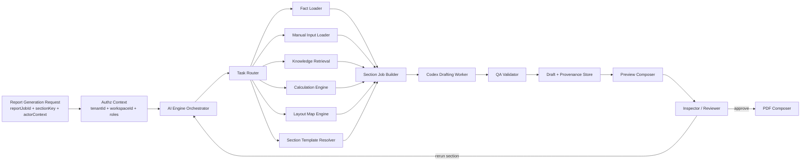
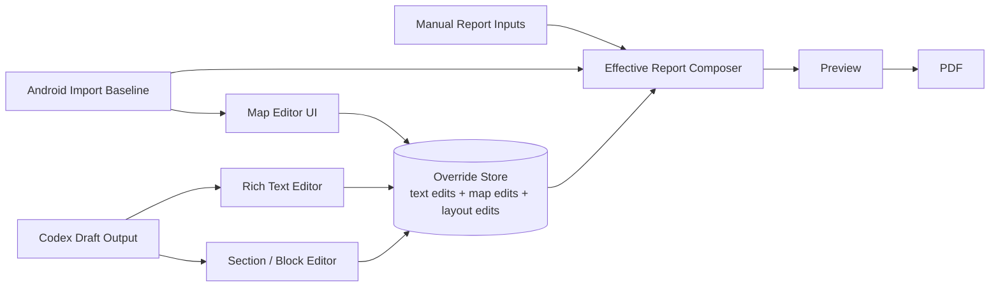
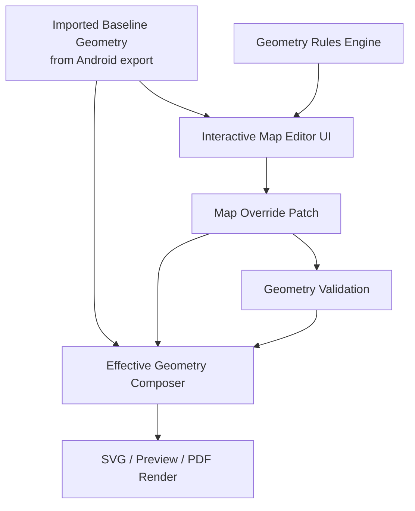
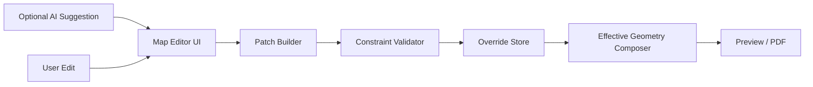
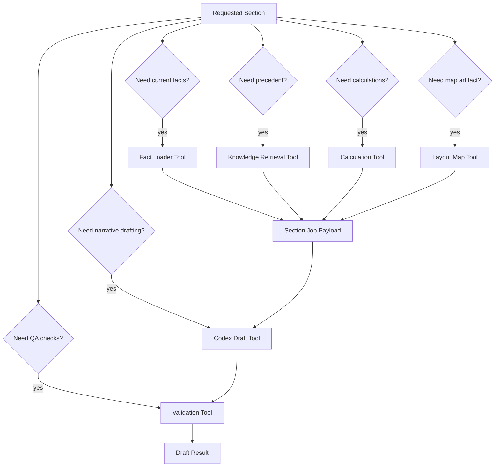
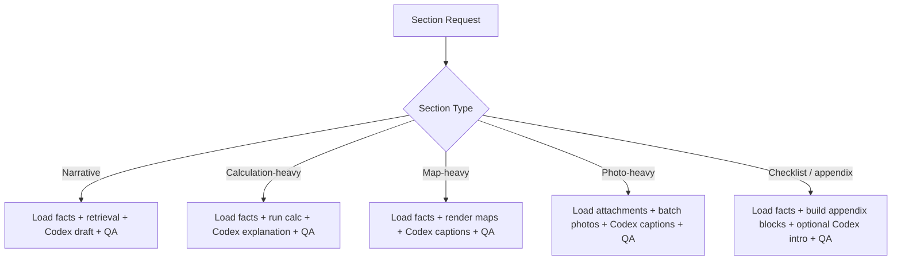
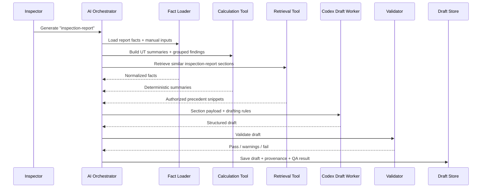
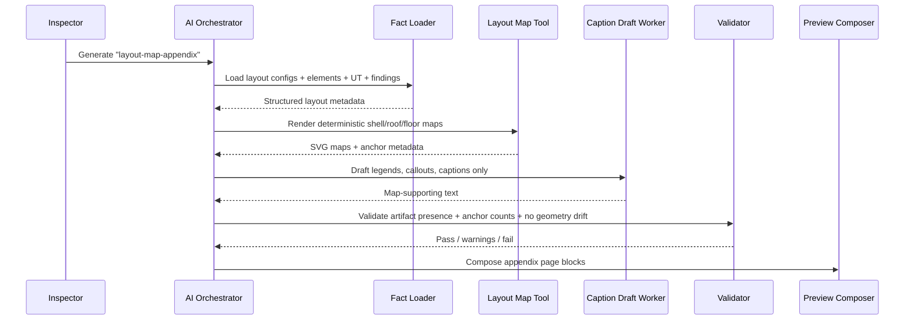
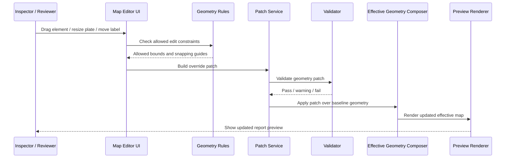

# AI Engine System Diagram

## Purpose

Show in detail how the report-platform AI engine should work, including:

- how a report generation request enters the system
- how the AI engine decides which tool to use
- which tasks are deterministic and which are AI-assisted
- how quality control happens before preview and PDF output

This document is narrower than the full platform diagram.

It focuses on the internal working model of the AI engine itself.

Supporting references:

- `apps/report-platform/FULL_SYSTEM_DIAGRAM.md`
- `apps/report-platform/AGENTIC_SYSTEM_DESIGN.md`
- `apps/report-platform/CODEX_ROLES_AND_TOOLING.md`
- `apps/report-platform/AI_QUALITY_AND_LAYOUTMAP.md`

## Core Principle

The AI engine is not one model call.

It is a controlled workflow with:

- a job orchestrator
- a task router
- deterministic tools
- retrieval tools
- Codex drafting workers
- QA validators
- human review gates

The topology must also preserve user editability.

That means generated content cannot be a dead end.

Users must be able to:

- edit drafted text
- reorder or hide report blocks
- edit captions and recommendations
- adjust layout-map presentation
- submit controlled geometry corrections where needed

## Important Correction

Yes, the current topology can support flexible editing, but only if we explicitly separate:

1. imported baseline data
2. report-side editable overrides
3. effective rendered output

Without that split, edits become fragile and hard to audit.

## Authoritative States

The system should treat these as different authoritative states for different purposes.

### 1. Android Export Baseline

This is the trusted field-capture baseline.

It is authoritative for:

- imported inspection facts
- original layout metadata
- original UT and findings linkage
- original attachment inventory

It is not automatically the final published report truth.

### 2. Working Report State

This is the editable report-side working state.

It contains:

- AI drafts
- user text edits
- user map edits
- layout overrides
- review comments
- approval decisions

This is the collaborative editing layer.

### 3. Approved Report Snapshot

This is the most important publication state.

It should become the authoritative source for:

- what was actually issued to the client
- final approved wording
- final approved map layout
- final approved appendix set
- final preview/PDF output

The platform should preserve it as an immutable versioned snapshot.

## Source Of Truth Split

The clean rule is:

- Android output is the source of truth for field-capture baseline
- report-platform edits are the source of truth for report composition
- approved report snapshot is the source of truth for final issued deliverable

That prevents the system from confusing imported facts with published report decisions.

## Detailed AI Engine Topology



## Editable Report Topology

This is the more complete product-standard flow.



The `EFFECTIVE` layer should always resolve from:

- baseline import
- manual report inputs
- approved overrides
- approved section text

Not from raw AI output alone.

## Three Edit Layers

The platform should support three different edit layers.

### 1. Draft Content Editing

This is the simplest type of flexibility.

Users should be able to edit:

- report narrative
- recommendations wording
- captions
- callouts
- headings
- block order

These changes are report-side edits.

They do not change the imported inspection facts.

### 2. Presentation Editing

Users should also be able to edit presentation choices such as:

- whether a map page is shown
- zoom level of a map block
- label visibility
- callout placement
- photo ordering
- appendix order

These changes affect presentation, not source geometry.

### 3. Controlled Geometry Editing

This is the sensitive part.

Yes, the system can support UI editing for:

- moving elements
- adjusting plate dimensions
- resizing regions
- changing label anchors
- correcting overlay positions

But those edits must not silently overwrite the imported Android baseline.

They should be stored as explicit report-side overrides with:

- editor identity
- timestamp
- reason
- old value
- new value
- validation result

## Editable Map Architecture

The safest way to support editable maps is:



This gives the user flexibility without losing provenance.

## Mermaid Should Not Be The Production Map Editor

Mermaid is useful for system diagrams and documentation diagrams.

It is not the right production abstraction for editable tank layout maps with:

- plate dimensions
- drag handles
- element movement
- snapping
- validation constraints
- audit-safe geometry patches

For this report platform:

- Mermaid is good for architecture diagrams
- deterministic geometry models should drive real report maps
- a dedicated interactive map editor should handle user adjustments

## Where AI Fits In An Editable Map Workflow

AI should help around the editor, not replace it.

Good AI jobs:

- suggest labels
- suggest callout wording
- summarize what changed
- propose likely corrections
- explain validation errors in plain language

Bad AI jobs:

- directly mutate the final geometry with no user confirmation
- invent coordinates
- invent plate counts
- rewrite field geometry invisibly

The right pattern is:

1. AI suggests a change
2. user sees the proposed change in UI
3. user accepts, edits, or rejects it
4. the system stores a patch
5. validators check the patch
6. preview and PDF use the effective geometry

## Tool Routing For Editable Maps



## What Each Engine Part Does

### Report Generation Request

This is the starting event.

Typical request:

- `reportJobId`
- `sectionKey`
- `actorUserId`
- `tenantId`
- `workspaceId`
- optional `rerunReason`

Example section keys:

- `scope-of-inspection`
- `general-tank-information`
- `inspection-report`
- `recommendations`
- `photo-pages`
- `layout-map-appendix`

### AI Engine Orchestrator

This is the controller of the whole process.

Responsibilities:

- load job context
- enforce tenant/workspace/role policy
- decide which tools are required for the requested section
- run prerequisite steps in order
- build the final section payload for Codex
- capture run history, warnings, and provenance

The orchestrator should be deterministic application code, not a prompt.

### Task Router

The task router decides what type of work is needed.

It should classify the request into one or more task families:

- fact loading
- retrieval
- calculations
- map generation
- template selection
- drafting
- QA

Different sections need different tools.

For example:

- `general-tank-information` needs facts and template resolution, but usually no retrieval and no map generation
- `inspection-report` needs facts, retrieval, calculations, and drafting
- `layout-map-appendix` needs facts, map generation, captions, and QA
- `recommendations` needs facts, findings grouping, optional calculations, retrieval, and drafting

## Tool Routing By Task Type



## Detailed Tool Inventory

Use this as the product-standard tool family split.

### 1. Fact Loader Tools

Purpose:
- load authoritative current-report data

Recommended internal tools:

- `report_import.get_report_job`
- `report_import.get_imported_facts`
- `report_import.get_manual_inputs`
- `report_import.get_attachment_manifest`

Outputs:

- normalized `ReportJob`
- `ManualReportInputs`
- attachment references
- scope flags

### 2. Knowledge Retrieval Tools

Purpose:
- retrieve precedent safely from the knowledge base

Recommended internal tools:

- `report_kb.search_sections`
- `report_kb.search_appendices`
- `report_kb.get_source_excerpt`
- `report_kb.get_style_patterns`

Inputs:

- `tenantId`
- `workspaceId`
- `sectionType`
- `reportFamily`
- retrieval query

Outputs:

- authorized precedent snippets
- report-family patterns
- style hints
- provenance references

### 3. Calculation Tools

Purpose:
- produce deterministic engineering and reporting calculations

Recommended internal tools:

- `report_calc.run_shell_ut_summary`
- `report_calc.group_findings_by_surface`
- `report_calc.build_photo_batches`
- `report_calc.build_checklist_rollup`
- `report_calc.build_appendix_flags`

Outputs:

- summary metrics
- grouped readings
- derived tables
- derived flags
- worksheet values

### 4. Layout Map Tools

Purpose:
- generate geometry and overlays from Android-defined layout metadata

Recommended internal tools:

- `report_layout.render_shell_map`
- `report_layout.render_roof_map`
- `report_layout.render_floor_map`
- `report_layout.render_findings_overlay`
- `report_layout.compose_map_page`

Inputs:

- `layoutTargets`
- `layoutConfigs`
- `elements`
- `utMeasurements`
- `findings`

Outputs:

- `SVG` map artifacts
- legend data
- callout anchor data
- page-ready layout blocks

Important rule:
- these tools own geometry
- Codex may describe the map, but must not generate coordinates

Recommended additional editable-map tools:

- `report_layout.open_map_editor_state`
- `report_layout.apply_map_patch`
- `report_layout.validate_map_patch`
- `report_layout.compose_effective_geometry`
- `report_layout.list_map_revision_history`

### 5. Template Resolver Tools

Purpose:
- decide the report block structure for a section

Recommended internal tools:

- `report_template.resolve_section_template`
- `report_template.resolve_page_block_order`
- `report_template.resolve_required_sections`

Outputs:

- expected section structure
- page block order
- required subsections
- optional appendix flags

### 6. Codex Drafting Tools

Purpose:
- generate readable section language from prepared structured inputs

Recommended tools:

- `codex exec --json`
- `codex exec --output-schema`
- `@openai/codex-sdk` for long-running product workers

Codex should receive:

- facts
- calculations
- map artifact references
- retrieved precedent
- section template requirements
- drafting rules

Codex should return:

- title
- body
- callout text
- captions
- warnings
- open questions
- fact references
- precedent references

### 7. Validation Tools

Purpose:
- verify draft quality before human review

Recommended internal tools:

- `report_validation.validate_schema`
- `report_validation.validate_fact_references`
- `report_validation.validate_required_blocks`
- `report_validation.validate_map_dependencies`
- `report_validation.validate_no_placeholders`

Recommended deterministic libraries:

- `ajv`
- unit-test fixtures
- preview screenshot checks

Editable-map validation should also check:

- element stays within allowed surface bounds
- plate edits do not create impossible geometry
- labels remain attached to valid anchors
- patch sequence is replayable
- effective geometry still renders for preview and PDF

## AI Engine Decision Logic

The AI engine should not call all tools for every section.

It should route by section type.



## Example: Inspection Report Section

This section usually needs:

- imported findings
- grouped UT values
- similar previous report wording
- a human-readable narrative



## Example: Layout Map Appendix

This section is different because geometry is primary.



## Example: User Adjusts A Map After Generation



## Concrete Example: Shell Map Edit With Tools

Use this example as the reference behavior for the first editable map workflow.

Scenario:

- the report contains a shell layout page
- baseline shell geometry came from Android export
- the user moves one nozzle marker
- the user also adjusts one plate width

Recommended UI and service tools:

- React-based map editor
- `React + Konva` for drag/resize interaction, or custom React + SVG for stricter print parity
- `report_layout.open_map_editor_state`
- `report_layout.apply_map_patch`
- `report_layout.validate_map_patch`
- `report_layout.compose_effective_geometry`
- `report_layout.render_effective_svg`
- `report_validation.validate_map_dependencies`

Tool responsibilities:

- UI editor captures pointer interaction
- patch builder converts interaction into explicit patch records
- validator checks constraints and whether review is required
- effective geometry composer merges baseline plus overrides
- SVG renderer regenerates preview/PDF-safe output
- Codex may update captions or summarize the change set


Important behavior in this example:

- moving the nozzle marker can be handled as a normal editable override if it stays within allowed constraints
- resizing the plate may affect engineering meaning, so the validator should be able to require stronger review
- both edits remain auditable and reversible because they are patch records, not destructive rewrites

## Suggested Edit Model

Use a patch-based edit model instead of full destructive rewrites.

Suggested patch types:

- `move-element`
- `resize-plate`
- `change-label-anchor`
- `hide-label`
- `change-callout-position`
- `set-surface-zoom`
- `toggle-overlay-visibility`

Suggested patch record:

```json
{
  "patchId": "patch-001",
  "mapId": "shell-overview",
  "patchType": "move-element",
  "targetId": "element-nozzle-12",
  "previousValue": { "x": 0.42, "y": 0.18 },
  "nextValue": { "x": 0.46, "y": 0.21 },
  "editedByUserId": "user-9",
  "reason": "Adjusted to match annotated report layout",
  "createdAt": "2026-06-11T10:00:00Z"
}
```

## Factual Correction Vs Presentation Override

This distinction is important.

### Presentation Override

Examples:

- move label
- change callout location
- adjust visual spacing
- reorder appendix blocks

These are safe report-side edits.

### Factual Correction

Examples:

- change plate width
- change plate count
- move an element to a materially different engineering location
- alter course boundaries

These may indicate the imported source facts are wrong or incomplete.

Those edits should require:

- a reason
- stronger validation
- revision history
- optional reviewer approval
- optional export correction workflow back to the source domain

The platform should not treat those as ordinary text edits.

## Publication Rule

The final report should only be issued from an approved report snapshot.

That snapshot should contain:

- effective section text
- effective geometry
- effective captions and callouts
- approval metadata
- revision number
- publication timestamp

This is the artifact that matters most to the business and the client.

## Section Payload Contract

Before Codex is called, the orchestrator should build a payload like this:

```json
{
  "reportJobId": "job-123",
  "sectionKey": "inspection-report",
  "tenantId": "tenant-1",
  "workspaceId": "workspace-9",
  "facts": {},
  "manualInputs": {},
  "calculationResults": [],
  "mapArtifacts": [],
  "precedentSnippets": [],
  "templateRequirements": {},
  "draftingRules": {
    "mustNotInventFacts": true,
    "mustNotChangeGeometry": true,
    "mustCiteFactReferences": true
  }
}
```

## Draft Output Contract

Codex should return structured output, not free-form mixed text.

```json
{
  "sectionKey": "inspection-report",
  "status": "draft",
  "title": "Inspection Report",
  "bodyMarkdown": "The tank shell interior was visually inspected...",
  "captions": [],
  "callouts": [],
  "factReferences": [],
  "precedentReferences": [],
  "warnings": [],
  "openQuestions": []
}
```

## Quality Gates

The AI engine should pass each section through these gates:

1. access gate
2. fact-completeness gate
3. deterministic tool gate
4. Codex draft gate
5. validation gate
6. human review gate
7. publication gate


## Task-To-Tool Matrix

| Task | Main tool | AI role | Notes |
| --- | --- | --- | --- |
| Load imported facts | `report_import.*` | none | authoritative input only |
| Load manual report inputs | `report_import.*` | none | report-side facts only |
| Search previous reports | `report_kb.*` | retrieval support | must enforce tenant/workspace filters |
| Build UT summaries | `report_calc.*` | explanation only | formulas must be deterministic |
| Group findings | `report_calc.*` | explanation only | no AI grouping as source of truth |
| Render shell/roof/floor maps | `report_layout.*` | caption support only | AI must not draw geometry |
| Choose page blocks | `report_template.*` | optional assist | template logic should remain product-owned |
| Draft report narrative | `codex exec` or SDK | primary | structured output required |
| Validate section structure | `report_validation.*` | optional second-pass review | deterministic checks first |
| Compose preview page | preview renderer | none | composition should be deterministic |
| Generate PDF | PDF service | none | final rendering is not an AI task |

## Best Product-Standard Implementation Shape

Build the AI engine in this stack:

- backend orchestrator service in `TypeScript`
- internal tool modules grouped by `report_import`, `report_kb`, `report_calc`, `report_layout`, `report_template`, `report_validation`
- `codex exec` first for section jobs
- later `@openai/codex-sdk` when you need thread persistence and tighter control
- `Postgres + pgvector` for tenant-safe retrieval and provenance
- object storage for imports, artifacts, previews, and final PDFs

## Reading Guide

When you look at this system, think of it in layers:

1. current facts are loaded
2. needed deterministic artifacts are produced
3. Codex writes only the language layer
4. validators check the output
5. humans approve before publication

That is the quality-preserving model for this report platform.
