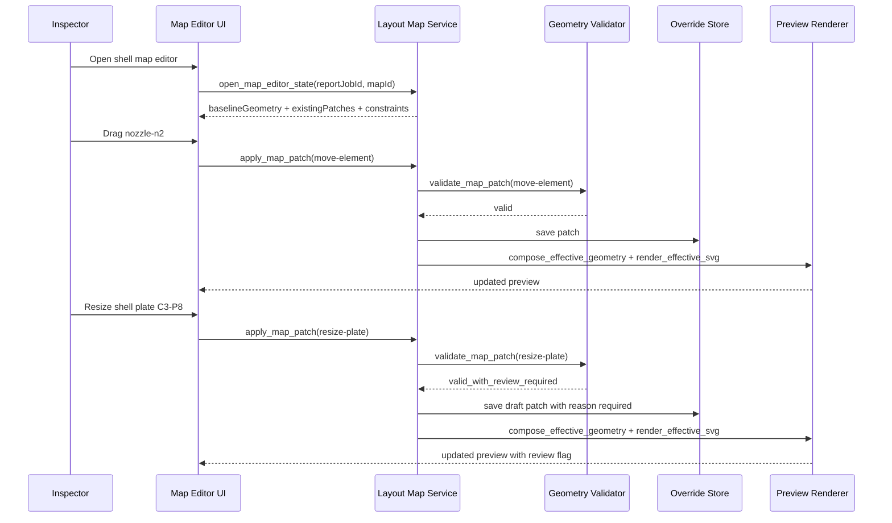

# AI Quality And Layout Map Control

> **Status: historical design reference.** This file preserves earlier product
> reasoning and may contain superseded V2, prototype, review, or output
> assumptions. Use `SYSTEM_ARCHITECTURE.md` and `DOCUMENTATION_INDEX.md` for
> current implementation decisions.

## Goal

Explain in concrete terms how Codex should be used to generate high-quality reports without inventing facts, and how layout maps should be controlled because the Android app already defines the metadata and map structure.

This is especially important because:

- report narrative can be AI-assisted
- layout maps must remain exact
- metadata and layout configuration already exist in the Android export

Companion operating-model reference:

- `apps/report-platform/CODEX_ROLES_AND_TOOLING.md`

## Core Rule

Codex should generate language, not geometry.

For this report platform:

- facts come from Android export plus manual report inputs
- layout geometry comes from deterministic rendering of exported metadata
- Codex assists with drafting, summarizing, grouping, and labeling
- Codex must not guess or redraw the structural map layout

Important refinement:

- users may edit report-side map presentation
- users may submit controlled geometry overrides when necessary
- those edits must be explicit, auditable, and separate from the imported baseline

Business refinement:

- Android output is the trusted baseline reference
- the final user-edited, user-approved report state is the authoritative publication output

## Responsibility Split

Use this split across the system:

### Deterministic, Non-AI Responsibilities

- schema validation
- record normalization
- tenant/workspace/role access control
- layout map geometry construction
- element placement projection
- UT point plotting
- finding-to-map linkage
- page composition
- PDF rendering

### Codex Responsibilities

- inspection narrative drafting
- scope wording
- recommendation wording
- explanation text around findings
- captions
- callout wording
- section summaries
- style alignment with precedent reports

### Human Responsibilities

- approve report facts
- validate engineering meaning
- review recommendations
- review map correctness
- accept, reject, or rerun drafted sections

## Why Layout Map Drawing Must Be Deterministic

The Android app already exports the important map-definition fields.

That means the report platform should not ask AI to recreate the geometry from prose.

If Codex tries to "draw" from text, we risk:

- wrong course/lane counts
- wrong plate positions
- wrong roof/floor segmentation
- misplaced nozzles or elements
- wrong finding linkage
- inconsistent map numbering across sections

Instead, the map must be compiled from exported structured data.

## Mermaid Is Not The Production Map Engine

Mermaid is useful for:

- system topology diagrams
- architecture diagrams
- workflow diagrams in docs

Mermaid is not the right production abstraction for editable tank layout maps.

Editable report maps need capabilities such as:

- drag and drop
- resize handles
- snapping and constraints
- patch history
- geometry validation
- preview/PDF-safe rendering

For this reason:

- use Mermaid for documentation diagrams
- use deterministic geometry plus an interactive editor for report maps

## Export Fields That Should Drive Layout Maps

The Android V2 Product export already includes the key building blocks:

### Layout Scope And Approval

- `layoutTargets`
- target/surface scope flags
- layout approval flags
- UT approval flags

These tell the report platform which maps exist and which are approved for reporting.

### Layout Configuration

`layoutConfigs` includes surface geometry inputs such as:

- `targetKey`
- `surfaceKey`
- `referenceMode`
- `referenceNote`
- `roofPattern`
- `roofRingCount`
- `roofSectorCount`
- `roofRowCount`
- `roofWidestRowPlateCount`
- `roofHasCenterOpening`
- `roofHasAnnularRing`
- `roofAnnularSectionCount`
- `shellCourseCount`
- `shellPlatesPerCourse`
- `shellLaneCount`
- `shellPlateOffset`
- `shellOffsetStartRow`
- `shellThirdOffsetStart`
- `floorTemplate`
- `floorPlateCount`
- `floorAnnularSectionCount`
- `floorPatternCountX`
- `floorPatternCountY`

### Placed Elements

`elements` includes:

- `targetKey`
- `elementId`
- `elementLabel`
- `elementTypeKey`
- `normalizedX`
- `normalizedY`

These should drive deterministic element overlays on the rendered map.

### UT Measurement Linkage

`utMeasurements` includes:

- `itemKey`
- `targetKey`
- `itemLabel`
- `itemKind`
- `laneId`
- `course`
- `plateId`
- `elementId`
- `value1` to `value5`

These are essential for tying measured points or regions back to precise map positions.

### Findings Linkage

`findings` includes:

- `findingId`
- `targetKey`
- `itemLabel`
- `itemKind`
- `linkedUtItemKey`

This should drive deterministic highlighting and callout linkage.

## Recommended Map Rendering Pipeline

The layout-map system should work like this:

```text
Android export
  -> schema validation
  -> normalized report job
  -> canonical geometry model
  -> deterministic SVG map renderer
  -> overlay elements / UT / findings
  -> page block for preview/PDF
```

If user edits are enabled, the pipeline becomes:

```text
Android export
  -> schema validation
  -> normalized report job
  -> canonical baseline geometry model
  -> user override patches
  -> effective geometry composer
  -> deterministic SVG map renderer
  -> overlay elements / UT / findings
  -> page block for preview/PDF
```

## Canonical Geometry Model

Before any map is rendered, the report platform should convert raw app export into a canonical geometry model.

Suggested model pieces:

- `MapSurface`
- `ReferenceSystem`
- `ShellGeometry`
- `RoofGeometry`
- `FloorGeometry`
- `PlacedElement`
- `MeasurementAnchor`
- `FindingAnchor`
- `MapLegend`

This geometry model should be generated by code, not AI.

Suggested split:

- `BaselineGeometry`: imported from Android-derived normalized data
- `GeometryOverridePatch`: user-editable report-side changes
- `EffectiveGeometry`: composed baseline plus approved overrides

## Surface-Specific Renderers

Use dedicated renderers per surface type.

### Shell Renderer

Inputs:

- `shellCourseCount`
- `shellPlatesPerCourse`
- `shellLaneCount`
- `shellPlateOffset`
- `shellOffsetStartRow`
- `shellThirdOffsetStart`
- element positions
- UT anchors
- finding anchors

Outputs:

- shell grid SVG
- course and lane labels
- element overlays
- finding markers
- optional measured-region overlays

### Roof Renderer

Inputs:

- `roofPattern`
- `roofRingCount`
- `roofSectorCount`
- `roofRowCount`
- `roofWidestRowPlateCount`
- `roofHasCenterOpening`
- `roofHasAnnularRing`
- `roofAnnularSectionCount`
- element positions
- UT anchors
- finding anchors

Outputs:

- roof plate segmentation SVG
- roof labels
- nozzle/manhole overlays
- finding markers

### Floor Renderer

Inputs:

- `floorTemplate`
- `floorPlateCount`
- `floorAnnularSectionCount`
- `floorPatternCountX`
- `floorPatternCountY`
- element positions
- UT anchors
- finding anchors

Outputs:

- floor layout SVG
- annular/grid overlays
- element and finding overlays

## Where Codex Fits In Around The Map

Codex should work around the map, not inside the geometry engine.

Codex can:

- suggest map captions
- suggest callout labels
- suggest legend wording
- summarize what changed after a user edit
- propose candidate geometry patches for user confirmation

Codex should not:

- directly commit geometry edits without confirmation
- invent coordinates
- invent plate dimensions
- alter engineering topology invisibly

## User-Editable Map Model

The report platform should support a proper edit model for maps.

### Safe Presentation Edits

These can be freely edited in the report layer:

- label position
- callout position
- overlay visibility
- zoom or crop
- page placement

### Controlled Geometry Edits

These should be supported, but more carefully:

- moving elements
- adjusting plate dimensions
- revising anchor points
- resizing regions

These edits should create patch records with:

- `patchId`
- `targetId`
- `patchType`
- `previousValue`
- `nextValue`
- `editedByUserId`
- `reason`
- validation outcome

### Factual Corrections

If an edit changes engineering meaning, it should be treated as a factual correction, not just a visual tweak.

Examples:

- changing plate count
- changing course boundaries
- materially relocating a nozzle or manhole

These should trigger:

- stronger validation
- revision history
- optional reviewer approval
- possible source-data correction workflow

## Final Approved Report Matters Most

For product behavior, the platform should distinguish:

- `ImportedBaseline`
- `WorkingReportState`
- `ApprovedReportSnapshot`

The final client-facing truth is the approved report snapshot.

That means:

- preview and PDF should be rendered from approved effective state
- approved text edits are first-class product data
- approved map overrides are first-class product data
- AI output without approval is only draft material

This is important because the business outcome is not just to preserve Android export data.

The business outcome is to produce a final reviewed report that users stand behind.

## Recommended UI Direction

The editable map UI should be a purpose-built interactive editor, not a Mermaid editor.

Recommended product direction:

- keep canonical geometry in structured `TypeScript` models
- render printable maps as deterministic `SVG`
- add an interactive editor layer for dragging, resizing, and patching

Good implementation options:

- custom React + SVG editor for maximum print control
- React + Konva if you want built-in drag, resize, and transform interactions
- Fabric.js if you want a strong interactive canvas object model with serialization support

Regardless of the UI library choice:

- persistence should remain patch-based and auditable
- preview/PDF should render from effective geometry, not raw editor state

## Concrete Example: Shell Layout Map Editing

Here is one practical example for how map editing should work in the report platform.

Scenario:

- Android export provides the shell baseline
- the report platform renders the shell map
- the inspector notices one nozzle marker is slightly off in the final report view
- the inspector also wants to adjust one plate width to match the approved report presentation

Important distinction:

- moving the nozzle marker may be a presentation or placement correction
- changing a plate width may be a factual geometry correction

The system should treat those edits differently.

### Example Tool Stack

Recommended stack for this example:

- baseline and effective geometry models in `TypeScript`
- deterministic printable renderer in `SVG`
- interactive editor in React
- `React + Konva` if we want strong drag/resize/transform interaction quickly
- or custom React + SVG if we want tighter control over print parity
- backend patch validation service
- override storage in `Postgres`

Suggested internal tools:

- `report_layout.open_map_editor_state`
- `report_layout.apply_map_patch`
- `report_layout.validate_map_patch`
- `report_layout.compose_effective_geometry`
- `report_layout.render_effective_svg`
- `report_layout.list_map_revision_history`

### Example Baseline Data

Imported baseline:

- `surfaceKey = "shell"`
- `shellCourseCount = 5`
- `shellPlatesPerCourse = 14`
- `shellLaneCount = 4`
- `elementId = "nozzle-n2"`
- `normalizedX = 0.42`
- `normalizedY = 0.18`

The editor first loads this baseline into an editable map state.

### Example Workflow

1. User opens the shell map editor from the report preview.
2. The platform calls `report_layout.open_map_editor_state`.
3. That tool loads:
   - `BaselineGeometry`
   - existing approved or draft override patches
   - geometry constraints
4. The UI renders the effective shell map.
5. The user drags nozzle `nozzle-n2` slightly to the right.
6. The editor builds a `move-element` patch.
7. The platform calls `report_layout.validate_map_patch`.
8. If valid, the patch is stored and the effective geometry is recomposed.
9. The preview updates immediately.
10. The user then tries to widen one shell plate.
11. The editor builds a `resize-plate` patch.
12. The validator marks this as a factual geometry change and requires reason plus stronger approval.
13. The user enters a reason.
14. The patch is stored in draft state and flagged for review.
15. The effective preview is regenerated from baseline plus patch.
16. If approved, the final report snapshot includes that override.

### Example Sequence



### Example Patch Records

Move element patch:

```json
{
  "patchType": "move-element",
  "targetId": "nozzle-n2",
  "previousValue": { "x": 0.42, "y": 0.18 },
  "nextValue": { "x": 0.46, "y": 0.18 },
  "reason": "Align marker with approved report map layout"
}
```

Resize plate patch:

```json
{
  "patchType": "resize-plate",
  "targetId": "shell-course-3-plate-8",
  "previousValue": { "widthRatio": 1.0 },
  "nextValue": { "widthRatio": 1.08 },
  "reason": "Correct plate geometry for final approved report presentation"
}
```

### Validation Behavior

For `move-element`:

- check the element remains on the shell surface
- check anchor relationships remain valid
- check the patch is replayable

For `resize-plate`:

- check neighboring plate geometry still closes correctly
- check plate count and course boundaries remain coherent
- classify the change as presentation-only or factual correction
- require stronger approval when engineering meaning changes

### Where AI Helps In This Example

AI can help with:

- suggesting a caption after the map changes
- explaining why a validation rule failed
- summarizing the edit history for the reviewer
- proposing a likely patch before the user confirms it

AI should not directly commit either patch on its own.

### Final Output Rule

The published report map should always render from:

- imported Android baseline
- approved map override patches
- effective geometry composer

Not from raw editor drag state and not from raw AI output.

Codex can help with:

- map title wording
- figure caption wording
- figure introduction text
- callout text that references existing anchors
- summary explanation of what the map shows

Codex should not decide:

- where courses are drawn
- where sectors/plates are drawn
- how offsets are applied
- where elements sit
- where findings attach
- how numbered regions are laid out

## Quality Gates For AI-Generated Report Sections

Use explicit quality gates before a draft section is accepted.

### Gate 1: Input Validation

Confirm:

- export JSON is schema-valid
- required metadata exists
- target/workspace identity is present
- required attachments exist

### Gate 2: Geometry Validation

Confirm:

- each approved target has a valid layout config
- shell/roof/floor counts are internally consistent
- element positions are within expected bounds
- UT points can resolve to map anchors
- findings can resolve to target items or linked UT items

### Gate 3: Deterministic Map Render Validation

Confirm:

- renderer produced the expected map artifact
- labels are present
- no missing overlays
- legend and scale/reference mode match the metadata

### Gate 4: Codex Grounding Validation

Confirm:

- section job contains only current inspection facts
- precedent retrieval is authorized
- prompt explicitly forbids invention
- layout map references use existing anchor ids/titles

### Gate 5: Draft Consistency Validation

Confirm:

- narrative agrees with map ids and labels
- recommendations do not contradict findings
- captions match the actual rendered map
- section wording does not reference nonexistent geometry

### Gate 6: Human Review

Confirm:

- reviewer/inspector accepts section
- engineering meaning is acceptable
- map and narrative match

## Suggested Section Job Design For Map-Related Sections

For any section that discusses a map, the Codex section job should receive:

- approved factual summary
- rendered map metadata
- anchor ids and labels
- allowed reference phrases
- retrieved precedent examples

It should not receive permission to mutate geometry.

Example job inputs:

- `mapTitle`
- `mapSurface`
- `referenceMode`
- `anchorList`
- `findingSummary`
- `figureNumber`
- `precedentSections`

Expected outputs:

- `figureCaption`
- `mapIntroParagraph`
- `calloutNotes`

## How To Ensure Report Quality End To End

Use a staged generation model:

1. import and validate facts
2. build geometry model
3. render map deterministically
4. retrieve authorized precedent
5. run Codex for one section
6. validate draft against facts and map anchors
7. review and approve
8. compose preview/PDF

This is safer than "generate the whole report" in one pass.

## Practical Product Rule

For this report platform, treat maps like tables, not like prose.

That means:

- maps are rendered by code from structured inputs
- Codex can explain the map
- Codex cannot define the map

## Recommended Next Implementation Pieces

Build these first:

1. `CanonicalGeometryModel`
2. `ShellMapRenderer`
3. `RoofMapRenderer`
4. `FloorMapRenderer`
5. `MeasurementAnchorResolver`
6. `FindingAnchorResolver`
7. `MapRenderArtifact`
8. `MapNarrativeSectionJob`
9. `DraftQualityValidator`

That will give us a strong quality foundation before broader report automation expands.
