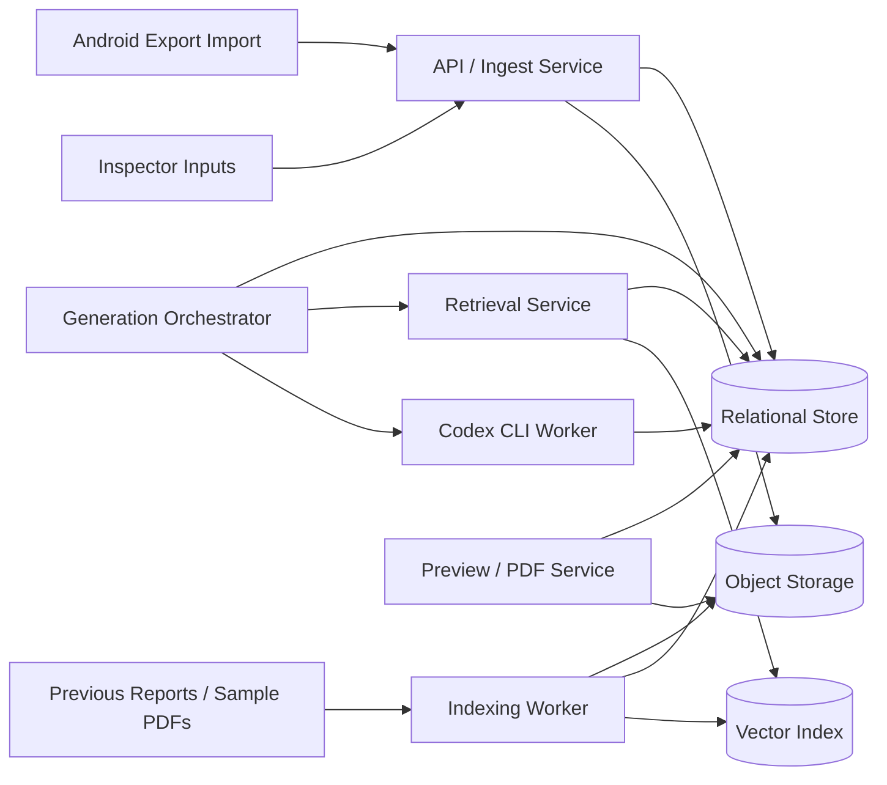

# Backend Storage Architecture

## Goal

Define the product-standard backend storage model for `apps/report-platform`, including:

- transactional backend storage
- object/file storage
- vector database retrieval

Detailed precedent retrieval, KB tuning, and evaluation procedures are defined in:

- `apps/report-platform/PRECEDENT_KB_ARCHITECTURE.md`

This architecture implements the report-platform control plane defined in
`SYSTEM_ARCHITECTURE.md`. It aligns with the LAIQ inspection app V3
tenant/workspace/user contract while remaining an independent application.

## Storage Layers

The report platform should use three complementary storage layers.

### 1. Transactional Backend Storage

Purpose:
- store product entities
- enforce tenancy and role rules
- persist report workflow state
- persist provenance and audit data

Required database:
- `Postgres`

Implementation status:
- PostgreSQL is the only runtime and audit database.
- Startup requires `DATABASE_URL` and runs versioned migrations.
- Local development uses the same PostgreSQL engine through `compose.yaml`.
- Embedded/file database fallbacks are intentionally unsupported.

Commercial scale target:
- approximately 200 user accounts in the early commercial stage
- approximately 50 concurrent active editors/reviewers
- background generation, export, indexing, and eval jobs running alongside interactive UI work
- support for future horizontal API scaling

Primary responsibilities:
- tenants
- workspaces
- users
- role assignments
- imported inspection packages
- report jobs
- report section drafts
- review decisions
- publication status
- knowledge-base document metadata
- retrieval provenance
- generation run history
- audit events

### 2. Object/File Storage

Purpose:
- store large files and immutable artifacts

Recommended default:
- S3-compatible object storage or equivalent blob storage

Implementation status:
- V3 attachment ingestion uses authenticated PostgreSQL upload sessions and short-lived signed S3-compatible URLs.
- The server issues opaque object keys and independently verifies uploaded bytes against SHA-256, byte size, and media type before report import.
- Authorized report evidence reads use short-lived signed URLs; bucket listing and object keys are never exposed to the app.
- Report-side MFL imports persist source PDFs, extraction/map manifests, transparent corrosion overlays, immutable plate previews, and source-layout vectors in S3-compatible storage.
- PostgreSQL owns MFL artifact scope and provenance; local disk is temporary processing space only, and browser/DOCX reads verify stored size, media type, and SHA-256.

Primary responsibilities:
- imported LAIQ inspection app V3 export packages
- imported field attachments
- source PDF reports
- OCR text extracts
- rendered preview artifacts
- generated PDFs
- screenshot/debug artifacts where needed

### 3. Vector Retrieval Storage

Purpose:
- retrieve similar prior report content for section drafting

Recommended default:
- `pgvector` in the same Postgres system for the first product-standard version

Why this is a strong first choice:
- simpler operations
- easier tenant/workspace metadata filtering
- easier provenance joins
- easier auditability

Possible future evolution:
- move to a dedicated vector service only if scale, latency, or operational needs justify it

## High-Level Backend Topology



## Product Entities In Transactional Storage

Recommended core records:

- `Tenant`
- `Workspace`
- `User`
- `UserRoleAssignment`
- `InspectionImport`
- `InspectionImportAttachment`
- `ReportJob`
- `ReportSectionDraft`
- `ReportSectionRevision`
- `ReportReviewDecision`
- `ReportPublication`
- `KnowledgeBaseDocument`
- `KnowledgeBaseChunk`
- `KnowledgeBaseSection`
- `KnowledgeBaseStylePattern`
- `KnowledgeBaseLayoutPattern`
- `KnowledgeBaseGoldExample`
- `KnowledgeBaseEvalRun`
- `GenerationRun`
- `GenerationRunSection`
- `AuditEvent`

Recommended common fields on report-side entities:

- `tenantId`
- `workspaceId`
- `inspectionId`
- `inspectionReference`
- `createdByUserId`
- `lastEditedByUserId`
- `createdAt`
- `updatedAt`

## Object Storage Layout

Suggested object prefixes:

```text
tenants/{tenantScopeHash}/workspaces/{workspaceScopeHash}/inspections/{inspectionScopeHash}/objects/{objectId}
tenants/{tenantId}/workspaces/{workspaceId}/reports/{reportJobId}/drafts/{sectionKey}.json
tenants/{tenantId}/workspaces/{workspaceId}/reports/{reportJobId}/preview/{artifactId}
tenants/{tenantId}/workspaces/{workspaceId}/reports/{reportJobId}/final/{fileName}.pdf
tenants/{tenantId}/workspaces/{workspaceId}/knowledge-base/{documentId}/source.pdf
platform-library/reports/{documentId}/source.pdf
```

Object storage rules:

- immutable source imports where possible
- version generated outputs
- signed URL access only
- no direct cross-tenant listing
- no client filenames or raw tenant/customer labels in trusted object keys

## Vector Database Role

The vector database should support retrieval for:

- section drafting
- structure suggestions
- tone/style matching
- appendix inclusion hints

It should not be treated as a source of truth for current inspection facts.

## What Gets Embedded

Recommended embedding units:

- report section chunks
- appendix intro chunks
- recommendation sections
- standard narrative blocks
- approved redacted exemplars

Do not embed blindly at whole-document level only.

Preferred chunking strategy:

- split by section first
- then by paragraph/table-adjacent chunk
- preserve section title and report-family metadata

## Vector Metadata Schema

Every embedded chunk should include metadata such as:

- `documentId`
- `chunkId`
- `sourceType`
- `tenantId`
- `workspaceId`
- `visibilityScope`
- `reportFamily`
- `sectionType`
- `inspectionType`
- `tankType`
- `approvalStatus`
- `isRedacted`
- `sourceReportName`
- `pageStart`
- `pageEnd`

This metadata is mandatory for safe filtering.

## Retrieval Strategy

Use hybrid retrieval:

1. metadata filter first
2. vector similarity search
3. optional keyword or lexical reranking
4. provenance capture

Minimum retrieval filters:

- actor can access tenant/workspace
- document is approved for retrieval
- section type matches or is closely related
- report family is compatible when possible

## Multi-Tenant Isolation Rules

Transactional, object, and vector storage must all enforce the same boundaries:

- tenant-private data stays inside tenant scope
- workspace-private data stays inside workspace scope unless promoted
- platform sample library is explicit and separate
- no vector query may search unrestricted global tenant content by default

Recommended enforcement methods:

- relational filtering and/or row-level security
- object key prefix isolation plus signed access
- vector metadata filters enforced by the retrieval service

## Role-Aware Access Rules

Aligned with the report-platform identity and tenancy contract:

- `Super Admin`: can manage platform libraries and tenant setup
- `Manager`: can view/manage report jobs and publication policy inside allowed scope
- `Inspector`: can create report jobs, edit manual inputs, and run section generation
- `Reviewer`: optional future role for tenants that require independent review
- `Client Viewer`: read-only access to approved assigned outputs

Users may carry multiple roles.

## Backend Service Responsibilities

Recommended logical services:

### API Service

Handles:
- auth context
- report job CRUD
- manual input updates
- review actions
- preview/PDF requests

### Ingest Worker

Handles:
- Android package import
- attachment verification
- relational persistence
- object storage writes

### Indexing Worker

Handles:
- PDF ingestion
- OCR/text extraction
- chunking
- embedding generation
- vector writes

### Retrieval Service

Handles:
- metadata filtering
- vector lookup
- lexical reranking if used
- provenance packaging for section jobs
- precedent-pack creation for Codex CLI workers
- retrieval evaluation against approved gold examples

### Generation Orchestrator

Handles:
- section planning
- Codex CLI job submission
- run tracking
- regeneration rules

### Preview / PDF Service

Handles:
- section composition
- HTML preview
- print/PDF rendering
- final artifact storage

## Audit And Provenance

Persist these records for every generation run:

- actor identity
- actor roles
- input package version
- manual input version
- retrieved chunk ids
- prompt/job payload hash
- generated output version
- review result

This is important for traceability and tenant trust.

## Recommended First-Version Choice

For the first product-standard release:

- `Postgres` for transactional storage
- `pgvector` for vector retrieval
- S3-compatible object storage for files
- queue-backed workers for long-running generation/export/indexing jobs
- optimistic concurrency/version checks for section draft editing

This gives a practical balance of:

- product readiness
- tenant-safe filtering
- operational simplicity
- auditability

## Recommended Next Implementation Artifacts

Define these contracts early:

1. `AuthorizationContext`
2. `ReportJobRecord`
3. `ReportSectionDraftRecord`
4. `KnowledgeBaseDocumentRecord`
5. `KnowledgeBaseChunkRecord`
6. `GenerationRunRecord`
7. object storage key conventions
8. vector metadata filter contract
9. PostgreSQL repository/query contracts with no alternate database implementation
10. `JobQueue` interface for generation, export, indexing, and eval work
11. optimistic concurrency fields such as `version`, `updatedAt`, and `updatedByUserId`

That will let the frontend, backend, retrieval, and Codex CLI orchestration evolve against a shared product-standard backend model.

## Product Hardening Direction

PostgreSQL-only storage and versioned schema migrations are implemented. Remaining hardening phases:

1. Add row-level tenant/workspace policies in PostgreSQL in addition to API authorization.
2. Extend the implemented section-draft optimistic concurrency guard to approval, manual-input, and layout-override writes.
3. Move final DOCX/PDF outputs, KB source files, and remaining generated figures to object storage; app evidence and MFL source/derivative artifacts are already on this boundary.
4. Add queue-backed background workers for generation, DOCX export, KB indexing, and eval runs.
5. Add managed backup, restore, observability, and connection-pool alerting.

For 50 concurrent active users, the most important backend behaviors are:

- short transactions
- no long-running AI or DOCX work inside request transactions
- section-level locking/version checks instead of whole-report locks
- explicit audit rows for every generation, edit, approval, and export action
- safe retry/idempotency keys for import, generation, export, and approval routes
