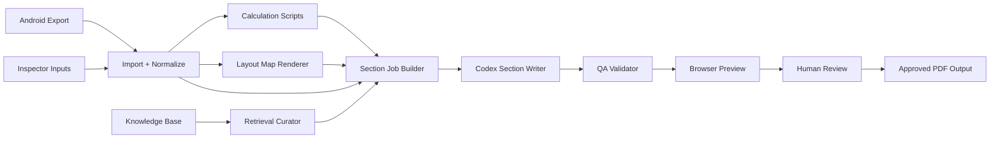

# Codex Roles And Tooling

## Goal

Define the product-standard role split for Codex in `apps/report-platform`, and clarify which work should be done by:

- Codex
- deterministic scripts and services
- retrieval and storage systems
- human reviewers

This document is the operating model for section-by-section report generation.

Supporting references:

- `apps/report-platform/REPORT_GENERATION_TOPOLOGY.md`
- `apps/report-platform/BACKEND_STORAGE_ARCHITECTURE.md`
- `apps/report-platform/AI_QUALITY_AND_LAYOUTMAP.md`
- `apps/report-platform/PRECEDENT_KB_ARCHITECTURE.md`

## Short Answer

Yes, your direction is right, but the product-standard split should be sharper:

1. Codex generates report language and section drafts.
2. Codex can control tools for layout rendering, formatting, and job flow.
3. Calculations and engineering models should be done by deterministic scripts, not by free-form AI reasoning.

For product quality, it is better to think of Codex as several controlled roles instead of one giant report-writing prompt.

## Core Rule

Codex is not the system of record.

For this platform:

- current-report facts come from Android export plus manual inspector/report inputs
- map geometry comes from deterministic renderers
- calculations come from deterministic code
- Codex turns structured facts into readable report sections
- Codex may orchestrate tools, but should not replace them

## Recommended Codex Role Split

Use six roles in the product-standard design.

### 1. Orchestrator Role

Purpose:
- decide which section job runs next
- collect the right structured inputs
- invoke retrieval, map rendering, calculations, and drafting
- persist run history and provenance

What this role should do:
- build a `SectionGenerationJob`
- call deterministic services first
- call Codex only after facts, calculations, and map artifacts are ready
- store run status, warnings, and outputs

What this role should not do:
- invent missing facts
- skip validation
- publish directly without review rules

Recommended tools:
- backend worker service in `TypeScript`/`Node.js`
- job queue
- `codex exec --json`
- `codex exec --output-schema`
- `@openai/codex-sdk` when the backend needs stronger thread control than shell calls
- `Postgres` for run state and audit history

Why these fit:
- official Codex guidance supports `codex exec` for scripted pipelines and machine-readable JSON output
- the Codex SDK is better when the application needs programmatic thread control and retries

### 2. Section Writer Role

Purpose:
- draft narrative sections from approved facts and retrieved precedent

Typical sections:
- scope of inspection
- general tank information
- inspection report narrative
- recommendations wording
- photo captions
- appendix intros

Inputs:
- normalized `ReportJob`
- manual report-side inputs
- calculation outputs
- map artifact references
- retrieved precedent snippets
- section-specific instructions

Outputs:
- section title
- section body
- optional tables/callouts requested
- provenance references
- unresolved question flags

What this role should not do:
- invent measurements
- change map geometry
- produce unverified calculations
- copy old report facts into the new report

Recommended tools:
- `codex exec` for section-by-section generation
- `@openai/codex-sdk` for persistent section threads
- JSON-schema-constrained outputs for stable downstream processing

Recommended output contract:

```json
{
  "sectionKey": "inspection-report",
  "status": "draft",
  "title": "Inspection Report",
  "bodyMarkdown": "Tank shell courses were visually examined...",
  "factReferences": ["inspectionRecord.shellCourseCount", "findings[3]"],
  "precedentReferences": ["kb:report-2019-022:inspection-report"],
  "warnings": [],
  "openQuestions": []
}
```

### 3. Layout Map Controller Role

Purpose:
- coordinate map generation without letting AI invent geometry

This role is especially important because Android V2 Product already defines:

- layout targets
- shell/roof/floor configuration
- element placement
- UT linkage
- finding linkage

Correct product behavior:
- Codex asks deterministic map tools to render shell, roof, or floor maps
- Codex can request legends, captions, callout wording, and page composition hints
- Codex must not decide coordinates or redraw topology from prose

Recommended tools:
- internal geometry modules in `TypeScript`
- deterministic `SVG` renderers for shell, roof, and floor
- React/SVG page blocks for preview
- optional internal MCP tools such as `report_layout.render_shell_map`
- optional internal MCP tools such as `report_layout.render_roof_map`
- optional internal MCP tools such as `report_layout.render_floor_map`
- optional internal MCP tools such as `report_layout.compose_map_page`

Recommended map artifact contract:

```json
{
  "surfaceKey": "shell",
  "targetKey": "tank-shell",
  "artifactType": "svg",
  "artifactPath": "reports/job-123/maps/shell-overview.svg",
  "findingAnchors": 8,
  "utAnchors": 42,
  "warnings": []
}
```

### 4. Calculation Role

Purpose:
- run thickness summaries, grouping logic, worksheet outputs, and engineering calculations from deterministic code

Correct product behavior:
- formulas live in script modules
- outputs are versioned and testable
- Codex may explain the result in words
- Codex must not be the authoritative calculator

Examples of deterministic outputs:
- minimum, maximum, and average UT values
- grouped readings by course/lane/plate
- corrosion summary tables
- worksheet appendix values
- report-side derived flags

Recommended tools:
- `TypeScript` calculation modules
- unit tests with fixed fixtures
- explicit formula versioning
- JSON outputs that the report composer and Codex can consume

Suggested calculation contract:

```json
{
  "calculatorKey": "shell-ut-summary",
  "version": "1.0.0",
  "inputsHash": "sha256:...",
  "results": {
    "minimum": 0.214,
    "maximum": 0.287,
    "average": 0.246
  },
  "warnings": []
}
```

### 5. Retrieval Curator Role

Purpose:
- fetch precedent safely from the knowledge base

This role should retrieve:
- section structure patterns
- wording style hints
- appendix patterns
- similar approved report sections

This role should not retrieve:
- unauthorized tenant content
- unapproved source material
- full old reports when only one section is needed

Recommended tools:
- `Postgres + pgvector` retrieval service for product-owned tenant data
- metadata filters on `tenantId`, `workspaceId`, `visibilityScope`, `sectionType`, `reportFamily`
- lexical search and reranking for exact section wording and report terminology
- gold example evaluation for retrieval tuning
- optional OpenAI `file_search` only for controlled shared libraries or future experiments, not as the primary tenant-private store

Why this split is strong:
- your current report-platform architecture already prefers product-owned relational and vector control
- OpenAI file search officially supports metadata filtering, which is useful where a hosted vector store is appropriate
- tenant-private retrieval is usually safer when the application owns filtering and provenance end to end

### 6. QA Reviewer Role

Purpose:
- check whether generated content is complete, grounded, and ready for human review

This role should run after drafting, not before facts are prepared.

Checks should include:
- schema validity
- missing placeholders
- unresolved open questions
- map artifact presence
- calculation attachment presence
- fact-reference coverage
- forbidden wording patterns such as guessed dates or copied tank numbers
- section completeness against the report family template

Recommended tools:
- JSON Schema validation with `ajv`
- deterministic business-rule validators
- regression fixtures
- Playwright screenshot checks for preview pages
- optional second-pass Codex review prompt for style and coherence only

Important rule:
- the QA role may flag issues
- the QA role may propose fixes
- final engineering acceptance remains human-owned

## Why One Big Prompt Is The Wrong Shape

Avoid asking Codex to do everything in one pass such as:

- interpret all facts
- retrieve precedent
- calculate values
- draw maps
- paginate the report
- output final PDF-ready content

That creates weak provenance and makes failures hard to detect.

Instead, split the pipeline into small jobs with deterministic checkpoints between them.

## Recommended Control Topology



## CLI Vs SDK Vs Responses API

All three can be useful, but they serve different jobs.

### Use `codex exec` First

Best for:
- first product worker
- section-by-section generation
- shell-driven pipelines
- cron or queue jobs

Use it with:
- `--json` for machine-readable event logs
- `--output-schema` for stable section outputs
- `--ephemeral` for stateless runs where appropriate

### Use `@openai/codex-sdk` When The App Needs Tighter Control

Best for:
- backend-managed retries
- resumed threads
- stronger in-app orchestration
- long-running product workers

This is the more product-standard direction once the report platform grows beyond shell wrappers.

### Use OpenAI Responses API For Smaller Model Services

Best for:
- non-Codex microservices
- schema-constrained classification or extraction
- direct function-calling workflows
- optional hosted retrieval experiments

Good examples in this product:
- classify appendix type
- convert OCR fragments into structured metadata
- run narrow helper prompts under strict schemas

For your stated design, Codex CLI or Codex SDK should remain the main report-drafting worker.

## Recommended Product Tool Stack

Use this as the default stack unless the implementation reveals a strong reason to swap.

| Area | Recommended tools | Why |
| --- | --- | --- |
| Import validation | JSON Schema + `ajv` | aligns with package contracts and deterministic validation |
| Internal domain typing | `TypeScript` + optional `zod` wrappers | safer report-job code paths |
| Transactional storage | `Postgres` | roles, jobs, provenance, audit |
| Vector retrieval | `pgvector` | tenant-aware retrieval close to metadata |
| File storage | S3-compatible object storage | imports, images, previews, PDFs |
| Section generation | `codex exec`, later `@openai/codex-sdk` | product-controlled drafting worker |
| Tool orchestration | internal CLI scripts or MCP servers | clearer boundaries than free-form prompts |
| Layout maps | custom `SVG` renderers in `TypeScript` | deterministic geometry from Android metadata |
| Browser preview | React page blocks + print CSS | preview-first workflow |
| PDF output | headless browser or Playwright PDF render | keeps preview and PDF close |
| Precedent ingest | `pdftotext`, OCR only when needed, chunk/index workers | reliable report knowledge-base ingestion |
| QA | `ajv`, unit tests, Playwright screenshots, review prompts | catches both data and presentation regressions |

## Best Way To Expose Internal Tools To Codex

For product-standard operation, prefer explicit tools over vague instructions.

Good options:

- backend invokes deterministic scripts before calling Codex
- backend exposes internal tools to Codex through MCP
- backend stores each tool result as an auditable artifact

Recommended internal tool families:

- `report_import.*`
- `report_kb.*`
- `report_calc.*`
- `report_layout.*`
- `report_preview.*`
- `report_validation.*`

Example tools:

- `report_kb.search_sections`
- `report_calc.run_shell_ut_summary`
- `report_layout.render_surface_map`
- `report_preview.compose_section_preview`
- `report_validation.check_section_output`

This is much safer than asking Codex to simulate those actions in plain text.

## Quality Rules By Role

Apply these hard rules:

- Orchestrator cannot send incomplete facts to the section writer.
- Section writer cannot emit authoritative numbers not present in facts or calculator outputs.
- Layout controller cannot alter coordinates from Android-defined layout metadata.
- Calculation role cannot accept undocumented formula changes.
- Retrieval role cannot cross tenant or workspace boundaries.
- QA role cannot auto-approve engineering meaning.

## Recommended First Implementation Sequence

Build in this order:

1. deterministic import normalization
2. deterministic calculation modules
3. deterministic map renderer
4. section job contract plus `codex exec --output-schema`
5. QA validator for section outputs
6. preview composer
7. PDF export

This sequence gives you strong quality control early, especially around layout maps and calculations.

## Official References

- Codex non-interactive mode: https://developers.openai.com/codex/noninteractive
- Codex SDK: https://developers.openai.com/codex/sdk
- Codex MCP support: https://developers.openai.com/codex/mcp
- OpenAI Responses API overview: https://developers.openai.com/api/reference/responses/overview
- OpenAI Structured Outputs: https://developers.openai.com/api/docs/guides/structured-outputs
- OpenAI Function calling: https://developers.openai.com/api/docs/guides/function-calling
- OpenAI File search: https://developers.openai.com/api/docs/guides/tools-file-search
