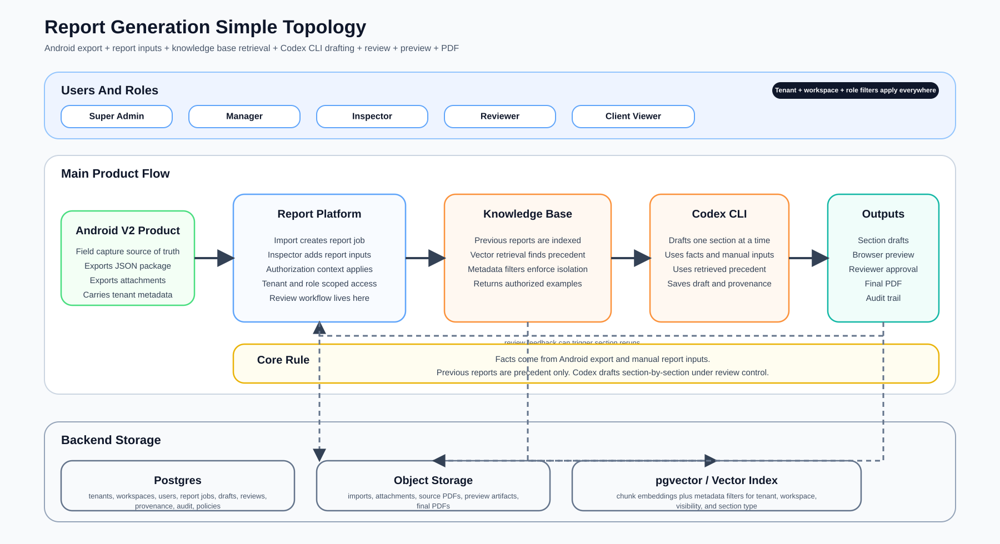
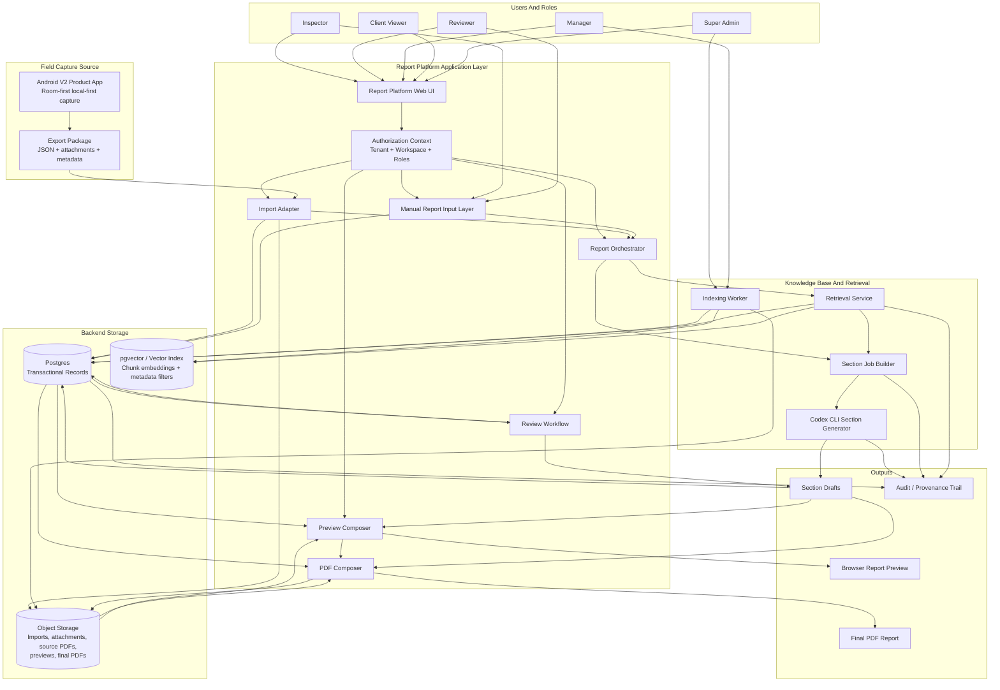
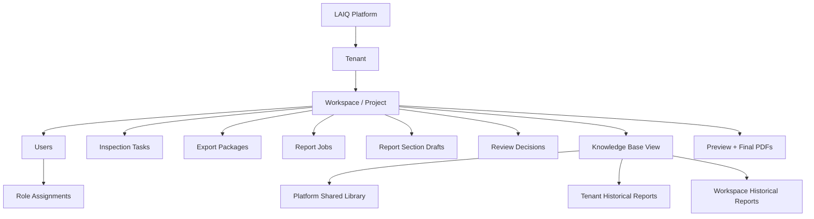
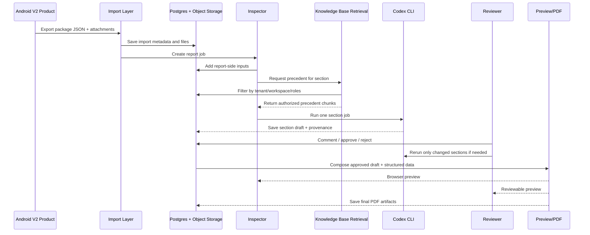
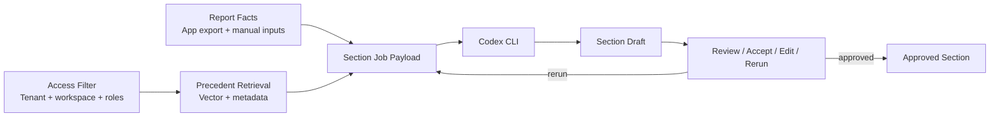

# Full System Diagram

## Purpose

This page shows the full report-generation system in one place so the product flow is easier to understand.

It combines:

- Android V2 Product export handoff
- inspector and reviewer inputs
- multi-tenant backend storage
- knowledge-base indexing and vector retrieval
- Codex CLI section generation
- browser preview and final PDF output

Detailed AI-engine internals:

- `apps/report-platform/AI_ENGINE_SYSTEM_DIAGRAM.md`

## One-Page Summary

The system works in five big stages:

1. Android V2 Product exports a structured inspection package.
2. The report platform imports that package into a tenant/workspace report job.
3. Inspectors add report-side inputs and the platform retrieves relevant precedent from the knowledge base.
4. Codex CLI drafts sections one-by-one using facts, manual inputs, and retrieved precedent.
5. Reviewers approve sections, then the platform composes browser preview and final PDF output.

## Visual Diagram



The SVG above is the primary visual version.

It is intentionally simplified so the main flow is easy to read.

The Mermaid diagrams below are kept as editable detailed source references.

## Full Layered System Diagram



## Tenant-Scoped Data Model View



## End-To-End Lifecycle



## Section Generation Loop



## How To Read The System

### 1. Facts Start In Android

The Android app is the field system of record for captured inspection data.

It exports:

- structured JSON
- attachments
- tenant/workspace/user/report-handoff metadata

### 2. Report Platform Creates A Report Job

The import layer converts Android output into a backend report job.

That report job becomes the report-side working container for:

- manual inspector inputs
- section drafts
- review decisions
- preview and final outputs

### 3. The Knowledge Base Supplies Precedent

Previous reports are indexed into:

- source files in object storage
- metadata in Postgres
- chunk embeddings in the vector layer

Retrieval is always filtered by:

- tenant
- workspace
- visibility policy
- actor role

### 4. Codex CLI Drafts Section By Section

Codex CLI does not write the whole report in one shot.

Instead, the orchestrator builds a section job with:

- current facts
- current manual inputs
- retrieved precedent
- generation rules

Then Codex CLI drafts one section, which can be reviewed or rerun independently.

### 5. Review Locks The Content

Inspectors and reviewers check the drafts.

Depending on tenant policy:

- reviewer approval may be optional
- or reviewer approval may be required before final publication

### 6. Preview And PDF Are The Final Composition Layer

The final report is composed from:

- structured page blocks
- approved section drafts
- imported tables and attachments
- report styling and pagination rules

That composition produces:

- browser preview
- final PDF

## Quick Mental Model

If you want the shortest way to think about it:

```text
Android export facts
  + Inspector report inputs
  + Retrieved precedent from approved previous reports
  -> Codex CLI drafts one section at a time
  -> Human review
  -> Browser preview
  -> Final PDF
```

## Best Next Build Step

If we want to turn this diagram into implementation, the next concrete contracts should be:

1. `AuthorizationContext`
2. `ReportJob`
3. `ManualReportInputs`
4. `KnowledgeBaseDocument`
5. `KnowledgeBaseChunk`
6. `SectionJob`
7. `SectionDraft`
8. `GenerationRun`

Once these exist, the diagram becomes directly buildable.
