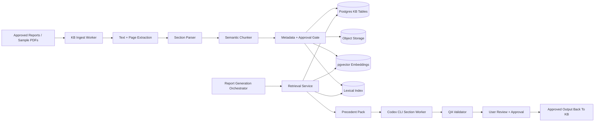

# Precedent Knowledge Base Architecture

## Purpose

Define the product-standard knowledge base for precedent retrieval in `apps/report-platform`.

The knowledge base should make report generation more reliable by retrieving approved examples of:

- report wording
- section structure
- formatting patterns
- layout map conventions
- appendix and attachment patterns

This is not a loose PDF search folder. It is a governed product system aligned with the V2 Product tenant, workspace, user, role, and audit model.

## Core Product Rule

Precedent can guide the report.

Precedent must not become the source of truth for the current inspection.

The current report facts must come from:

- Android V2 Product export
- report-side inspector inputs
- user edits approved in the report platform
- deterministic calculations
- deterministic layout map geometry and user-approved overrides

Previous reports can influence:

- wording style
- section order
- bullet structure
- table format
- recommendation phrasing
- photo caption style
- layout map title blocks, legends, and visual conventions
- attachment form structure

Previous reports must not silently provide:

- current customer details
- current tank dimensions
- current dates
- current UT readings
- current defects
- current recommendations
- current approval status

## Knowledge Layers

Use four separate knowledge layers. Keeping these separate makes retrieval safer and easier to tune.

| Layer | Purpose | Example |
| --- | --- | --- |
| Fact precedent | Understand common report fields and section requirements | General tank information commonly includes year built, previous inspection date, diameter, height, product, and roof type |
| Writing precedent | Retrieve approved phrasing and narrative style | `OFF-LINE` and `ON-LINE` recommendation wording |
| Format precedent | Retrieve visual and document formatting patterns | centered headings, two-column fact tables, photo page captions, attachment title formatting |
| Layout precedent | Retrieve sketch and layout map conventions | shell plate labels, weld bands, compass placement, legends, title blocks |

## Seed Corpus

Use the full sample report folder as the first curated platform-library corpus:

```text
/Users/oscar/Public/irs/Sample Reports/
```

This corpus should be treated as approved precedent material for product development, subject to the normal KB approval and chunk-review gates before the chunks are used by Codex generation.

Current sample corpus:

| File | Initial KB use |
| --- | --- |
| `15PC1-1 Rev.1 - TK 5470 Survey Inspection Report.pdf` | survey inspection report precedent |
| `16TJS3 -1 TK 10 Internal & External Inspection Report.pdf` | internal/external inspection precedent |
| `16TJS4 -1 TK 465 Internal & External Inspection Report.pdf` | internal/external inspection precedent |
| `17TJS12 -1 TK 461 Internal & External Inspection Report.pdf` | internal/external inspection precedent |
| `18PE1-3 TK SU4 Internal & External Inspection Report.pdf` | internal/external inspection precedent |
| `18PE1-5 TK SU 2 Internal & External Inspection Report.pdf` | internal/external inspection precedent |
| `18PE2-1 TK SU 2 Post Repair Inspection Report.pdf` | post-repair report precedent |
| `19PE1-7 TK BE 51 Internal & External Inspection Report.pdf` | internal/external inspection precedent |
| `19ROT1-1 Shell Bukom TK 145 Floor & Edge Settlement Survey Report Rev.1.pdf` | floor and edge settlement precedent |
| `19SE3-1 Shell Bukom TK 147 In-Service Inspection Report.pdf` | in-service inspection precedent |
| `20SE1-1 Shell Bukom TK 28 Internal Inspection Report.pdf` | internal inspection precedent |
| `21PE1-1 TK V10 Consultation & Review on Repairs.pdf` | repair consultation precedent |
| `22PE1-4 TK V10 Internal & External Inspection Report.pdf` | primary API 653 internal/external format precedent |
| `22PE2-1 TK V10 Shell Internal Inspection Report (Post Blast).pdf` | shell-internal/post-blast reference precedent only |
| `22PE2-MPI-1 TK V10 Shell Repairs.pdf` | MPI and shell repair attachment precedent |
| `23PE1-1 TK FU 1 External Inspection Report.pdf` | external inspection precedent |
| `23PE1-3 TK FU 48 Internal & External Inspection Report.pdf` | internal/external inspection precedent |
| `23PE1-6 TK FU 51 Internal & External Inspection Report.pdf` | internal/external inspection precedent |
| `23PE1-7 TK FU 47 Calibration Report.pdf` | calibration report precedent |
| `23SE1-4 Shell Bukom TK 27 Floor 3D Scan.pdf` | floor 3D scan precedent |
| `24PE1-2 TK 13 Internal & External Inspection Report.pdf` | internal/external inspection precedent |
| `Pacific Energy Fieldsheet (Fullscope).pdf` | checklist and fieldsheet precedent |

The initial retrieval implementation should index all of these reports, then narrow the `PrecedentPack` by report family, section key, inspection type, and current report intent.

This gives Codex enough history to learn the report family, but prevents unrelated sections from drifting into a shell-internal draft.

## Standards / Codes Corpus

Use the local codes folder as a separate standards guidance corpus:

```text
/Users/oscar/Public/irs/Codes/
```

This corpus is not a report-format precedent. It answers a different question: which standards and requirements apply to the current report classification.

Current code/reference corpus includes API 653, API 650, API 651, API 652, API 575, API 577, EEMUA 159, STI SP001, ASTM, AS 1692, and API 620 references.

Generation must keep the two retrieval lanes separate:

- Sample reports provide section order, visual formatting, wording style, and page-block precedent.
- Codes and standards provide requirements/compliance grounding, calculation context, and reviewer check prompts.
- Code text must not be copied verbatim into client-facing report drafts.
- If the code basis is uncertain, the section should remain in review with a missing/confirmation item.

## Report Classification Before Generation

Every report job should be classified before any section is generated.

The classification output should identify:

- report family, for example `API 653 Internal & External AST Inspection`
- tank type, for example `Vertical aboveground storage tank`
- inspection mode, for example `Internal and external`
- primary format precedent, currently `22PE1-4 - Internal & External Inspection Report`
- primary code basis, currently `API 653`
- supporting code basis, currently `EEMUA 159`, `API 650`, `API 575`, `API 652`, and `API 577` where applicable
- excluded or non-default codes, for example `API 620` and `STI SP001` unless user/source data proves they apply

The report-generation orchestrator uses this classification to choose:

- the ToC/section list to follow
- which sample report pages to retrieve as formatting precedent
- which standards/code PDFs to retrieve as requirement guidance
- which sections need user confirmation before final approval

## High-Level Topology



## Ingestion Pipeline

### 1. Source Registration

Every precedent source starts as a `kb_document`.

Required fields:

- `tenant_id`
- `workspace_id`
- `visibility_scope`
- `source_type`
- `report_family`
- `inspection_type`
- `tank_type`
- `approval_status`
- `source_file_object_key`
- `created_by_user_id`
- `created_at`

Recommended `visibility_scope` values:

- `platform_library`
- `tenant_library`
- `workspace_library`
- `private_job`

Only `platform_library`, `tenant_library`, and approved `workspace_library` records should be retrievable during generation.

### 2. Text And Page Extraction

For PDFs:

- store the original PDF in object storage
- extract text with page boundaries
- preserve layout-oriented text where possible
- render page thumbnails when visual review is needed
- store extraction diagnostics

Recommended first tools:

- `pdftotext -layout` for text extraction
- `pdfinfo` for page count and metadata
- `pdftoppm` or Playwright/PDF rendering for page images when needed

Future tools can add OCR for scanned PDFs.

### 3. Section Parsing

The parser should identify report units such as:

- cover page
- table of contents
- scope of inspection
- inspection and maintenance regime
- general tank information
- inspection report
- repair recommendations / API 653 assessment
- photographs
- layout sketches
- calculations
- MPI attachments
- MFL attachments
- settlement attachments
- crawler attachments
- other appendices

Store parsed sections as `kb_sections`.

Important fields:

- `document_id`
- `section_key`
- `section_title`
- `page_start`
- `page_end`
- `section_order`
- `parser_confidence`
- `needs_human_review`

### 4. Semantic Chunking

Chunk by report meaning, not by raw token count.

Recommended chunk types:

- `section_intro`
- `heading_block`
- `paragraph_block`
- `bullet_group`
- `fact_table`
- `recommendation_group`
- `photo_caption_group`
- `layout_legend`
- `layout_title_block`
- `attachment_form_block`
- `calculation_summary`

Each chunk should be small enough to retrieve precisely but large enough to preserve context.

### 5. Metadata Enrichment

Every chunk needs retrieval metadata.

Required fields:

- `tenant_id`
- `workspace_id`
- `visibility_scope`
- `document_id`
- `section_id`
- `chunk_id`
- `report_family`
- `section_key`
- `chunk_type`
- `inspection_type`
- `tank_type`
- `approval_status`
- `page_start`
- `page_end`
- `source_report_name`
- `redaction_status`
- `quality_score`

Optional fields:

- `customer_name`
- `site_name`
- `standard_refs`
- `surface_type`
- `attachment_type`
- `layout_map_type`
- `style_tags`
- `reviewer_notes`

### 6. Approval Gate

Do not allow all extracted chunks into generation retrieval.

Each chunk should move through:

```text
extracted -> parsed -> reviewed -> approved_for_retrieval -> retired
```

Only `approved_for_retrieval` chunks should enter normal section generation.

## Storage Model

Use `Postgres + pgvector` for the first product-standard version.

Recommended tables:

| Table | Purpose |
| --- | --- |
| `kb_documents` | One source report, sample PDF, form template, or approved final output |
| `kb_document_pages` | Extracted page text, page image references, extraction metadata |
| `kb_sections` | Parsed report sections with page ranges |
| `kb_chunks` | Semantic chunks used for retrieval |
| `kb_embeddings` | Vector embeddings for approved chunks |
| `kb_style_patterns` | Approved formatting and language patterns |
| `kb_layout_patterns` | Approved map/sketch layout conventions |
| `kb_gold_examples` | Evaluation examples with expected output |
| `kb_retrieval_runs` | Retrieval inputs, selected chunks, scores, filters |
| `kb_eval_runs` | Offline quality evaluation results |

Object storage should keep:

- original source PDFs
- extracted text artifacts
- page images
- approved generated PDFs
- redacted sample variants

## Retrieval Strategy

Use hybrid retrieval.

The retrieval service should run this sequence:

1. authorize actor and scope
2. apply tenant/workspace visibility filters
3. apply section and report-family filters
4. run lexical search
5. run vector search
6. rerank combined candidates
7. package only the minimum useful precedent
8. store retrieval provenance

Minimum filters:

- actor has access to the tenant/workspace
- chunk is approved for retrieval
- visibility scope is allowed
- section key is exact or compatible
- report family is compatible where available

Recommended ranking signals:

- same section key
- same report family
- same inspection type
- same tank type
- high reviewer quality score
- recent approved report version
- exact keyword match for requested topic
- vector similarity

## Precedent Pack Contract

Codex CLI should receive a small, structured precedent pack, not a raw report dump.

Suggested contract:

```json
{
  "sectionKey": "repair-recommendations",
  "reportFamily": "shell-internal",
  "retrievalRunId": "kbrr_123",
  "wordingPrecedents": [
    {
      "chunkId": "kbc_001",
      "sourceReportName": "22PE2-1 TK V10 Shell Internal Inspection Report (Post Blast)",
      "pageStart": 14,
      "pageEnd": 14,
      "excerpt": "OFF-LINE ...",
      "reason": "Same section family and recommendation structure"
    }
  ],
  "formatPatterns": [
    {
      "patternId": "kbfp_001",
      "patternType": "recommendation_heading_split",
      "instruction": "Use separate OFF-LINE and ON-LINE headings with concise action bullets."
    }
  ],
  "layoutPatterns": [],
  "constraints": [
    "Do not copy old tank facts.",
    "Use current report facts as authoritative.",
    "List unresolved missing inputs as open questions."
  ]
}
```

Keep the pack intentionally small:

- 1 to 3 wording chunks
- 1 to 2 format patterns
- 0 to 2 layout patterns
- provenance for every retrieved item

## Section-Specific Retrieval

Different sections need different retrieval behavior.

| Section | Preferred retrieval |
| --- | --- |
| Scope of Inspection | section structure, standard scope phrasing, report-family wording |
| General Tank Information | table format pattern, required field list, previous inspection history format |
| Inspection Report | narrative structure, threshold bullet style, finding grouping pattern |
| Repair Recommendations | `OFF-LINE` / `ON-LINE` action wording and API 653 assessment pattern |
| Photographs | caption pattern, photo page layout pattern |
| Layout Sketches | map title block, legend, plate label convention, callout pattern |
| Attachments | form template, field labels, appendix intro text |

## Codex CLI Orchestration

Codex should use retrieval as one tool in a controlled section workflow.

```text
User clicks Generate Section
  -> load current Android facts
  -> load report-side inputs
  -> resolve section template
  -> detect missing content
  -> retrieve precedent pack
  -> run deterministic calculations if needed
  -> render map artifact if needed
  -> call Codex CLI with structured context
  -> validate generated output
  -> show draft, warnings, and provenance in UI
  -> user edits or approves
```

Important prompt rules:

- current facts outrank precedent
- user edits outrank generated drafts
- missing facts must be listed as open questions
- retrieved chunks are style references, not current facts
- output must include fact references and precedent references

## Tuning Procedure

Tune retrieval before considering model training.

Recommended tuning loop:

1. build a gold set from approved sample report sections
2. create an input fixture for each target section
3. run retrieval against the fixture
4. inspect selected chunks and missed chunks
5. adjust chunking, metadata, lexical terms, filters, and reranking
6. run Codex generation
7. score the generated section
8. record approval feedback
9. promote approved outputs back into the KB

This makes the system improve through governed product data rather than prompt guessing.

## Gold Example Contract

Each gold example should include:

```json
{
  "goldExampleId": "kbge_001",
  "reportFamily": "shell-internal",
  "sectionKey": "general-tank-information",
  "inputFixtureObjectKey": "platform-library/gold/shell-internal/general-info/input.json",
  "expectedOutputObjectKey": "platform-library/gold/shell-internal/general-info/expected.md",
  "requiredChunkIds": ["kbc_010", "kbc_011"],
  "forbiddenChunkIds": [],
  "qualityCriteria": [
    "Uses two-column fact table structure",
    "Does not invent missing customer representative",
    "Includes previous inspection history when available"
  ],
  "approvalStatus": "approved"
}
```

## Evaluation Metrics

Run evaluation per section, not only per full report.

Recommended metrics:

- section structure match
- required field coverage
- current-fact fidelity
- missing-input honesty
- precedent relevance
- formatting pattern match
- prohibited leakage
- hallucinated-fact count
- reviewer edit distance
- reviewer approval rate

For layout map sections, also score:

- plate dimension consistency
- element placement consistency
- legend completeness
- title block completeness
- finding marker linkage
- user override preservation

## Training Strategy

Do not start with broad model fine-tuning.

Start with:

- better ingestion
- better section parsing
- better chunk metadata
- better hybrid retrieval
- better reranking
- better section templates
- better QA validators

Consider fine-tuning only after these are stable.

If fine-tuning is used later, keep it narrow:

- section-specific writing style
- recommendation wording
- attachment form completion style
- layout instruction phrasing

Do not fine-tune on raw customer reports without:

- tenant permission
- redaction policy
- approval workflow
- evaluation baseline
- rollback plan

## Feedback Loop

Approved user edits should become future knowledge only after review.

Recommended lifecycle:

```text
generated draft
  -> user edited
  -> reviewer approved
  -> final report published
  -> candidate KB extraction
  -> curator review
  -> approved_for_retrieval
```

This keeps the KB from learning from accidental drafts or unapproved experiments.

## Tenant And Role Rules

Retrieval must enforce the same access model as report jobs.

Suggested permissions:

| Role | KB capability |
| --- | --- |
| Super Admin | manage platform library and tenant policies |
| Manager | approve tenant/workspace precedent promotion where policy allows |
| Inspector | use allowed KB retrieval during generation |
| Reviewer | review and approve candidate chunks |
| Client Viewer | no precedent retrieval access unless explicitly allowed |

Default rules:

- no cross-tenant retrieval
- no unapproved chunk retrieval
- no full-report prompt injection by default
- platform library must be explicitly curated
- every retrieval run must be auditable

## First Implementation Slice

Build the first KB slice from the full sample report corpus, then focus the first generation target on the shell-internal report family.

Recommended first steps:

1. create `kb_documents`, `kb_sections`, `kb_chunks`, and `kb_retrieval_runs` contracts
2. ingest every PDF in `/Users/oscar/Public/irs/Sample Reports/` with page-aware text extraction
3. classify each report by report family, inspection type, and appendix types
4. manually approve the first shell-internal chunks from `22PE2-1` for:
   - general tank information
   - inspection report
   - repair recommendations
   - layout sketches
   - MPI attachments
5. approve supporting chunks from other sample reports for broader style and appendix patterns
6. add a local retrieval service that returns a `PrecedentPack`
7. pass the `PrecedentPack` into Codex CLI section generation
8. display retrieved source references in the UI
9. create three gold examples for regression:
   - `general-tank-information`
   - `inspection-report`
   - `repair-recommendations`

This gives us a robust path from real sample reports into controlled, reviewable generation.

Current local implementation hooks:

- rebuild the filesystem-backed sample KB with `npm run kb:rebuild`
- check KB status with `GET /api/v1/knowledge-base/precedent/status`
- rebuild through the API with `POST /api/v1/knowledge-base/precedent/rebuild`
- inspect retrieval with `GET /api/v1/knowledge-base/precedent/search?sectionId=repair-recommendations`
- audit all current section retrieval with `npm run kb:audit`
- audit all current section retrieval through the API with `GET /api/v1/knowledge-base/precedent/audit`
- section generation now receives a `PrecedentPack` from this local KB instead of only hardcoded guidance

## Acceptance Criteria

The first KB implementation is ready when:

- section generation can retrieve approved precedent by section key
- retrieval respects tenant/workspace visibility rules
- every generated section stores retrieval provenance
- current Android export facts are preserved over precedent text
- missing current facts are surfaced as open questions
- the UI can show which precedent influenced a draft
- offline evaluation can compare generated output to at least three approved gold examples
