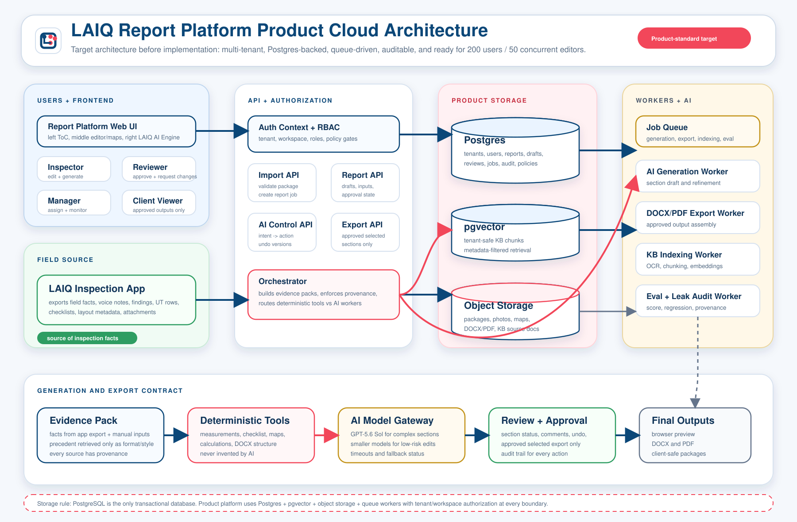

# Product Cloud Architecture

## Purpose

This diagram shows the intended product-standard cloud architecture for the report generation platform before the storage migration is implemented.

It assumes the first commercial scale target:

- up to 200 report-platform users
- approximately 50 concurrent active editors/reviewers
- multiple tenants and workspaces
- background AI generation, DOCX/PDF export, KB indexing, and eval jobs

## Visual Architecture

Remote-editor image version:

- [product-cloud-architecture.png](assets/product-cloud-architecture.png)

## Key Decisions

- SQLite remains a local development and internal demo fallback only.
- Postgres becomes the transactional product database.
- pgvector is the first production vector retrieval layer.
- S3-compatible object storage owns imported packages, attachments, rendered map figures, DOCX/PDF outputs, and KB source documents.
- Queue-backed workers own long-running generation, export, indexing, and eval tasks.
- Interactive API requests should stay short and should not run long AI/export/indexing work inside request transactions.
- Section drafts use optimistic concurrency so multiple users can edit different sections without whole-report locking.

## Product Data Flow

1. The LAIQ inspection app exports a structured inspection package with field facts, layout metadata, findings, checklist rows, attachments, and voice-note context.
2. The report platform import API validates and normalizes the package into a tenant/workspace report job.
3. Postgres stores product state, audit records, report drafts, review decisions, generation runs, and KB metadata.
4. Object storage keeps large immutable artifacts such as packages, photos, PDFs, DOCX files, layout-map figures, and source documents.
5. The generation orchestrator builds section evidence packs, retrieves tenant-safe precedent through pgvector, and dispatches jobs to workers.
6. AI workers draft or refine report sections, but deterministic tools own measurements, checklist rows, layout geometry, calculations, provenance, and export structure.
7. Inspectors and reviewers approve sections.
8. Export workers generate final DOCX/PDF from approved and selected sections only.

## Implementation Boundary

Before implementation, use this architecture as the target contract for:

- storage-provider interface design
- Postgres schema and migrations
- object storage key conventions
- queue/job interface
- authorization context
- optimistic concurrency behavior
- AI/model gateway behavior
- eval and audit persistence

## Current Implementation Status

The first authentication and tenancy foundation is implemented in V1 Beta:

- users must sign in before the browser workspace loads
- API requests derive the actor from the authenticated session
- report and import routes enforce tenant/workspace scope and role permissions
- app export metadata cannot create users or grant roles
- KB retrieval filters platform, tenant-private, and workspace-private sources before scoring
- development identities are blocked automatically in production mode
- OIDC issuer/audience/JWKS token verification is available for a pre-provisioned commercial identity

Still required to reach the full diagram:

- commercial browser SSO flow and account provisioning UI
- dedicated Reviewer, Manager, Super Admin, and approved Client Viewer surfaces
- Postgres, pgvector, and object storage adapters
- queue-backed generation, export, indexing, and eval workers
- optimistic concurrency and persistent audit events
