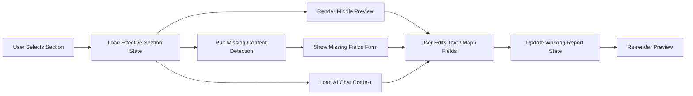

# Product Development Plan

## Purpose

Define the product development workflow for `apps/report-platform`.

This plan follows the development style you requested:

1. UI screens first
2. user review and approval
3. backend wiring after UI approval
4. AI and retrieval wired into the approved workspace

This keeps the product direction visible early and avoids backend work drifting away from the actual authoring experience.

Supporting references:

- `apps/report-platform/REPORT_COMPILER_WORKFLOW.md`
- `apps/report-platform/IMPLEMENTATION_PLAN.md`
- `apps/report-platform/BACKEND_STORAGE_ARCHITECTURE.md`
- `apps/report-platform/AI_ENGINE_SYSTEM_DIAGRAM.md`
- `apps/report-platform/REPORT_GENERATION_AND_LAYOUTMAP_ORCHESTRATION.md`
- `apps/report-platform/SAMPLE_REPORT_FORMATTING_REVIEW.md`
- `apps/report-platform/PRECEDENT_KB_ARCHITECTURE.md`

## Product Rule

The report platform is an authoring workspace, not just a generator.

The backend engine should be a report compiler, not a free-form report-writing AI:

```text
field data -> canonical package -> data QA -> report/code classification -> standard rules -> KB retrieval -> section JSON/prose -> deterministic diagrams/tables -> human approval -> export
```

The user must be able to:

- see report progress by section
- preview generated content immediately
- edit text and maps directly
- chat with AI about the current section
- fill missing content in real time
- approve the final report state section by section

## Current Priority

The workspace shell and local backend baseline now exist.

The current product priority should shift to:

1. canonical package and report classification alignment
2. report section generation
3. layout map editing from imported Android input
4. standard-rule validation and evidence-chain traceability
5. AI orchestration of retrieval, calculation, rendering, drafting, and QA

Use this focused operating model:

- `apps/report-platform/REPORT_GENERATION_AND_LAYOUTMAP_ORCHESTRATION.md`

Important rule:

- do not broaden into generic platform work before the section-generation and layout-map-editing loop feels solid

## Development Workflow

Use this product workflow for implementation:

1. define the workspace UI shell
2. build low-friction section interactions with mock data
3. review and approve the UX
4. wire real import, report state, and overrides
5. wire AI generation into the approved UX
6. wire backend storage and audit trail behind the same screens

This means UI is the contract for backend work.

## Target Workspace

The main product screen should be a simple VS Code-like authoring workspace with three columns.

```text
| Left Sidebar | Middle Workspace | Right Sidebar |
```

## Three-Pane Layout

### Left Sidebar

Purpose:
- show the report task list
- show section progress and generation state
- give the user fast navigation

Content:

- report overview
- section list
- status per section such as:
  - `not started`
  - `generated`
  - `edited`
  - `missing info`
  - `review required`
  - `approved`
- optional appendix list
- generation queue state

Recommended first sections:

- cover
- report metadata
- table of contents
- scope of inspection
- inspection and maintenance regime
- general tank information
- inspection report
- repair recommendations / API assessment
- photographs
- layout sketches
- attachments

### Middle Workspace

Purpose:
- show the current section’s actual working content
- make preview and editing feel immediate

Structure:

- upper area: text/content preview and rich-text editing
- lower area: layout drawing or structured visual block when applicable

Behavior:

- if a section is narrative-only, the lower area can collapse or be empty
- if a section includes a map, sketch, or photo block, the lower area becomes active
- the middle pane always reflects the effective working state, not raw AI output alone

Examples:

- `inspection-report`: upper area active, lower area optional summary/table block
- `layout sketch`: upper area for captions/callouts, lower area for map editor
- `attachment report`: upper area for structured fields, lower area for form/table preview

### Right Sidebar

Purpose:
- let the user collaborate with AI
- show system-detected missing content in real time

Structure:

- upper area: AI chat tool
- lower area: missing-content assistant

## Right Sidebar Detail

### Upper Right: AI Chat Tool

The AI chat should be section-aware.

It should know:

- current section
- current report facts
- current user edits
- missing inputs
- relevant precedent hints

Typical actions:

- refine wording
- shorten or formalize language
- rewrite bullets
- explain a finding
- regenerate one section
- suggest map captions
- summarize changes for review

Important rule:

- the AI chat should operate on the current section context by default
- it should not randomly rewrite the whole report unless explicitly asked

### Lower Right: Missing-Content Assistant

This is one of the most important product features.

The system should detect what is missing for the current section and show a structured completion panel.

Examples:

- customer name missing
- contact person missing
- prepared by missing
- report number missing
- section note missing
- caption missing
- map legend missing
- recommendation reason missing

If the missing item is structured, the UI should show:

- label
- reason it is needed
- text box, select box, or date field
- optional AI suggestion beside it

Example:

```text
Customer Name    [ Pacific Energy SWP Ltd                  ]
Source           Missing from current report-side inputs
Suggestion       Derived from report import / precedent
```

Important behavior:

- this panel updates in real time when the selected section changes
- it should be driven by section template requirements, not only by generic validation

## How Missing-Content Detection Should Work

The lower-right panel should be driven by three sources.

### 1. Structured Requirements

From:

- section template definitions
- required report metadata
- required appendix fields
- required approval fields

### 2. Current Report State

From:

- imported baseline facts
- manual report inputs
- current section draft
- current overrides

### 3. Precedent-Aware Hints

From:

- report family patterns
- common fields present in similar approved reports
- formatting expectations of the current section

Important rule:

- precedent can suggest likely missing content
- precedent must not silently invent current-report facts

## High-Level Workspace Flow



## Product Development Phases

Build the product in these phases.

### Phase 1. Workspace Shell Only

Goal:
- prove the three-pane UX

Build:

- left section list
- middle split workspace
- right chat and missing-content panes
- mock section selection behavior

Use:

- hardcoded local mock data only

Do not build yet:

- real backend
- real AI
- real retrieval

Approval checkpoint:
- approve pane sizes, navigation, section interaction model, and overall simplicity

### Phase 2. Fixture-Driven UI

Goal:
- make the UI realistic without backend complexity

Build:

- one real Android export fixture
- one local normalized `ReportJob`
- one real shell preview
- one real narrative section
- one mock missing-content panel driven by section requirements

Approval checkpoint:
- approve whether the workspace feels right for actual report authoring

### Phase 3. Real Editing UX

Goal:
- prove the workspace is genuinely usable

Build:

- rich-text editing in the upper middle pane
- first map editor behavior in the lower middle pane
- right-side missing-field form updates in real time

Approval checkpoint:
- approve text editing, map editing, and missing-content flow

### Phase 4. Backend Wiring

Only after UI approval:

- wire report job loading
- wire report-side overrides
- wire draft persistence
- wire approval states
- wire audit history

This backend should follow:

- `apps/report-platform/BACKEND_STORAGE_ARCHITECTURE.md`

### Phase 5. AI Wiring

Only after the authoring UI is stable:

- wire section-aware AI chat
- wire section generation jobs
- wire refinement actions
- wire AI suggestion support for missing fields

Important rule:

- AI should plug into the approved workspace
- the workspace should not be redesigned around the AI afterward

### Phase 6. Retrieval And Precedent Support

After core generation works:

- wire knowledge-base retrieval
- wire section-style hints
- wire precedent-aware missing-content suggestions
- wire section-level retrieval provenance into the UI
- add gold examples and offline evaluation runs

### Phase 7. Approval Snapshot And PDF

After authoring and generation stabilize:

- freeze approved report snapshots
- render PDF from approved effective state
- support issue/revision workflow

## What To Build First

The first coding target should be:

`UI shell first`

More specifically:

1. create the three-pane workspace
2. populate the left pane with report sections
3. show one middle-pane narrative preview
4. show one lower middle map/sketch area
5. show one right-side chat panel
6. show one right-side missing-content form

This should work with local mock data first.

## First Deliverable

The first deliverable for review should be:

- one report authoring screen
- simple, minimal styling
- no heavy branding polish yet
- one selected section with realistic content
- one map-enabled section example
- one missing-content example

That is enough to approve the UX direction before backend work.

## Suggested First Screen Scope

Use these example sections for the first UX review:

- `General Tank Information`
- `Inspection Report`
- `Findings / MPI Locations on Shell Internal - Horizontal Weld 7`

Why these three:

- one structured metadata section
- one narrative-heavy section
- one layout-map-heavy section

Together they cover most of the workspace behavior.

## UI Simplicity Rules

Keep the first UI intentionally simple.

Rules:

- use a clean neutral workspace layout
- do not over-design panels
- prioritize readable text and stable spacing
- use collapsible lower-middle and lower-right panels where useful
- make status colors subtle
- keep actions obvious: generate, edit, save, approve, ask AI

This should feel like a practical working tool, not a marketing site.

## Backend Wiring Rule

After the UI is approved, wire backend services to match the screen contract.

That means backend APIs should serve:

- section list and status
- effective section state
- editable text blocks
- editable map state
- missing-content requirements
- chat context
- draft save and approval actions

Not the other way around.

## First Sprint Recommendation

For the next build sprint, do only this:

1. scaffold `apps/report-platform/src`
2. build the three-pane workspace shell
3. add local mock section data
4. add one middle-pane narrative preview
5. add one lower-middle map placeholder area
6. add one right-side chat placeholder
7. add one right-side missing-content panel

If this is approved, the next sprint can wire:

- real fixture data
- normalized `ReportJob`
- deterministic shell map rendering
- section editing
