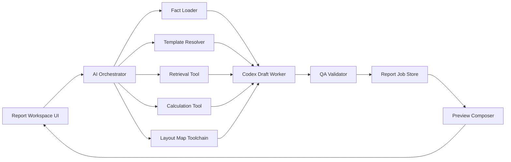

# Report Generation And Layout Map Orchestration

## Purpose

Define the first-priority product engine for `apps/report-platform`:

1. report section generation
2. layout map editing based on imported Android input

This document answers the practical question:

`How should the AI orchestrate different tools to finish the task?`

Supporting references:

- `apps/report-platform/REPORT_COMPILER_WORKFLOW.md`
- `apps/report-platform/AI_ENGINE_SYSTEM_DIAGRAM.md`
- `apps/report-platform/AI_QUALITY_AND_LAYOUTMAP.md`
- `apps/report-platform/CODEX_ROLES_AND_TOOLING.md`
- `apps/report-platform/BACKEND_STORAGE_ARCHITECTURE.md`
- `apps/report-platform/PRECEDENT_KB_ARCHITECTURE.md`

## Focus-First Rule

At this stage, the most important product work is not broad platform expansion.

It is:

- generate high-quality report sections from trusted inputs
- let users edit layout maps safely on top of imported baseline geometry
- keep every step reviewable, repeatable, and auditable

Everything else should support these two flows.

## Core Principle

The AI does not directly "make the report" by itself.

The AI orchestrates a toolchain.

The product engine should behave like a compiler:

```text
Android field export
-> canonical inspection package
-> data QA / missing-field checks
-> report and code classification
-> standard rule checks
-> precedent and standards retrieval
-> section drafting
-> deterministic table/map rendering
-> review and approval
-> report export
```

Use this split:

- deterministic tools prepare facts, geometry, calculations, templates, and validation
- Codex drafts language and coordinates the next step
- users approve, reject, or edit the result

The system must always preserve three states:

1. `Android Export Baseline`
2. `Working Report State`
3. `Approved Report Snapshot`

## What AI Should And Should Not Do

### AI Should Do

- decide which section job to run
- decide which supporting artifacts are needed first
- draft section wording
- rewrite or shorten text
- suggest captions, legends, and callout wording
- explain missing inputs
- decide whether to request retrieval, calculations, or map artifacts before drafting
- run second-pass QA prompts for style or completeness

### AI Should Not Do

- invent measurements
- invent report facts
- invent tank geometry
- calculate engineering results free-form
- move map anchors directly without an explicit user override
- publish final output without human approval

## Tool Stack

The product-standard orchestration stack should use the following tool groups.

### 1. Fact And State Tools

Purpose:
- load imported Android package
- load manual report inputs
- load current section draft
- load current layout overrides

Recommended implementation:
- local/backend API
- PostgreSQL for local, audit, and cloud transactional state
- JSON normalization layer

Current examples:
- `/api/v1/report-jobs/:reportJobId`
- report job store
- manual input store
- section draft store
- layout override store

### 2. Template Resolver

Purpose:
- choose the expected report structure for the current section
- define required fields
- define formatting expectations

Recommended implementation:
- TypeScript section-template registry
- report family metadata
- per-section requirement rules

### 3. Retrieval Tool

Purpose:
- fetch precedent snippets from approved previous reports
- fetch standards/code references from the Codes library
- provide style and structure hints from reports
- provide standards guidance from codes/procedures
- provide layout and formatting patterns when the section needs them

Recommended implementation:
- product-owned vector database
- metadata filters by `tenantId`, `workspaceId`, `sectionType`, `reportFamily`
- hybrid lexical/vector retrieval with provenance
- section-specific `PrecedentPack` output

Role of AI:
- ask retrieval for the right precedent window
- do not retrieve raw full reports by default
- treat retrieved precedent as style and structure guidance, not current inspection fact authority
- treat standards/code retrieval as compliance guidance, not report wording to copy verbatim

### 4. Calculation Tool

Purpose:
- compute UT summaries
- group readings
- produce deterministic worksheet outputs

Recommended implementation:
- TypeScript calculation modules
- versioned calculator outputs
- unit-tested JSON result contracts

Role of AI:
- request calculation results
- explain them in text
- never replace the calculator

### 5. Layout Map Toolchain

Purpose:
- convert imported layout metadata into exact geometry
- render shell, roof, or floor maps
- apply user override patches

Recommended implementation:
- canonical geometry builder
- deterministic SVG renderer
- interactive SVG editor in the UI
- override patch composer

Important:
- Mermaid is for documentation only
- production maps should use deterministic SVG, not Mermaid

### 6. Codex Drafting Worker

Purpose:
- turn prepared facts into report language

Recommended implementation:
- Codex CLI
- structured JSON outputs
- one section at a time

### 7. QA Validator

Purpose:
- validate generated output before it appears as ready

Recommended implementation:
- schema validation
- business-rule checks
- missing-content checks
- optional second-pass Codex review

### 8. Evidence Chain Builder

Purpose:
- record why a section draft exists
- connect generated wording to field data, standards refs, precedent refs, calculations, map artifacts, warnings, blockers, and approval state

Recommended implementation:
- deterministic metadata builder
- store evidence chain in generation orchestration JSON
- expose it in review/audit tooling before final export

Important:
- final report does not need to show all internal citations
- the system must keep them so an inspector can answer where each generated statement came from

## High-Level Orchestration Topology



## Workflow 1: Section Generation

This is the main report-generation workflow.

### Input

- imported Android export package
- manual report-side inputs
- current section key
- current draft state
- current approval state
- optional precedent retrieval
- optional calculation outputs
- optional map artifact references

### Orchestration Sequence

```text
User clicks "Generate Section"
  -> Orchestrator loads section context
  -> Template resolver defines required inputs
  -> Missing-input detector checks blockers
  -> Retrieval fetches precedent snippets if allowed
  -> Calculation tool runs if the section needs numbers
  -> Layout map tool renders map artifact if the section references geometry
  -> Orchestrator builds SectionGenerationJob
  -> Codex drafts section output in structured JSON
  -> QA validators run
  -> Draft is stored with provenance
  -> Preview re-renders
```

### SectionGenerationJob Contract

Suggested structure:

```json
{
  "reportJobId": "job-123",
  "sectionKey": "inspection-report",
  "facts": {},
  "manualInputs": {},
  "templateRules": {},
  "retrievalContext": [],
  "calculationOutputs": [],
  "mapArtifacts": [],
  "styleGuide": {},
  "outputSchema": {}
}
```

### Codex Output Contract

Suggested structure:

```json
{
  "sectionKey": "inspection-report",
  "status": "draft",
  "title": "Inspection Report",
  "bodyMarkdown": "Shell internal surfaces were reviewed...",
  "warnings": [],
  "openQuestions": [],
  "factReferences": [],
  "precedentReferences": []
}
```

### QA After Drafting

Run these checks before the draft is treated as usable:

- all required template fields are present
- no unresolved placeholder text remains
- no invented dates, tank numbers, or client names appear
- fact references point to real imported or manual fields
- required map artifact exists for map-linked sections
- required calculation output exists for calculation-linked sections

## Workflow 2: Layout Map Editing

This is the second critical workflow.

### Important Rule

AI should not redraw geometry from text.

Instead:

- baseline geometry comes from Android export
- user edits produce explicit override patches
- AI may help with captions, legends, and callout wording

### Layout Map State Model

Use these three map layers:

1. `BaselineGeometry`
2. `GeometryOverridePatch`
3. `EffectiveGeometry`

### Orchestration Sequence

```text
User opens a map section
  -> Fact loader gets imported layout metadata
  -> Geometry builder creates baseline map model
  -> Override store loads any existing patches
  -> Effective geometry composer merges baseline + overrides
  -> SVG renderer draws the current editable map
  -> User edits labels, anchors, or approved geometry overrides
  -> Patch validator checks constraints
  -> Override patch is stored
  -> Effective geometry re-renders
  -> AI may update caption, legend, or narrative references
```

### Layout Editing Tool Split

#### Deterministic Map Tools

These handle:

- geometry construction
- element projection
- finding anchor placement
- UT anchor placement
- coordinate constraints
- snap rules
- printable SVG output

#### AI-Assisted Map Tools

These handle:

- caption drafting
- legend wording
- callout wording
- reviewer summary
- mismatch explanation

#### Human Editing Tools

These handle:

- marker movement
- label adjustment
- visibility toggles
- zoom/frame choices
- override approval

## Layout Editing UI Recommendation

Use an interactive SVG-based editor first.

Recommended near-term stack:

- React
- SVG
- pointer/drag handlers in the app
- deterministic geometry modules in TypeScript

Possible future upgrade if needed:

- `Konva`
- `Fabric.js`
- `tldraw`-style interaction layer

But the data model should stay product-owned and deterministic regardless of the library.

## Tool-Orchestration Matrix

| Task | Primary Tool | AI Role | Human Role |
|---|---|---|---|
| Load facts | API + store | request correct scope | none |
| Detect missing inputs | template rules + validators | explain blockers | fill fields |
| Retrieve precedent | vector DB | request best snippets | none |
| Run calculations | deterministic scripts | request results, explain outputs | review meaning |
| Build geometry | deterministic geometry modules | none | none |
| Render editable map | SVG renderer | none | inspect/edit |
| Draft narrative | Codex | write/refine | review |
| Draft captions/legends | Codex | write/refine | review |
| Validate output | validators + QA prompt | style review | approve/reject |
| Persist state | backend store | none | none |

## Human Review Gates

The system should stop and ask for human review at these points:

### Section Review Gate

Before a section is approved:

- text draft exists
- blockers are resolved
- required fields are filled
- supporting artifacts exist

### Map Review Gate

Before a map section is approved:

- baseline geometry is valid
- override patch history is valid
- visible marker positions are reviewed
- drawing block metadata is complete

### Final Snapshot Gate

Before the report is issued:

- all required sections approved
- all required appendices present
- map sections approved
- publication snapshot frozen

## Immediate Product Priority

The next implementation work should focus on these items in order:

1. `SectionGenerationJob` model
2. section template registry
3. deterministic map baseline/override/effective model
4. section-generation worker endpoint
5. map-override validation and save flow
6. Codex structured output contract
7. section QA validator
8. preview refresh from effective state

## Immediate Build Sequence

### Step 1. Generation Endpoint

Add:

- `POST /api/v1/report-jobs/:reportJobId/sections/:sectionId/generate`

It should:

- load facts
- resolve template
- run retrieval if configured
- run calculations if needed
- render map artifact references if needed
- call Codex
- validate output
- persist section draft

### Step 2. Map Override Contract

Define:

- `LayoutOverridePatch`
- `patchReason`
- `editorUserId`
- `updatedAtIso`

Persist per section and keep it separate from the imported baseline.

### Step 3. Caption / Legend Assist

Add AI actions such as:

- `Generate Caption`
- `Suggest Legend`
- `Explain Override`

These should work only on report-side text, not geometry.

### Step 4. Provenance View

Show in the UI:

- imported facts used
- manual inputs used
- calculation artifacts used
- map artifact used
- precedent snippets used

This will make review much easier.

## Product Rule To Keep

Use this simple rule across all generation work:

- AI writes language
- tools build geometry
- scripts calculate numbers
- users approve the report
