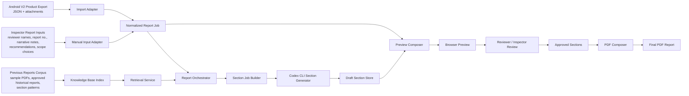
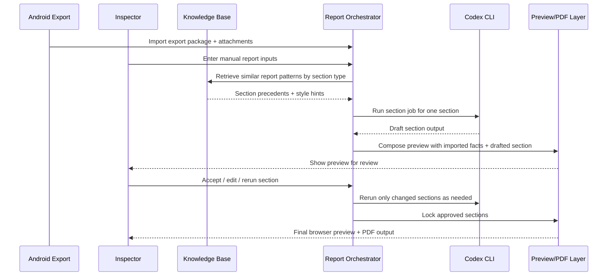

# Report Generation Topology

> **Status: historical design reference.** This file preserves earlier product
> reasoning and may contain superseded V2, prototype, review, or output
> assumptions. Use `SYSTEM_ARCHITECTURE.md` and `DOCUMENTATION_INDEX.md` for
> current implementation decisions.

## Goal

Describe how the report-generation system should work when combining:

- Android app export output
- inspector report-side inputs
- previous reports as a knowledge base
- Codex CLI as a section-by-section drafting worker

Supporting backend/storage reference:

- `apps/report-platform/FULL_SYSTEM_DIAGRAM.md`
- `apps/report-platform/BACKEND_STORAGE_ARCHITECTURE.md`
- `apps/report-platform/AI_QUALITY_AND_LAYOUTMAP.md`

## Core Principle

There are three different roles in the system:

1. facts
2. precedent
3. drafting

They must stay separate.

### Facts

Facts come from:

- Android V2 Product export packages
- inspector-entered report-side inputs

These are the only authoritative inputs for the current report, and they remain scoped by tenant, workspace, user, and role metadata inherited from V2 Product.

### Precedent

Precedent comes from:

- previous IRS/Pacific Energy reports
- standard section patterns
- known calculation/appendix layouts

Precedent helps with:

- structure
- phrasing
- tone
- ordering
- section inclusion patterns

Precedent does not override current inspection facts.

### Drafting

Drafting is performed by:

- Codex CLI

Codex CLI should draft one section at a time using structured inputs and retrieval context.

## Tenant Topology Alignment

The report platform should extend the V2 Product tenant topology instead of inventing a separate model:

```text
LAIQ Platform
  |
  |-- Tenant
        |
        |-- Workspace / Project
              |
              |-- Users
              |-- Inspection Tasks
              |-- Export Packages
              |-- Report Jobs
              |-- Report Section Drafts
              |-- Review Decisions
              |-- Tenant/Workspace Knowledge Base Views
```

All report-side records should carry:

- `tenantId`
- `workspaceId`
- `inspectionId`
- `inspectionReference`
- `reportJobId`
- `createdByUserId`
- `lastEditedByUserId`
- timestamps

## Role Management Alignment

Role behavior should align with V2 Product:

- `Super Admin`: LAIQ/internal only. Manages tenant setup, platform policy, and global libraries.
- `Manager`: manages tenant/workspace report operations, assignment, visibility, and publication rules.
- `Inspector`: creates report jobs from exported inspections, enters manual inputs, runs section generation, and prepares drafts.
- `Reviewer`: optional audit role for section review, completeness checks, comments, and approval when tenant policy requires it.
- `Client Viewer`: read-only access to approved reports and assigned deliverables.

Users may carry multiple roles.

Reviewer approval should remain optional by default unless tenant policy makes it mandatory, matching the V2 Product direction.

## High-Level Topology



## Access And Isolation Rules

- Import, preview, review, and export must always be tenant-scoped and workspace-scoped.
- Knowledge-base retrieval must only search reports visible to the current actor.
- A tenant must never retrieve another tenant's private report content.
- Platform-level sample reports should be stored as an explicit shared library, not mixed with tenant-private corpora.
- Client Viewer access should be limited to approved outputs explicitly assigned to them.
- Backend storage and vector retrieval must enforce the same isolation rules as the application layer.

## Operational Flow



## System Components

### 1. Import Layer

Purpose:
- parse Android export JSON
- verify attachments
- normalize app output into the report domain

Outputs:
- `ReportJob`
- attachment manifest
- import warnings

### 2. Manual Input Layer

Purpose:
- capture inspector/report-writer inputs that do not belong in Android

Typical fields:
- report number
- revision
- contact person
- prepared by / reviewed by
- scope wording overrides
- section notes
- recommendations
- attachment notes
- photo caption edits

Outputs:
- `ManualReportInputs`

### 3. Knowledge Base Layer

Purpose:
- index previous reports for retrieval
- reuse section patterns without copying facts from old reports
- respect tenant/workspace visibility and role-based access

Implementation note:
- use metadata-filtered vector retrieval plus structured storage for provenance and access control

Recommended knowledge-base units:
- report family
- section type
- appendix type
- inspection type
- tank type
- page block pattern

Recommended outputs:
- similar section examples
- style/tone hints
- structural patterns
- optional appendix suggestions

Recommended corpus partitions:
- platform shared sample/reference reports
- tenant-approved historical reports
- workspace-approved historical reports
- optional redacted exemplars for global use

Recommended storage split:
- transactional metadata in backend relational storage
- source files in object/blob storage
- embeddings and chunk search in the vector layer

## Knowledge Base Rules

Previous reports should be treated as:

- style references
- layout references
- section pattern references
- wording references

Previous reports should not be treated as:

- factual data source for the current tank
- automatic recommendation source
- measurement source
- party/date/reference source

Previous reports should also not be retrieved across unauthorized tenant or workspace boundaries.

Every retrieval result should carry metadata such as:

- source report id/name
- section type
- report family
- confidence or relevance

## Codex CLI Role

Codex CLI should be used directly as a controlled report-generation worker.

It should not generate the whole report in one run.

It should generate:

- one section at a time
- with a section-specific contract
- with explicit facts
- with explicit retrieved precedents
- with explicit output expectations

It must run within the caller's tenant/workspace authorization context.

### Why Section-By-Section

Section-by-section generation gives us:

- easier review
- easier reruns
- better provenance
- lower prompt complexity
- more stable output
- safer handling of report changes

## Section Job Contract

Each Codex CLI run should receive a section job payload similar to:

```json
{
  "sectionKey": "inspection_report",
  "reportTemplate": "shell-internal-post-blast",
  "authorization": {
    "tenantId": "tenant-001",
    "workspaceId": "workspace-001",
    "actorUserId": "user-001",
    "actorRoles": ["Inspector"]
  },
  "facts": {
    "inspection": {},
    "tank": {},
    "findings": [],
    "utMeasurements": []
  },
  "manualInputs": {
    "narrativeNotes": [],
    "recommendationNotes": []
  },
  "precedents": [
    {
      "sourceReport": "22PE2-1 TK V10 Shell Internal Inspection Report (Post Blast)",
      "sectionType": "inspection_report",
      "notes": "Use as structure/tone reference only"
    }
  ],
  "rules": [
    "Do not invent facts.",
    "Prefer imported measurements over precedent wording.",
    "Write only the requested section."
  ],
  "outputSchema": {
    "title": "string",
    "bodyMarkdown": "string",
    "factReferences": ["string"],
    "manualInputReferences": ["string"],
    "precedentReferences": ["string"]
  }
}
```

## Source-Of-Truth Hierarchy

When the system has conflicting information, resolve it in this order:

1. current Android export facts
2. current inspector manual inputs
3. approved human edits in report-platform
4. previous reports as precedent only
5. Codex CLI draft output last

Codex CLI output must always be replaceable.

## Section Families For Codex CLI

Good first candidates for section-by-section drafting:

- scope of inspection
- inspection and maintenance regime
- general tank information narrative wrapper
- inspection report narrative
- repair recommendations / API assessment
- photograph captions and summaries
- attachment intro pages

Better rendered from structured page blocks than prose generation:

- cover page
- metadata page
- table of contents
- fixed data tables
- checklist tables
- UT tables
- nozzle thickness tables
- shell thickness tables
- findings maps

## Browser Preview Composition

The preview layer should combine:

- fixed page blocks
- imported tables
- AI-drafted narrative sections
- manually edited content
- findings maps and photo pages

Each preview section should expose provenance:

- imported
- manual
- retrieved precedent-assisted
- Codex CLI drafted
- human-edited after draft

Each preview section should also expose access context where needed:

- tenant
- workspace
- owner/editor
- review status

## Proposed Directory Additions

```text
apps/report-platform/
  REPORT_GENERATION_TOPOLOGY.md
  BACKEND_STORAGE_ARCHITECTURE.md
  src/
    ingest/
    authz/
    knowledge-base/
      corpus/
      indexing/
      retrieval/
    generation/
      codex-cli/
      prompts/
      section-jobs/
    review/
    preview/
```

## Minimal First Version

The first practical version should do this:

1. import one Android V2 Product export
2. capture manual report inputs in a simple form or fixture
3. enforce tenant/workspace scoped access for the active actor
4. select 1 to 3 authorized previous-report precedents per section
5. run Codex CLI for:
   - scope
   - inspection report
   - recommendations
6. compose those drafts into a browser preview
7. allow manual edits and rerun per section
8. print to PDF

## Safety Rules

- Do not let previous reports silently fill missing facts.
- Do not let retrieval cross tenant/workspace boundaries without explicit policy.
- Do not let Codex CLI invent measurements, identifiers, dates, or approvals.
- Keep attachments and findings linked to imported record ids.
- Save every generated section with provenance and timestamps.
- Allow reviewers to reject one section without discarding the whole report.

## Recommended Next Implementation Step

Implement these artifacts first:

1. `ReportJob`
2. `ManualReportInputs`
3. `KnowledgeBaseMatch`
4. `SectionJob`
5. `SectionDraft`
6. `AuthorizationContext`
7. one Codex CLI runner for `inspection_report`

That gives us the smallest useful end-to-end path from field export to reviewed draft section.
