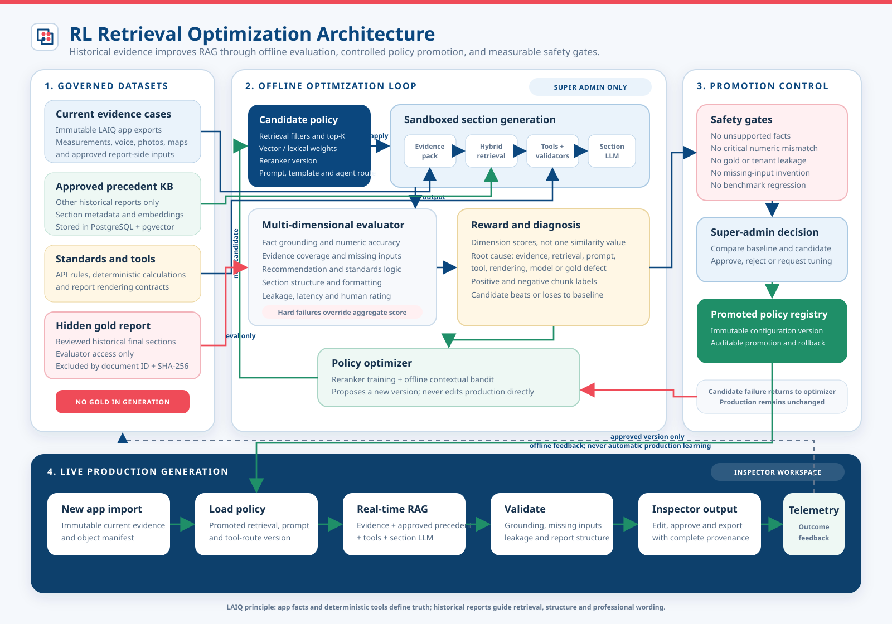

# RL Retrieval Optimization Architecture

This architecture uses offline evaluation to improve report-platform retrieval, reranking, prompts, templates, and agent/tool routing. It does not retrain the Codex model or allow live inspector traffic to change production behavior automatically.

The Truth Case Builder, Answerability Map, Capture Variant Builder,
variant grouping, and batch harness are defined in
`TRAINING_HARNESS_ARCHITECTURE.md`.



## Control Boundary

The workflow has two isolated execution lanes:

- `Offline optimization`: super-admin-only datasets, hidden gold reports, candidate policies, eval runs, reward calculation, and promotion decisions.
- `Live generation`: inspectors use one immutable promoted policy version for real-time RAG generation.

The gold report can be read only by the evaluator. Its document ID, object
hash, alternate renditions, and derived chunks must be excluded from retrieval
for the same evaluation case. Validation and hidden-test gold are unavailable
to generation across the benchmark snapshot, and all precedent retrieval must
respect the case's `evidenceAsOf` cutoff.

## Implemented System-Level RL Baseline

The first operational loop is a PostgreSQL-backed contextual bandit:

```text
categorical section context
  -> choose one approved policy arm
  -> apply its retrieval/prompt/tool configuration
  -> generate without gold answer access
  -> evaluate after generation
  -> convert eval metrics to guarded reward
  -> update candidate arm statistics
  -> choose again using contextual UCB
```

The approved action space currently controls:

- precedent minimum score and candidate depth
- precedent, wording, and standards context limits
- fact-to-recommendation retrieval limit
- reviewed prompt variant
- reviewed agent/tool route

It cannot create arbitrary prompts, scripts, tools, SQL, or code. New action configurations must first be registered as reviewed policy arms.

Runtime storage:

- `system_rl_policy_versions`: immutable production/training policy versions and promotion gates
- `system_rl_policy_arms`: approved configuration choices
- `system_rl_policy_decisions`: one auditable selection per generation run
- `system_rl_policy_rewards`: post-generation reward and hard-gate result
- `system_rl_context_arm_stats`: contextual and global reward aggregates
- `system_rl_policy_events`: promotion and rollback history
- `report_evaluation_cases`: paired app-capture and hidden-gold cases
- `report_evaluation_case_sections`: report-to-gold section mappings
- `report_evaluation_relevance_labels`: graded retrieval qrels and review status
- `report_evaluation_required_fact_labels`: section-level fact recall labels

Runtime APIs are super-admin only:

- `GET /api/v1/admin/system-rl/status`
- `POST /api/v1/admin/system-rl/episodes`
- `POST /api/v1/admin/system-rl/policies/:policyVersionId/promote`
- `POST /api/v1/admin/system-rl/policies/:policyVersionId/rollback`

Offline episodes persist generation/eval evidence but never replace the inspector's current section draft. Missing-input or blocked episodes are stored for audit but do not update the learner.

## Optimization Episode

```text
state = report family + section + current evidence + missing-input state
action = retrieval policy + reranker + prompt + template + tool route
result = generated section
reward = factual + numeric + completeness + recommendation + format + safety + human scores
```

Evaluation metrics are post-action reward signals, not the state. State is the
pre-generation section context, evidence richness, missing-input classes,
capture profile, and available retrieval lanes.

Rewards are first aggregated across sections and capture profiles inside one
Truth Case, then macro-averaged across Truth Cases. This prevents a report with
many synthetic variants from dominating policy learning.

Hard failures override aggregate reward:

- unsupported current facts
- critical numeric mismatch
- same-gold-report retrieval
- validation/hidden-gold or post-cutoff retrieval
- tenant or historical-client leakage
- invented required inputs
- regression against protected benchmark cases

## Promotion

The optimizer can create candidate configurations but cannot update production. A candidate must pass the complete held-out benchmark and receive a super-admin promotion decision. Production stores the approved configuration as an immutable, auditable version with rollback support.

## Reward Contract

The V2 retrieval reward combines available normalized evaluator dimensions:

- retrieval Precision@3: 20%
- retrieval Recall@3: 20%
- retrieval nDCG@3: 10%
- verifiable claim precision: 15%
- required-fact recall: 15%
- source grounding: 10%
- report format match: 5%
- leakage safety: 5%

Unavailable dimensions are excluded and remaining weights are normalized. An offline retrieval episode is learning-eligible only when relevance labels exist with sufficient confidence. Machine-proposed labels remain visible but must pass human review before promotion-grade use.

Reference alignment cannot override safety. Same-gold retrieval, medium/high reference leakage, or materially unsupported verifiable claims force reward to zero. Missing required user input, generation blockers, unavailable retrieval labels, or low-confidence labels make the episode ineligible, so the controller is never rewarded for guessing or learning from unreliable supervision.

The candidate promotion gate additionally requires minimum mean retrieval precision, retrieval recall, claim precision, and required-fact recall. One aggregate reward cannot hide a regression in these protected dimensions.
