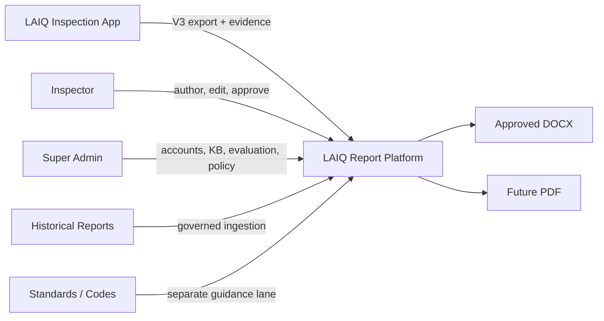
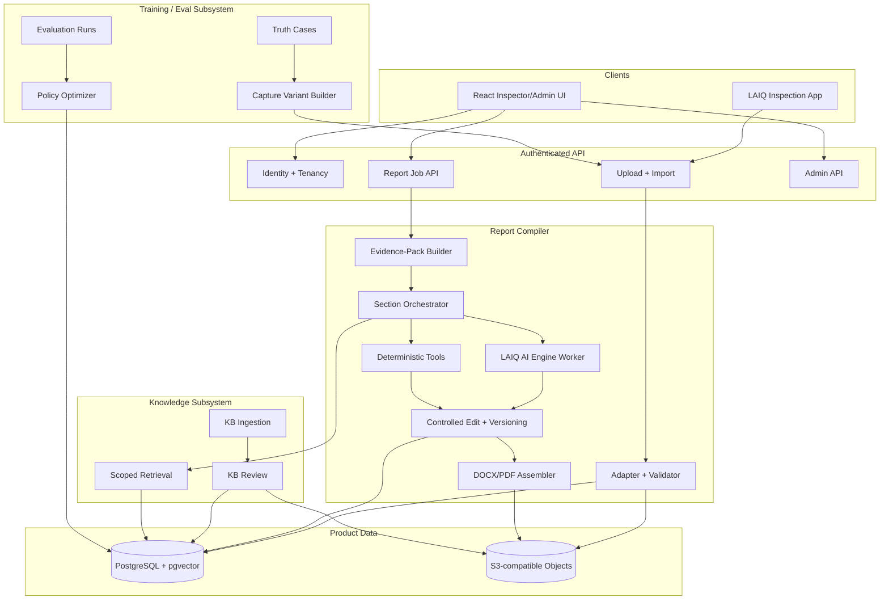

# LAIQ Report Platform System Architecture

## Authority

This is the top-level architecture contract for `apps/report-platform`.

The report platform is one product system. Report authoring is its primary
workflow. Authentication, app ingestion, storage, AI orchestration, layout and
MFL processing, knowledge management, evaluation, training, and system-level
RL are supporting subsystems.

If another design document conflicts with this file, this file governs the
system boundary and `DOCUMENTATION_INDEX.md` identifies the detailed subsystem
contract that governs implementation.

`PRODUCT_TERMINOLOGY.md` governs product, UI, and workflow names.

## Product Purpose

The platform converts immutable LAIQ inspection app evidence into editable,
traceable inspection reports and exports only user-approved report content.

```text
LAIQ inspection app evidence
  -> authenticated immutable ingestion
  -> normalized report job
  -> section evidence packs
  -> deterministic tools + constrained LAIQ AI Engine
  -> editable report drafts
  -> inspector approval
  -> selected-section DOCX/PDF output
```

Historical knowledge improves structure, retrieval, and recommendations, but
it never replaces current inspection evidence.

## System Context



The LAIQ inspection app and report platform are independent applications. They
share versioned contracts and authenticated upload APIs, not implementation
internals or databases.

## Product Planes

### 1. Production Report Plane

Used by inspectors for real report work:

```text
sign in
  -> list authorized app imports/report jobs
  -> open one immutable inspection revision
  -> generate selected sections
  -> inspect app evidence and layout artifacts
  -> edit generated blocks
  -> resolve missing report-side inputs
  -> approve sections
  -> export selected approved sections
```

This is the primary product plane. KB, evaluation, and training must not make
it slower, mutate its source evidence, or expose hidden gold content.

### 2. Knowledge Plane

Used by Super Admins and background ingestion workers:

```text
source registration
  -> immutable object storage
  -> deterministic extraction
  -> section and chunk parsing
  -> classification and quality review
  -> approval
  -> embedding/index publication
  -> tenant-safe retrieval
```

The knowledge plane contains three separate lanes:

- precedent: report structure, wording patterns, and presentation conventions
- standards: controlled technical guidance from codes and standards
- fact-to-recommendation: reviewed condition-to-recommendation relationships

### 3. Training And Evaluation Plane

Used only by Super Admins and offline workers:

```text
approved historical gold
  -> reviewed truth graph and answerability map
  -> realistic inspector capture scenarios
  -> LAIQ app V3 export through the production upload path
  -> gold-isolated section generation
  -> deterministic and semantic evaluation
  -> case/profile reward aggregation
  -> candidate RAG policy comparison
  -> validation + hidden-test gate
  -> audited production-policy promotion
```

This plane improves system configuration. It does not train the foundation
model in the current architecture and cannot alter production policy directly.

### 4. Platform Control Plane

Shared across all product planes:

- authentication and sessions
- tenants, workspaces, users, and roles
- authorization and access filtering
- PostgreSQL transactions and migrations
- S3-compatible object storage
- pgvector metadata and embeddings
- audit records, versions, and provenance
- job status, retries, observability, and operational controls

## Subsystem Map



## Source-Of-Truth Matrix

| Concern | Authoritative source | Never authoritative |
| --- | --- | --- |
| Captured inspection facts | Immutable V3 app export revision | Historical report prose or AI output |
| App attachments | Checksum-verified object storage object | Browser-local file or filename alone |
| Report-side confirmation | Persisted authenticated user input | Inferred precedent value |
| Measurements and calculations | App rows and deterministic tools | Free-form model arithmetic |
| Layout geometry | App-resolved geometry and app-owned figure contract | AI-redrawn geometry |
| MFL placement | Approved report-side placement manifest | Unreviewed automatic match |
| Draft wording | Current versioned report-section draft | Raw chat response |
| Publication content | Approved section snapshot selected for export | App export or unapproved draft alone |
| KB source | Approved immutable source plus extraction provenance | Loose local PDF search result |
| Retrieval policy | Immutable promoted policy version | Live model-selected arbitrary config |
| Hidden Gold | Sealed Historical Gold Report linked to an approved Truth Case | Generation prompt or retrieval context |

Imported source data is append-only. Report editing creates derived report
state and never changes the pinned inspection revision.

## Report Compiler

The report compiler is the core runtime subsystem.

### Section Classes

- deterministic: measurements, checklist grids, calculations, and fixed tables
- deterministic visual: roof/shell/floor maps and MFL overlays
- hybrid: evidence-backed narrative with deterministic artifacts
- narrative: constrained prose grounded in evidence and allowed guidance
- report-side form: required user confirmations not captured by the app

### Generation Order

1. authorize report and section access
2. load the pinned inspection revision
3. normalize section-specific evidence
4. identify required and missing inputs
5. select the immutable production policy
6. retrieve authorized non-gold guidance
7. run deterministic tools first
8. call the AI worker only for allowed prose/planning work
9. validate claims, numbers, structure, and leakage
10. persist a new versioned draft and provenance trace

The model is never the system of record. If the assistant says an edit was
applied, a persisted controlled action and new draft version must exist.

## Layout And MFL Subsystem

The app owns V3 baseline layout geometry and app-generated report figures.
Report-platform uses that baseline for browser/DOCX parity and linked evidence.

MFL is a report-side workflow:

```text
source MFL document
  -> plate identity validation
  -> grid-free corrosion extraction
  -> plate transform proposal
  -> user orientation/scale/offset refinement
  -> explicit placement approval
  -> clipped overlay on immutable floor layout
  -> durable source, manifest, overlay, and preview objects
```

Importing MFL must not rebuild or replace the floor layout.

## Identity And Tenancy

Current authentication is PostgreSQL-backed username/password with hashed
credentials, hashed sessions, throttling, and secure cookies. The app uses the
same account boundary with short-lived bearer sessions.

The API derives identity and roles from the authenticated session. Request
bodies and app export metadata cannot grant identity, tenant, workspace, or
role access.

All report, import, object, KB, evaluation, policy, and admin operations are
tenant/workspace scoped below the model layer.

## Storage And Execution

### PostgreSQL

Only supported transactional database for development, audits, staging, and
deployment. It stores identity, tenancy, imports, report state, draft history,
approvals, generation/eval traces, KB metadata, policy state, and audit records.

### pgvector

First production vector layer inside PostgreSQL. Retrieval remains gated by
approval, tenant/workspace access, document role, dataset split, case exclusion,
and temporal cutoff before semantic scoring.

### S3-Compatible Object Storage

Stores immutable app packages and evidence, KB sources, MFL sources and
derivatives, generated figures, and exported documents. PostgreSQL stores
ownership, media type, byte size, and SHA-256 metadata.

### Workers

Codex CLI is the bounded internal AI worker today. KB ingestion and floor-MFL
processing have dedicated worker/service boundaries. A general durable queue
for generation, export, indexing, and evaluation is still required before
horizontal commercial deployment.

## Current Implementation Status

| Subsystem | Status | Current boundary |
| --- | --- | --- |
| Inspector report workspace | Implemented V1 Beta | React UI and authenticated API |
| Password authentication and account admin | Implemented V1 Beta | PostgreSQL-backed internal product path |
| Tenant/workspace authorization | Implemented baseline | Server permissions; further RLS hardening planned |
| V3 app upload/import | Implemented baseline | Signed S3 upload, verification, immutable revision |
| Report compiler and controlled editing | Implemented V1 Beta | Section generation, versioning, approval, restore |
| Deterministic tables/layout figures | Implemented baseline | Browser and DOCX paths |
| MFL floor-corrosion workflow | Implemented internal baseline | Durable objects and placement review |
| DOCX export | Implemented baseline | Selected approved sections only |
| PDF export | Planned | Must compile from the approved snapshot |
| KB ingestion/review | Implemented baseline | Python ingestion plus Super Admin review UI |
| pgvector publication/retrieval | Partial | Schema/publication foundation; continue production hardening |
| Evaluation Lab | Partial live subsystem | Real PostgreSQL approved sources, consolidated automated Truth Case and user-selected mock-data generation, and policy state; App Round Trip and batch runner still required |
| System-level RL controller | Implemented baseline | Approved policy arms and offline rewards only |
| Training Harness | Phase 3 baseline implemented | PostgreSQL benchmark/truth contracts, source-linked Truth Case Builder, immutable Truth Graph and Capture Scenario artifacts, deterministic faithful Capture Variants, app-import parity validation, and pre-scoring Gold Firewall; App Round Trip and batch runner remain planned |
| General durable job queue | Planned | Required for scale and retry isolation |
| Cloud production deployment | Planned | Mac mini is internal staging only |

## Hard Invariants

- PostgreSQL is the only transactional database.
- Current inspection facts come from the pinned app revision or authenticated
  report-side confirmation.
- Source evidence is immutable and checksum verified.
- Historical gold is never available to generation for its evaluation case.
- Validation/hidden gold and post-cutoff reports cannot enter eval retrieval.
- Deterministic tools own measurements, calculations, tables, and geometry.
- AI output cannot bypass validation, versioning, approval, or rollback.
- Production policy is immutable during live use; offline exploration cannot
  auto-promote.
- Only selected approved sections are exportable.
- Training artifacts never appear as customer inspections or production jobs.

## Detailed Contracts

Use `DOCUMENTATION_INDEX.md` to locate the governing document for each
subsystem. Older topology and implementation-plan files are historical design
records and cannot override this architecture.
