# Tank Inspection Copilot Product Report

Generated: April 13, 2026

## Executive Summary

Tank Inspection Copilot is a mobile-first field data-capture app for tank inspection defects. It records each defect against a repeatable spatial coordinate using a flattened 2D matrix for tank surfaces. The current prototype focuses on the detailed location capture workflow: select tank context, choose a surface, tap or enter a location, capture defect details, attach required photo evidence, review validation warnings, and prepare a report-ready dataset.

The UI is intentionally mobile-only for this version. It uses a single-column app shell, large touch targets, offline draft persistence, unsynced status feedback, and a guided workflow suitable for field engineers working in restricted connectivity conditions.

## Product Scope

- Mobile-only field workflow with single-column layout and large touch targets.
- Offline draft persistence through local storage with draft, unsynced, and synced status badges.
- Guided inspection setup for site, client, tank ID, inspection type, inspector, and date context.
- Surface selection for bottom, shell, roof, annular ring, nozzle area, and weld zone.
- Primary tap-on-grid location capture plus manual X/Y entry and plate ID fallback modes.
- SVG grid map with disabled cells outside circular tank footprint for bottom and roof surfaces.
- Shell view uses an unwrapped rectangular grid with lower-left origin behavior.
- Layer toggles for plate IDs, grid labels, prior defects, and repair overlays.
- Defect details capture for type, subtype, severity, extent, description, measurements, and photo evidence.
- Validation panels for missing photos, missing subtype, annular review, required surfaces, and invalid coordinates.
- Report-ready structured data model for InspectionSession, SurfaceInspection, GridLocation, DefectRecord, and EvidenceItem.

## At-a-Glance Workflow

| Phase | Screens | Purpose |
| --- | --- | --- |
| Start | Home, Inspection Setup, Tank Overview | Open or create the inspection draft and choose the tank surface. |
| Location | Location Mode, Grid Map, Manual X/Y, Plate ID, Location Confirmation | Capture a repeatable surface, X, Y, grid ID, and optional plate ID. |
| Defect Capture | Defect Type, Defect Details, Measurements, Evidence | Record defect type, severity, measurements, notes, and required photo evidence. |
| Review | Defect Saved, Surface Map, Surface Review | Confirm the saved record, review spatial markers, and run surface-level QA. |
| Submit | Inspection Validation, Submission Success | Run whole-inspection QA, block invalid submission, and close the workflow. |

## Screenshot Gallery

### Screenshot 1: Mobile Home

Entry screen with sync status, active draft context, and actions to start, resume, or view inspections.

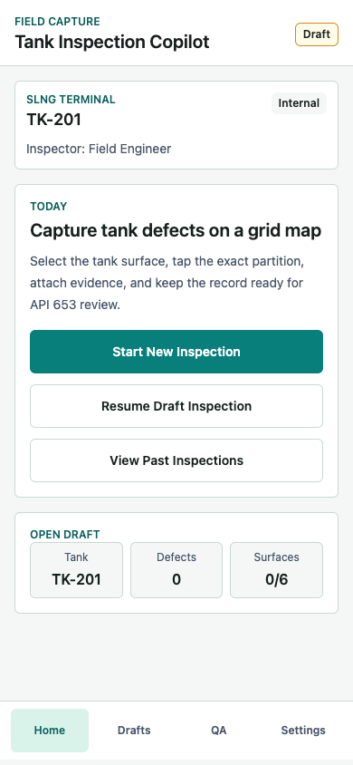

### Screenshot 2: Tank Overview and Surface Selection

Surface cards for bottom, shell, roof, annular ring, nozzle area, and weld zone with completion state.

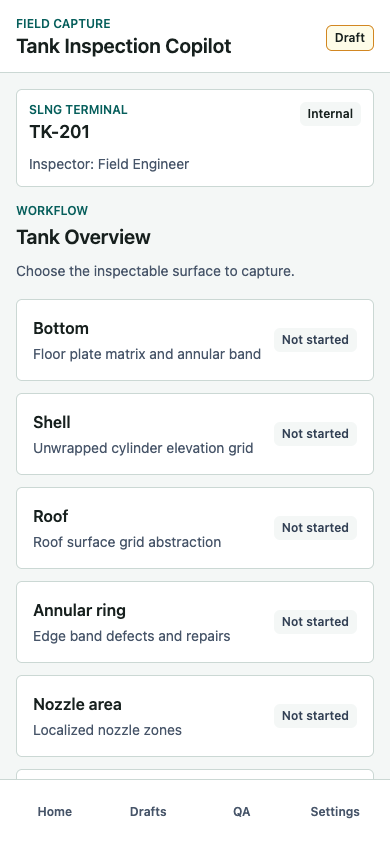

### Screenshot 3: Grid Map Location Picker

Primary location capture screen with plate IDs, repair overlays, prior defects, grid labels, disabled cells, and selected X/Y summary.

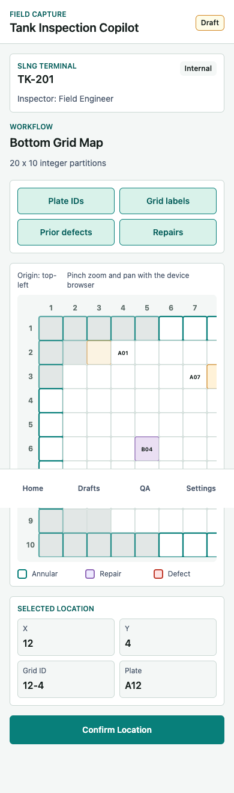

### Screenshot 4: Location Confirmation

Locked location review before defect typing, with location summary and a mini map preview.

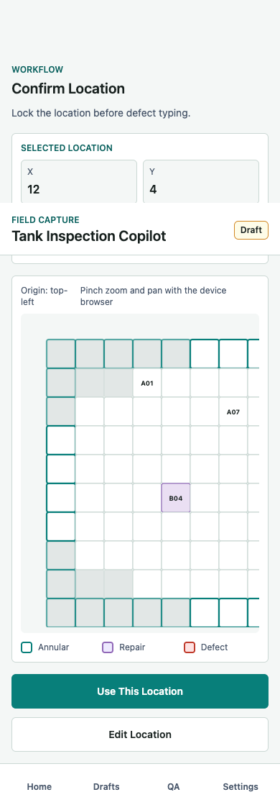

### Screenshot 5: Defect Type Selection

Location-linked defect taxonomy picker for corrosion, crack, deformation, coating failure, leakage, weld defect, repair observation, or other.

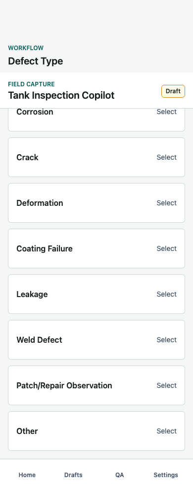

### Screenshot 6: Defect Details

Structured defect details with subtype, severity, extent, and field note capture.

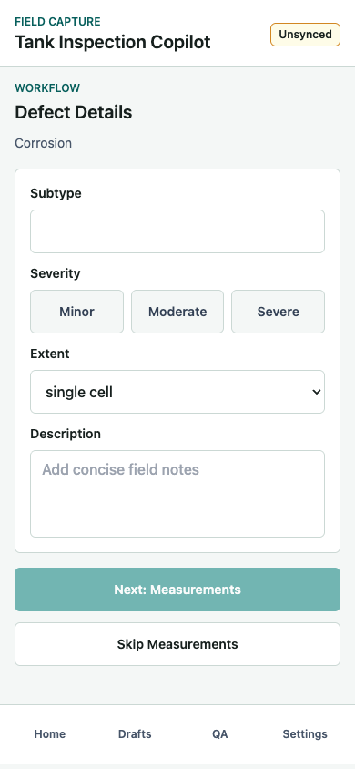

### Screenshot 7: Measurement Capture

Dynamic measurement fields and defect-specific warning logic, shown here for corrosion without UT thickness.

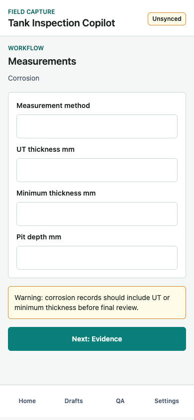

### Screenshot 8: Evidence Required

Evidence capture screen blocks save until at least one photo is attached.

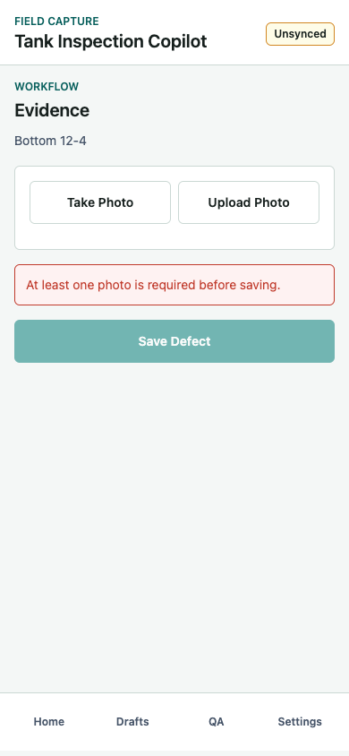

### Screenshot 9: Evidence Attached

Mock photo evidence linked to tank, surface, and X/Y location, with delete control.

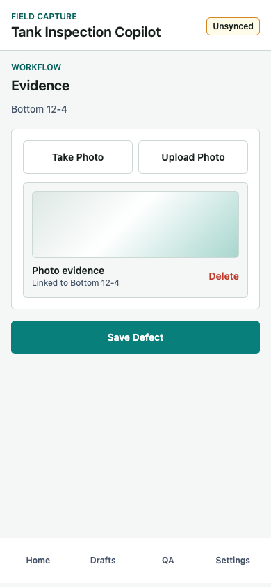

### Screenshot 10: Defect Saved

Saved defect summary showing type, severity, location, photo count, and next actions.

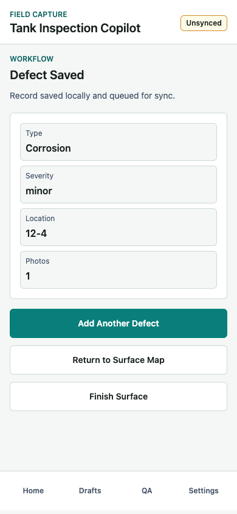

### Screenshot 11: Saved Defect Map

Surface map with saved defect marker, layer toggles, legend, and finish surface action.

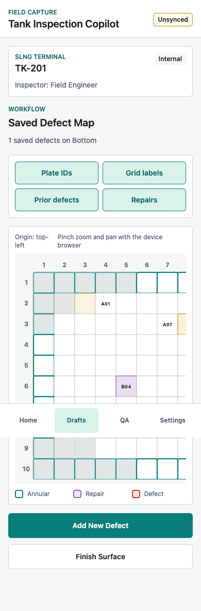

### Screenshot 12: Surface Completion Review

Surface-level QA summary with defect count, photo count, grid size, status, and warnings.

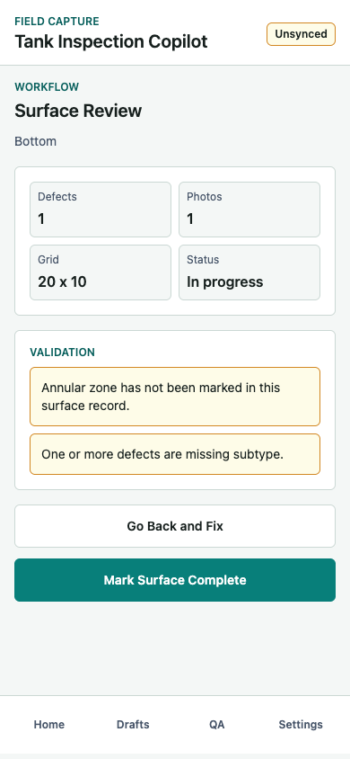

### Screenshot 13: Inspection Validation

Whole-inspection QA blocks submission until required surfaces and defect records pass validation.

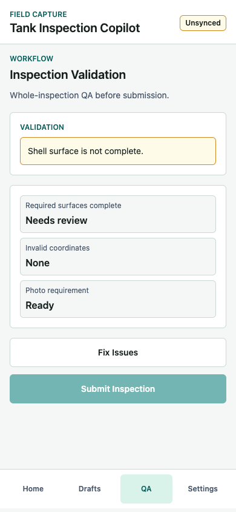

## Complete Screen-by-Screen Function and Feature Description

### Screen 01 - Home

**Purpose:** Entry point for the field engineer and quick access to the active draft.

**Functions and features:**
- Shows app name, field capture context, and sync status badge.
- Shows active draft header with site, tank ID, inspection type, and inspector.
- Provides Start New Inspection, Resume Draft Inspection, and View Past Inspections actions.
- Shows open draft metrics for tank, defect count, and completed surfaces.
- Bottom navigation provides Home, Drafts, QA, and Settings access.

**Validation:** No blocking validation on this screen.

**Output:** Routes to Inspection Setup for a new inspection or Tank Overview for an existing draft.

### Screen 02 - Inspection Setup

**Purpose:** Create or update the inspection context before location capture begins.

**Functions and features:**
- Captures site, client, tank ID, and inspection type.
- Inspection type supports routine, external, internal, and special.
- Inspection date and inspector are treated as auto-filled context for the draft.
- Continue saves the inspection context and moves to Tank Overview.
- Save Draft writes the inspection context locally and returns to Home.

**Validation:** Continue is disabled until site, tank ID, and inspection type are present.

**Output:** Updates the InspectionSession object and sets sync status to unsynced.

### Screen 03 - Tank Overview

**Purpose:** Select the inspectable surface for the next defect capture operation.

**Functions and features:**
- Shows inspection header with site, tank ID, inspection type, and inspector.
- Lists bottom, shell, roof, annular ring, nozzle area, and weld zone.
- Each surface card includes a short operational description.
- Each surface card shows Not started, defect count, or Complete state.
- Selecting a surface initializes a default draft location for that surface.

**Validation:** No blocking validation on this screen.

**Output:** Routes to Location Mode Selection with the chosen surface.

### Screen 04 - Location Mode Selection

**Purpose:** Let the engineer choose the most practical location capture method.

**Functions and features:**
- Tap on Grid Map is marked as the recommended method.
- Manual X,Y Entry supports checklist-driven or difficult touch conditions.
- Plate ID Entry supports engineers working directly from a plate map drawing.
- Each option explains when to use the method.

**Validation:** No blocking validation on this screen.

**Output:** Routes to Grid Map Location Picker, Manual X,Y Entry, or Plate ID Picker.

### Screen 05A - Grid Map Location Picker

**Purpose:** Primary location capture screen for selecting the exact X/Y partition.

**Functions and features:**
- Displays tank header, surface name, and grid size such as 20 x 10.
- Renders an SVG rectangular grid with every valid cell tappable.
- Disables cells outside the valid circular footprint for bottom and roof surfaces.
- Shows the active origin convention: top-left for bottom/roof and lower-left for shell.
- Supports plate ID, grid label, prior defect, and repair overlay toggles.
- Highlights annular edge cells on the bottom surface.
- Highlights selected cell and updates X, Y, grid ID, and plate ID summary.
- Shows a map legend for annular, repair, and defect states.
- The scrollable SVG supports device browser zoom and pan behavior.

**Validation:** Confirm Location is disabled until a valid cell is selected.

**Output:** Creates a GridLocation with surface, x, y, gridId, optional plateId, locationMode, and isAnnular.

### Screen 05B - Manual X,Y Entry

**Purpose:** Fallback location entry for known coordinates or poor map interaction conditions.

**Functions and features:**
- Shows the selected surface as context.
- Captures X partition and Y partition as integer inputs.
- Provides a live valid or invalid partition message.
- Preview on Map returns to the grid map for visual confirmation.
- Confirm Location accepts only valid inspectable coordinates.

**Validation:** X and Y must be integers, within grid bounds, and inside the valid surface footprint.

**Output:** Creates the same GridLocation object as tap-on-grid mode with locationMode set to manual_xy.

### Screen 05C - Plate ID Picker

**Purpose:** Capture location by plate number when working from a floor plate drawing.

**Functions and features:**
- Searches available plate IDs by typed query.
- Shows plate cards with plate ID, subzone, and mapped X/Y coordinate.
- Selecting a plate auto-fills the mapped location.
- Show on Map returns to the grid map if the engineer wants visual confirmation.

**Validation:** Only listed mapped plates can be selected in the MVP.

**Output:** Creates a GridLocation with locationMode set to plate_id and the mapped plateId.

### Screen 06 - Location Confirmation

**Purpose:** Lock the selected location before defect type and details are entered.

**Functions and features:**
- Shows location summary for surface, X, Y, grid ID, and optional plate ID.
- Shows mini grid preview with the selected location highlighted.
- Use This Location advances to defect typing.
- Edit Location returns to the original location capture mode.

**Validation:** Use This Location is disabled if no location is available.

**Output:** Confirms the location for the draft defect record.

### Screen 07 - Defect Type Selection

**Purpose:** Start a defect record linked to the confirmed location.

**Functions and features:**
- Shows selected surface and grid ID in the screen subtitle.
- Offers corrosion, crack, deformation, coating failure, leakage, weld defect, patch/repair observation, and other.
- Each type is a large touch target for field use.

**Validation:** The user must select one defect type to continue.

**Output:** Stores defectType on the draft record and routes to Defect Details.

### Screen 08 - Defect Detail Form

**Purpose:** Capture structured qualitative defect details.

**Functions and features:**
- Shows defect type as the context heading.
- Captures subtype as free text.
- Captures severity as minor, moderate, or severe.
- Captures extent as single cell, multi-cell region, or edge/annular.
- Captures a concise description or field note.
- Supports Next: Measurements and Skip Measurements actions.

**Validation:** Next: Measurements requires defect type and severity.

**Output:** Updates draft defect subtype, severity, extent, and description.

### Screen 09 - Measurement Capture

**Purpose:** Capture numeric NDE or visual measurement values when relevant.

**Functions and features:**
- Captures measurement method.
- For cracks, captures crack length and crack width.
- For deformation, captures deformation dimension.
- For corrosion and other default cases, captures UT thickness, minimum thickness, and pit depth.
- Shows defect-specific warning text when important measurement values are missing.

**Validation:** Corrosion without UT/min thickness, crack without size, and deformation without dimension produce warnings.

**Output:** Updates the DefectMeasurement object and routes to Evidence.

### Screen 10 - Evidence Capture

**Purpose:** Attach required proof to the defect before saving.

**Functions and features:**
- Shows selected surface and grid ID as context.
- Provides Take Photo and Upload Photo actions in the MVP.
- Displays attached evidence in a gallery-style strip.
- Each evidence item is linked to surface, X, and Y metadata.
- Delete removes an attached evidence item before saving.
- The data model can represent photo, video, and audio evidence, but the current UI implements photo flows first.

**Validation:** Save Defect is disabled until at least one photo is attached.

**Output:** Creates evidence metadata and enables local defect save.

### Screen 11 - Defect Saved Summary

**Purpose:** Confirm local save and let the engineer choose the next field action.

**Functions and features:**
- Shows that the record is saved locally and queued for sync.
- Summarizes defect type, severity, location, and photo count.
- Add Another Defect keeps the same location context for rapid capture.
- Return to Surface Map shows spatial defect context.
- Finish Surface moves to surface completion review.

**Validation:** This screen is reached only after required defect fields and photo evidence pass save rules.

**Output:** Adds a DefectRecord to the active SurfaceInspection and sets sync status to unsynced.

### Screen 12 - Surface Map with Saved Defects

**Purpose:** Review recorded defects spatially on the selected tank surface.

**Functions and features:**
- Shows the selected surface map with saved defect markers on top of the grid.
- Shows the number of saved defects on the surface.
- Keeps plate ID, grid label, prior defect, and repair overlay toggles available.
- Provides Add New Defect and Finish Surface actions.
- Keeps annular, repair, and defect legend visible below the map.

**Validation:** No blocking validation on the map itself.

**Output:** Routes back to location capture for a new defect or to Surface Completion Review.

### Screen 13 - Surface Completion Review

**Purpose:** Run surface-level QA before marking a surface complete.

**Functions and features:**
- Summarizes defect count, photo count, grid size, and surface status.
- Shows validation panel for surface-specific warnings.
- Warns when saved defects are missing photos or subtype.
- Warns when bottom surface has no saved defects or no annular zone record.
- Go Back and Fix returns to the surface map.
- Mark Surface Complete marks the current surface complete and moves to inspection validation.

**Validation:** Warnings are shown for QA review; the current prototype still allows Mark Surface Complete.

**Output:** Updates the SurfaceInspection completed flag and sets sync status to unsynced.

### Screen 14 - Inspection Validation

**Purpose:** Whole-inspection QA before submission.

**Functions and features:**
- Shows all blocking inspection warnings in one validation panel.
- Checks required surfaces, currently bottom and shell.
- Checks defect photo requirement across saved defects.
- Checks saved defect locations against the surface grid validity rule.
- Shows readiness summaries for required surfaces, invalid coordinates, and photo requirement.
- Fix Issues returns to the tank overview.
- Submit Inspection is disabled until blocking warnings are resolved.

**Validation:** Submission is blocked if required surfaces are incomplete, defects have no photo, or defects have invalid coordinates.

**Output:** When valid, sets sync status to synced and routes to Submission Success.

### Screen 15 - Submission Success

**Purpose:** Close the inspection workflow after a successful submit.

**Functions and features:**
- Shows submitted state and report-ready dataset confirmation.
- View Defect Map returns to the saved defect map.
- Start Another Inspection creates a fresh session.
- Return Home goes back to the mobile home screen.

**Validation:** Only reachable after inspection validation allows submission.

**Output:** Ends the current workflow and leaves the dataset available for review.

## Location Capture Model

Each defect location is stored as a structured grid coordinate:

```json
{
  "surface": "bottom",
  "x": 12,
  "y": 4,
  "gridId": "12-4",
  "plateId": "A12",
  "locationMode": "tap_map",
  "isAnnular": false
}
```

Bottom and roof surfaces use a circular validity mask inside a rectangular grid abstraction. Shell, nozzle, and weld surfaces use rectangular unwrapped grids. The MVP uses integer partitions only.

## Data Model Summary

- InspectionSession: inspection ID, site, client, tank ID, inspection type, inspector, surfaces, and syncStatus.
- SurfaceInspection: surface type, grid columns, grid rows, completion state, and saved defects.
- GridLocation: surface, x, y, gridId, optional plateId, locationMode, and isAnnular.
- DefectRecord: inspection ID, tank ID, location, defect type, subtype, severity, extent, description, measurements, evidence, creator, and timestamp.
- EvidenceItem: local URI, type, timestamp, optional GPS, linked surface, linked X, and linked Y.

## Validation and Offline Behavior

- Location requires a valid surface, X, and Y.
- Selected grid cells must be inside the valid tank footprint.
- Defect type is required.
- Severity is required.
- At least one photo is required before saving a defect.
- Corrosion without UT or minimum thickness produces a warning.
- Crack without length or width produces a warning.
- Deformation without dimension produces a warning.
- Submission is blocked when a required surface is incomplete, a saved defect has no photo, or a saved defect has an invalid location.

Drafts are persisted locally in the browser prototype. Every draft change marks the inspection as unsynced. For a production mobile app, this should move to durable mobile storage with a sync queue for evidence files and retryable upload state.

## Recommended Next Steps

1. Freeze grid calibration rules per tank and surface.
2. Define the source of plate ID to X/Y mapping from drawings like TK 201.
3. Replace mock photo entries with real native camera and offline file storage.
4. Add a durable sync queue with retry state per evidence item.
5. Add region selection for multi-cell defects.
6. Import prior repairs, replacements, and historical defects as map overlays.
7. Move from browser localStorage to a mobile-grade persistence layer such as SQLite, AsyncStorage, or IndexedDB in a Capacitor shell.
