# Tank Inspection Copilot - Latest Screen Review

Generated: April 20, 2026

31 current mobile screens covering setup, tank profile, orientation, MFL import, surface geometry, defect capture, QA validation, export, and submission.

## Screen Inventory

### Screen 01 - Home

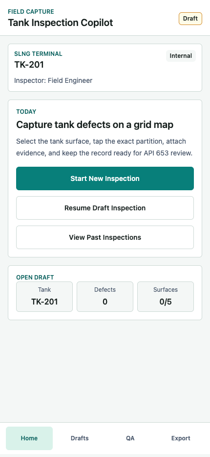

**Stage:** Start and resume

**Purpose:** Lets an inspector start a new tank inspection, resume the current draft, or review prior work while keeping the active tank context visible.

**Customer validation points:**
- Confirm the active draft summary uses customer-recognisable site, tank, inspection type, and inspector fields.
- Validate that Start New Inspection and Resume Draft Inspection are the right primary actions for field users.
- Confirm the sync badge language - Draft, Unsynced, Synced - is understandable to non-technical inspectors.

### Screen 02 - Inspection Setup

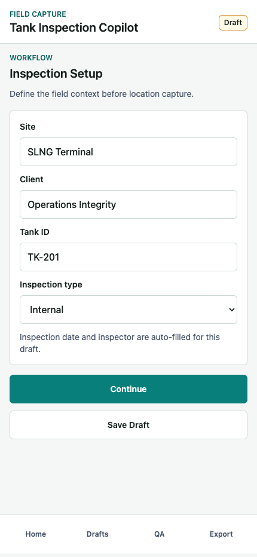

**Stage:** Start and resume

**Purpose:** Captures site, client, tank ID, and inspection type so every defect record is tied to the correct asset and inspection session.

**Customer validation points:**
- Validate required setup fields: Site, Tank ID, and Inspection Type.
- Confirm the pre-filled TK-201 demo values are credible for customer walkthroughs.
- Confirm Save Draft behavior is clear for interrupted field work.

### Screen 03 - Tank Profile

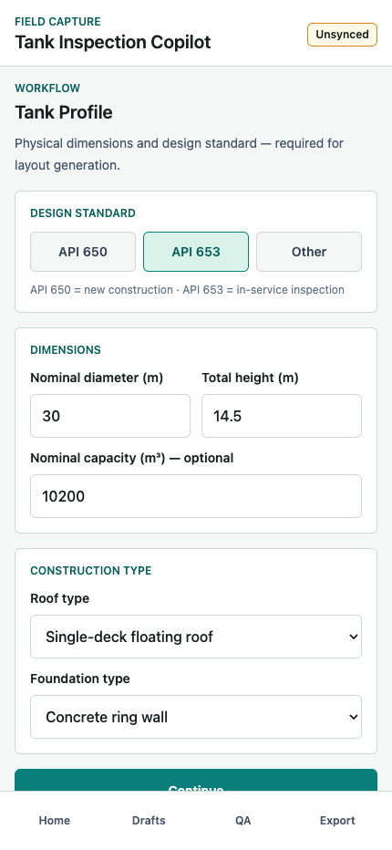

**Stage:** Tank definition

**Purpose:** Collects physical tank data required to generate repeatable floor, shell, roof, annular, and nozzle location maps.

**Customer validation points:**
- Confirm the design code choices reflect customer language: API 650, API 653, or Other.
- Validate diameter, height, capacity, roof type, and foundation type as the right minimum profile fields.
- Confirm these fields are sufficient for downstream layout drawing and defect overlay generation.

### Screen 04 - Tank Orientation

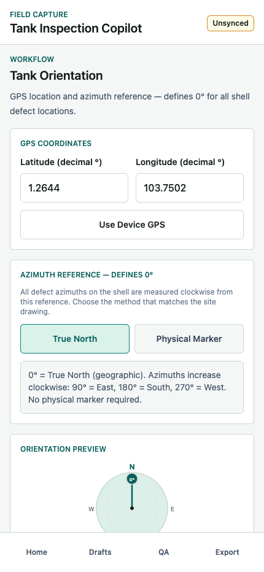

**Stage:** Tank definition

**Purpose:** Defines how shell and top-view defect positions map to real-world orientation using True North or a physical reference marker.

**Customer validation points:**
- Confirm True North versus Physical Marker matches customer field practice.
- Validate whether GPS should be optional, required, or manually entered when device GPS is unavailable.
- Confirm the compass preview is enough to explain 0 degree orientation during customer review.

### Screen 05 - Tank Overview

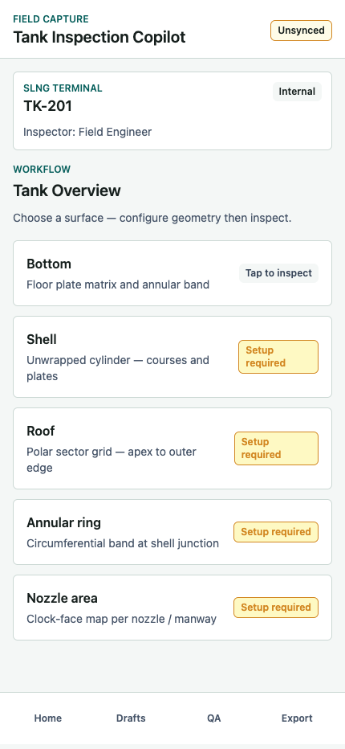

**Stage:** Surface selection

**Purpose:** Shows all inspectable surfaces and whether each surface is ready, requires setup, has defects, or is complete.

**Customer validation points:**
- Validate the surface list: Bottom, Shell, Roof, Annular ring, and Nozzle area.
- Confirm setup-required badges make sense before shell, roof, annular, and nozzle inspection begins.
- Confirm Bottom should route to MFL import before manual defect capture.

### Screen 06 - Bottom MFL Report

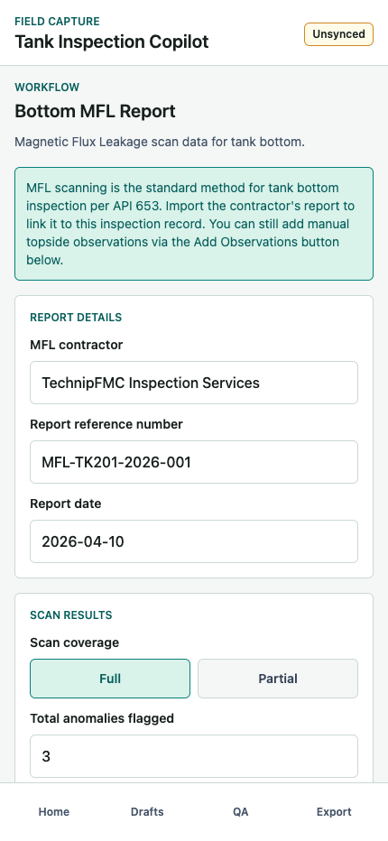

**Stage:** Bottom inspection

**Purpose:** Records the Magnetic Flux Leakage report for the bottom surface, including contractor, report reference, date, coverage, anomaly count, severity, and notes.

**Customer validation points:**
- Validate MFL as the default bottom inspection path for customer operations.
- Confirm severity labels: Clean, Minor findings, Significant findings, Critical findings.
- Confirm Add Manual Observations is the right secondary action when MFL does not capture all observations.

### Screen 07 - Location Mode

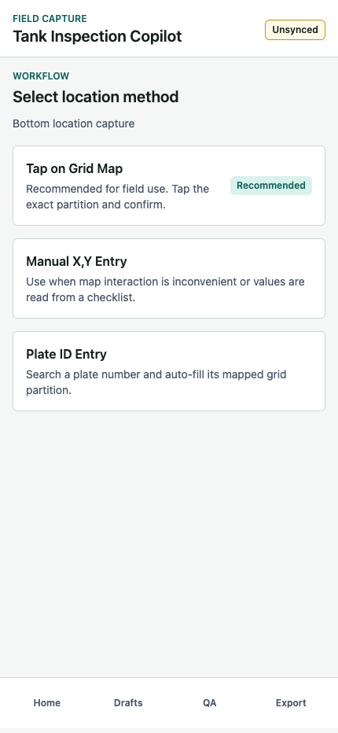

**Stage:** Location capture

**Purpose:** Offers three capture methods: tap the surface map, type X/Y coordinates, or search a plate ID from the drawing.

**Customer validation points:**
- Confirm Tap on Grid Map should remain the recommended mode.
- Validate Manual X,Y Entry for checklist-driven inspections.
- Validate Plate ID Entry for inspectors working from tank drawings.

### Screen 08 - Bottom Grid Map

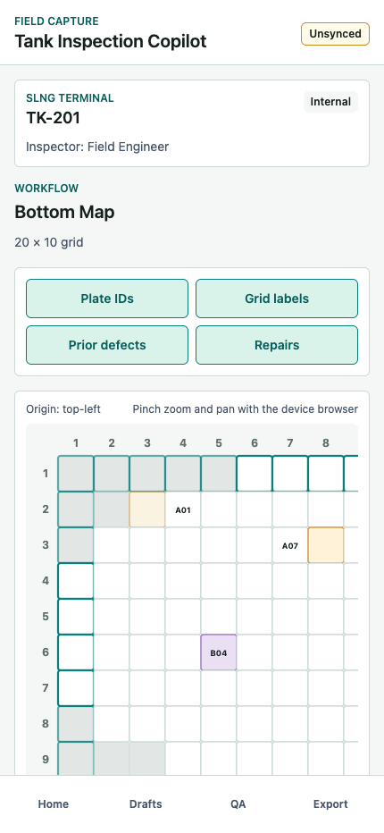

**Stage:** Location capture

**Purpose:** Renders the bottom surface as a grid with disabled outside cells, annular edge highlighting, plate IDs, prior defects, repairs, and a selected location summary.

**Customer validation points:**
- Confirm the grid abstraction is understandable for bottom plate inspection.
- Validate the overlay controls: Plate IDs, Grid labels, Prior defects, and Repairs.
- Confirm the selected X/Y, Grid ID, and Plate ID summary provides enough audit detail.

### Screen 09 - Manual X,Y Entry

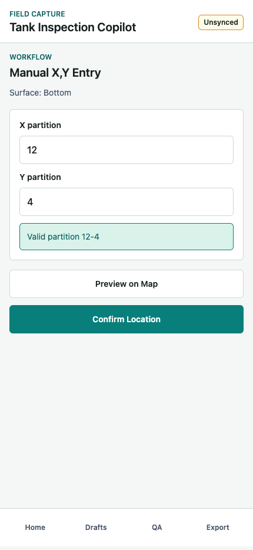

**Stage:** Location capture

**Purpose:** Accepts integer X and Y partitions and validates them against the active surface grid and inspectable footprint.

**Customer validation points:**
- Confirm integer X/Y input is enough for field checklist workflows.
- Validate the valid/invalid partition message wording.
- Confirm Preview on Map and Confirm Location are the right next actions.

### Screen 10 - Plate ID Picker

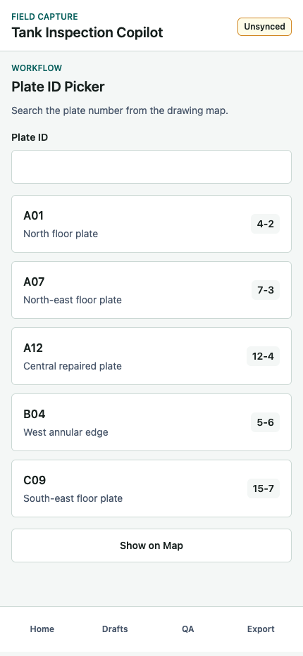

**Stage:** Location capture

**Purpose:** Lets the inspector choose a known plate number and automatically maps it to X/Y grid coordinates.

**Customer validation points:**
- Confirm plate search matches customer drawing conventions.
- Validate which plate metadata should appear in each result: ID, subzone, and grid coordinate.
- Confirm Show on Map is useful before locking the location.

### Screen 11 - Confirm Location

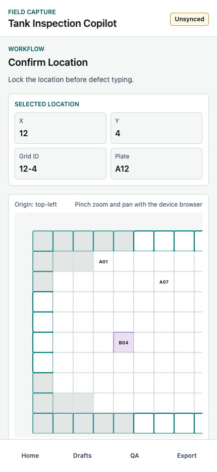

**Stage:** Location capture

**Purpose:** Shows a final location summary and preview map so spatial data is confirmed before the inspector records defect details.

**Customer validation points:**
- Confirm location cannot advance without a valid selected position.
- Validate whether the mini map is enough to catch an incorrect plate or grid cell.
- Confirm Edit Location should return to the original location method.

### Screen 12 - Defect Type

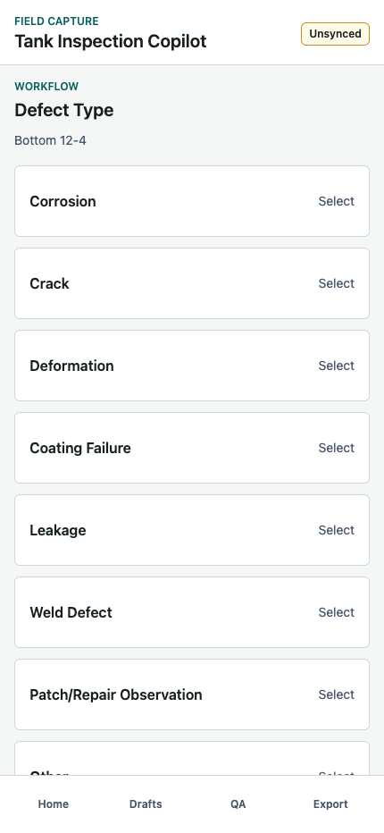

**Stage:** Defect capture

**Purpose:** Starts the defect record by selecting the primary defect type linked to the confirmed surface and grid ID.

**Customer validation points:**
- Validate the eight defect types against customer taxonomy.
- Confirm one-tap selection is acceptable or whether a confirmation step is needed.
- Confirm the location in the subtitle is visible enough as context.

### Screen 13 - Defect Details

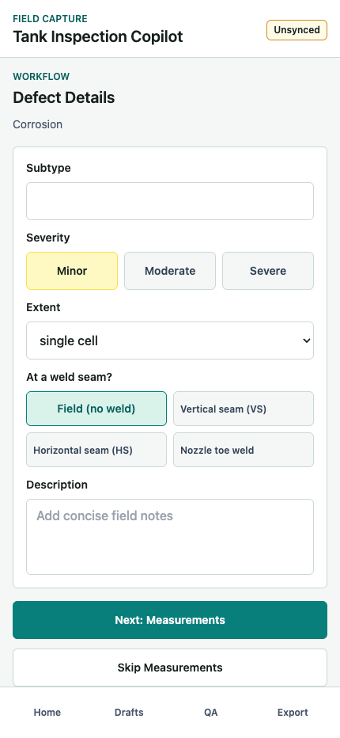

**Stage:** Defect capture

**Purpose:** Collects qualitative defect details before numeric measurements and evidence are added.

**Customer validation points:**
- Confirm severity choices: Minor, Moderate, Severe.
- Validate weld seam options for shell, bottom, roof, annular, and nozzle contexts.
- Confirm required fields before moving to measurements.

### Screen 14 - Measurements

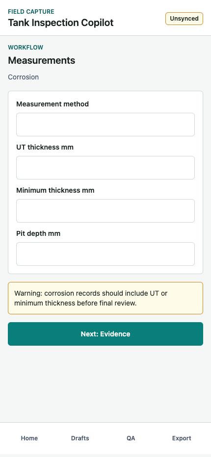

**Stage:** Defect capture

**Purpose:** Provides dynamic measurement fields for UT thickness, minimum thickness, pit depth, crack sizing, or deformation.

**Customer validation points:**
- Confirm the measurement method field is needed for audit traceability.
- Validate corrosion measurement fields: UT thickness, minimum thickness, and pit depth.
- Confirm non-blocking warnings are acceptable before final QA review.

### Screen 15 - Evidence Required

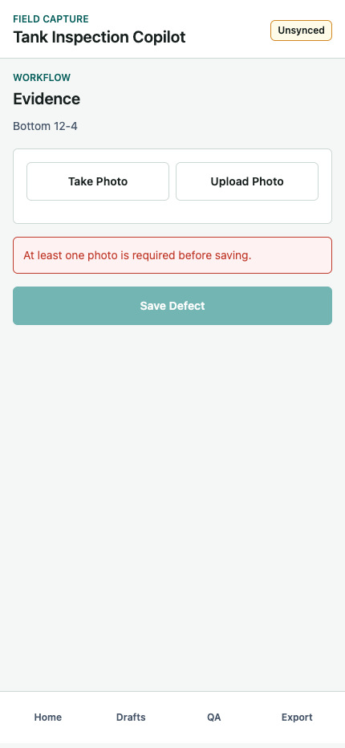

**Stage:** Defect capture

**Purpose:** Requires at least one photo before the defect record can be saved locally.

**Customer validation points:**
- Confirm photo evidence should be mandatory for all saved defects.
- Validate Take Photo versus Upload Photo as the right field actions.
- Confirm the disabled Save Defect state is obvious enough.

### Screen 16 - Evidence With Photo

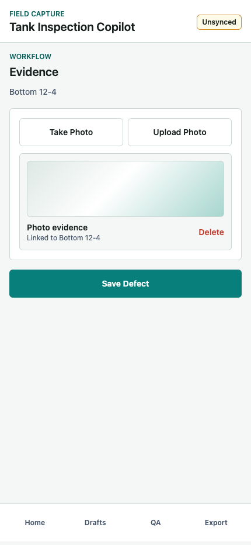

**Stage:** Defect capture

**Purpose:** Shows attached evidence cards with photo preview, surface link, coordinate link, and delete control.

**Customer validation points:**
- Confirm linked location metadata is sufficient for customer reporting.
- Validate whether multiple photos per defect are needed.
- Confirm Delete is enough for replacing incorrect or blurred evidence.

### Screen 17 - Defect Saved

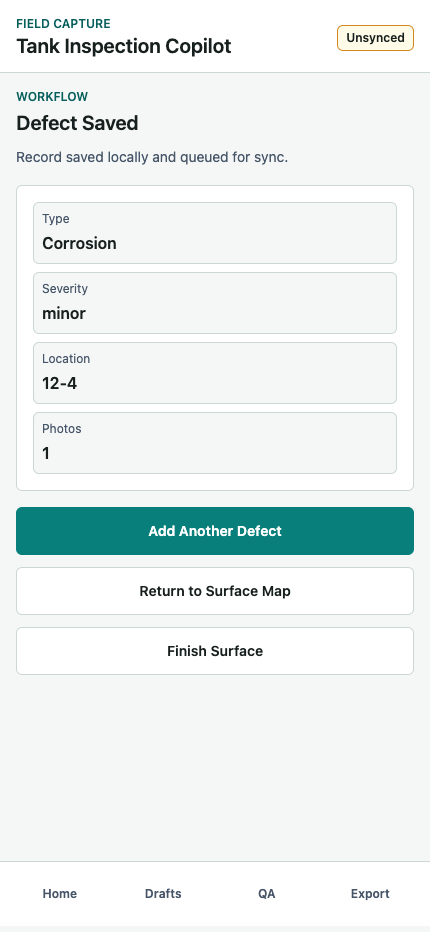

**Stage:** Review

**Purpose:** Summarizes the saved defect and lets the inspector add another defect, return to the surface map, or finish the surface.

**Customer validation points:**
- Confirm the saved summary has the right fields: type, severity, location, and photo count.
- Validate Add Another Defect behavior for repeated observations at the same area.
- Confirm Finish Surface is the right path into QA review.

### Screen 18 - Saved Defect Map

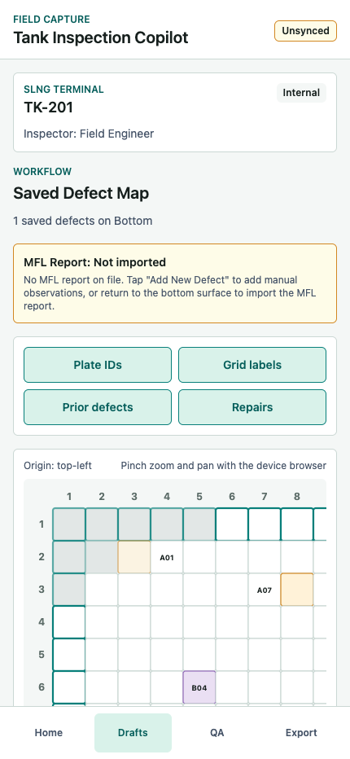

**Stage:** Review

**Purpose:** Displays all saved defects on the surface map alongside overlays and MFL status where applicable.

**Customer validation points:**
- Confirm saved defect markers are visible enough on the grid.
- Validate whether MFL-not-imported warnings should appear on the bottom surface map.
- Confirm Add New Defect and Finish Surface are the right review actions.

### Screen 19 - Surface Review

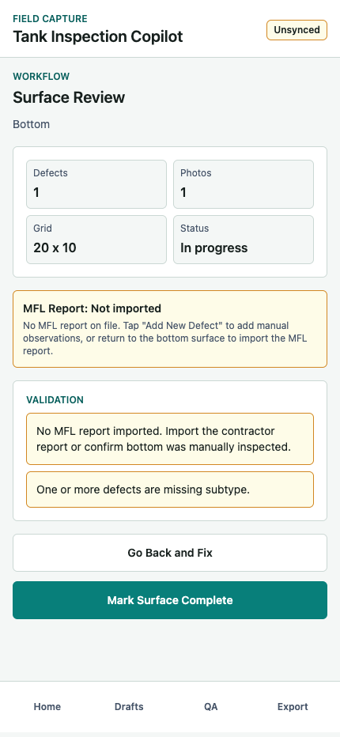

**Stage:** Review

**Purpose:** Shows surface metrics, warnings, MFL status, and completion actions before the surface is marked complete.

**Customer validation points:**
- Confirm warning language for missing MFL, missing photos, missing subtype, and empty surfaces.
- Validate whether Mark Surface Complete should be allowed with non-blocking warnings.
- Confirm the metrics panel is enough for customer QA review.

### Screen 20 - Shell Setup

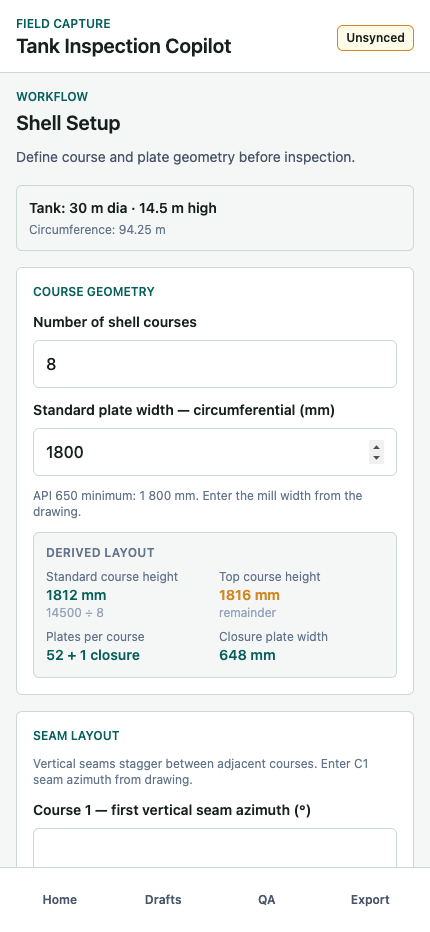

**Stage:** Surface geometry

**Purpose:** Calculates shell layout from tank diameter, height, course count, plate width, and seam offset rules.

**Customer validation points:**
- Confirm shell course count and plate width are the right minimum drawing inputs.
- Validate seam offset rules: half plate, third plate, or custom.
- Confirm derived layout values are meaningful to inspectors and engineers.

### Screen 21 - Shell Map

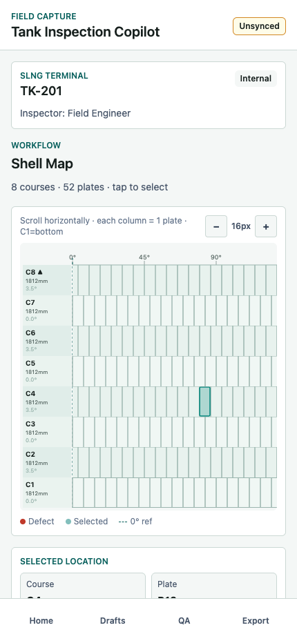

**Stage:** Surface geometry

**Purpose:** Renders the shell as an unwrapped cylinder with course rows, plate columns, seam origins, azimuth ticks, and defect markers.

**Customer validation points:**
- Confirm unwrapped shell representation is acceptable for customer field users.
- Validate course and plate terminology: C1, C2, P1, P2.
- Confirm azimuth and elevation summaries are sufficient for report handoff.

### Screen 22 - Roof Setup

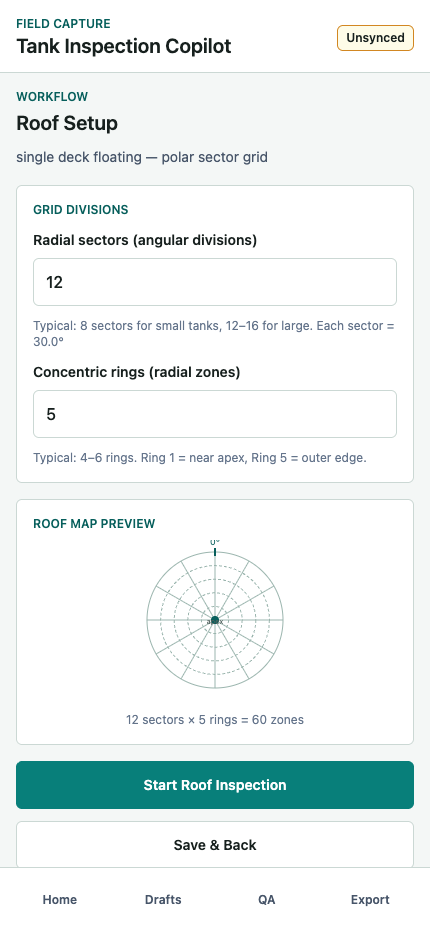

**Stage:** Surface geometry

**Purpose:** Defines a polar roof grid using angular sectors and concentric radial rings.

**Customer validation points:**
- Confirm typical sector and ring counts for customer tank roofs.
- Validate floating roof handling and whether apex height should be hidden or optional.
- Confirm the preview communicates the roof map convention.

### Screen 23 - Roof Map

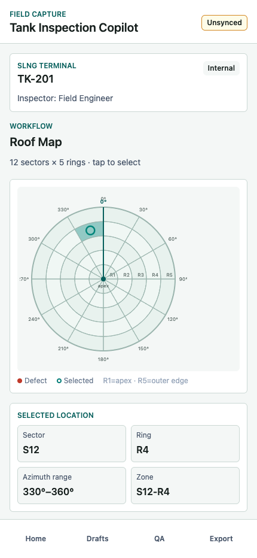

**Stage:** Surface geometry

**Purpose:** Provides a polar roof map with selected sector, ring, azimuth range, and zone summary.

**Customer validation points:**
- Confirm sector/ring location language matches how customers inspect roofs.
- Validate 0 degree reference placement against the orientation screen.
- Confirm selected roof zone is obvious on touch devices.

### Screen 24 - Annular Ring Setup

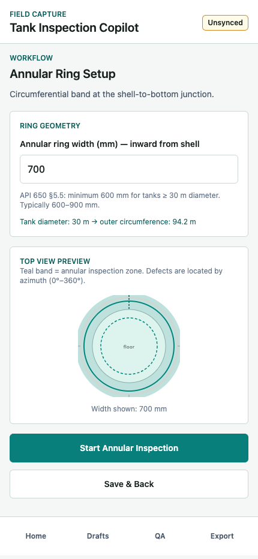

**Stage:** Surface geometry

**Purpose:** Captures annular ring width and previews the band around the floor-to-shell junction.

**Customer validation points:**
- Confirm default annular width and API 650 guidance text with customers.
- Validate whether width should be imported from drawings instead of entered manually.
- Confirm this setup should route directly to the annular map.

### Screen 25 - Annular Map

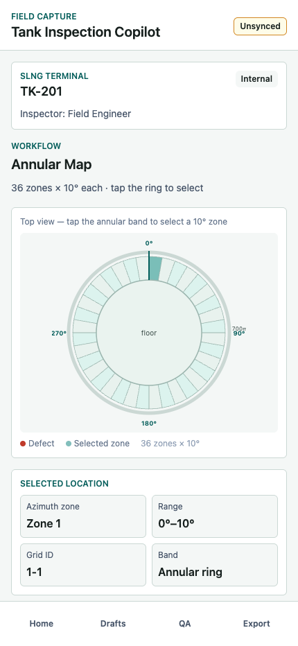

**Stage:** Surface geometry

**Purpose:** Shows the annular band as 36 ten-degree zones around the tank floor edge.

**Customer validation points:**
- Confirm 10 degree annular zones are the right resolution for customer use.
- Validate whether customers need plate IDs in addition to azimuth zones.
- Confirm zone selection and range labels are easy to explain.

### Screen 26 - Nozzle Registry

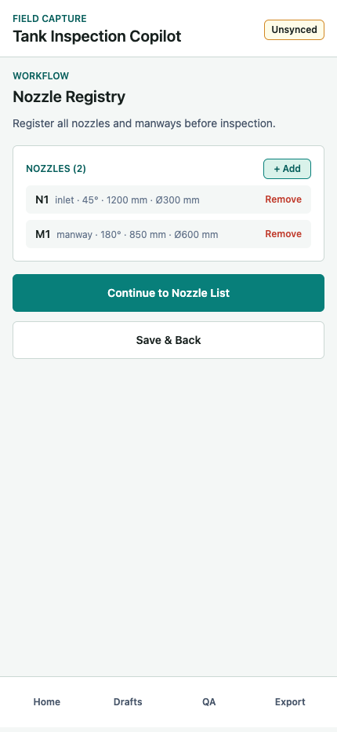

**Stage:** Surface geometry

**Purpose:** Stores nozzle ID, type, azimuth, elevation, diameter, and optional description to support nozzle-specific defect maps.

**Customer validation points:**
- Confirm the nozzle registry fields match customer asset drawings.
- Validate whether nozzle data should be manually entered or imported.
- Confirm add/remove behavior is sufficient for the prototype.

### Screen 27 - Nozzle Inspection List

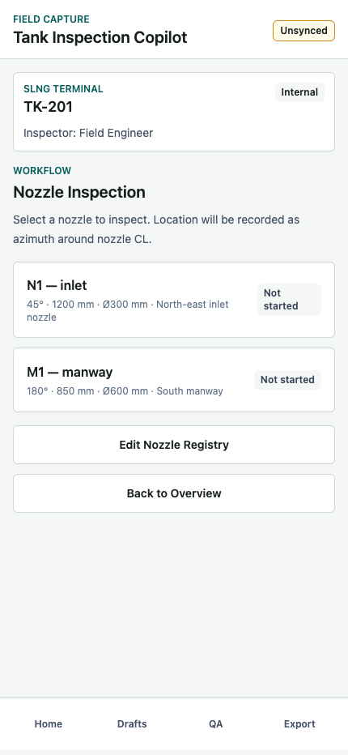

**Stage:** Surface geometry

**Purpose:** Lists registered nozzles with azimuth, elevation, diameter, and per-nozzle defect count.

**Customer validation points:**
- Confirm registered nozzle metadata is enough to identify the correct feature in the field.
- Validate defect count badges for completed or in-progress nozzle inspection.
- Confirm Edit Nozzle Registry remains accessible during inspection.

### Screen 28 - Nozzle Clock Map

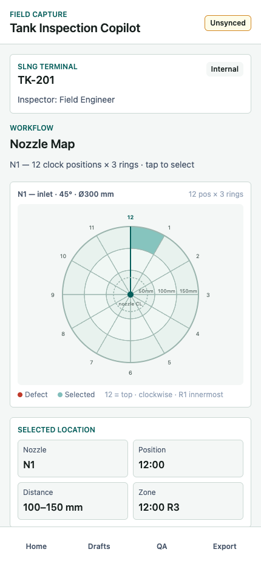

**Stage:** Surface geometry

**Purpose:** Maps defects around a selected nozzle using 12 clock positions and 3 radial distance rings from the nozzle centerline.

**Customer validation points:**
- Confirm clock-position language is familiar to inspectors.
- Validate 50 mm, 100 mm, and 150 mm rings for nozzle weld inspection.
- Confirm the selected zone summary should include nozzle ID, position, and distance.

### Screen 29 - Inspection Validation

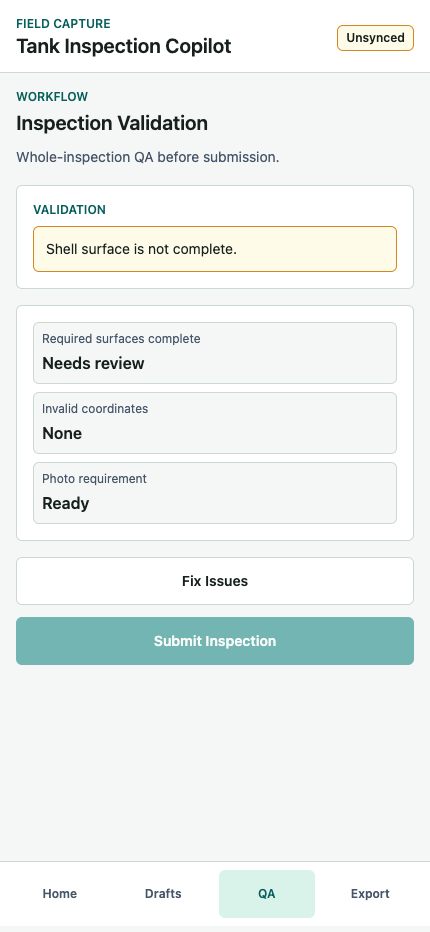

**Stage:** Submit

**Purpose:** Checks required surfaces, photo evidence, and location validity before submission.

**Customer validation points:**
- Confirm Bottom and Shell are the required surfaces for the current inspection type.
- Validate warning language when required surfaces are incomplete.
- Confirm disabled Submit Inspection behavior when blocking warnings exist.

### Screen 30 - Export & Summary

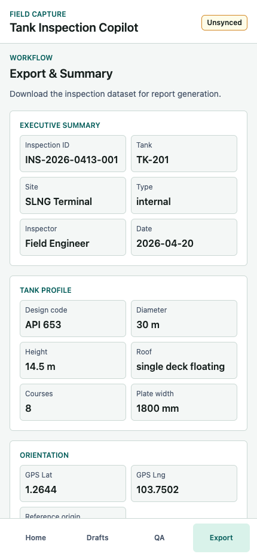

**Stage:** Submit

**Purpose:** Shows the inspection summary, tank profile, orientation, findings, MFL status, and export actions for JSON and CSV.

**Customer validation points:**
- Confirm JSON package and defect CSV are the right export formats for the next reporting step.
- Validate executive summary fields for customer reporting.
- Confirm Confirm & Submit Inspection should live on this screen after QA passes.

### Screen 31 - Submission Success

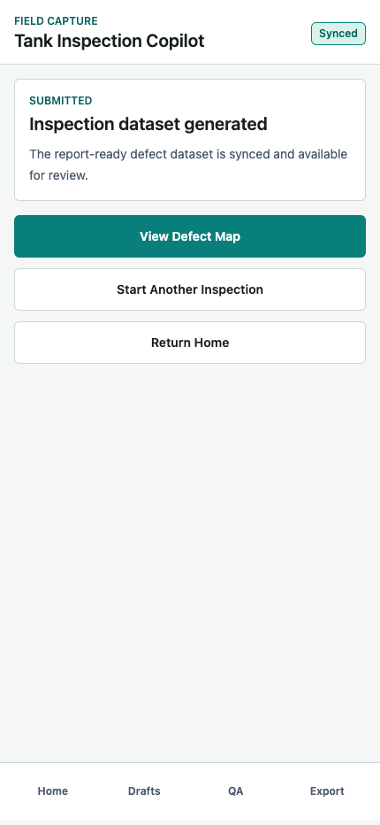

**Stage:** Submit

**Purpose:** Closes the workflow and gives the inspector options to review the defect map, start another inspection, or return home.

**Customer validation points:**
- Confirm success wording reflects the real integration state for the prototype.
- Validate next actions after submission.
- Confirm sync status changes to Synced after final submission.

